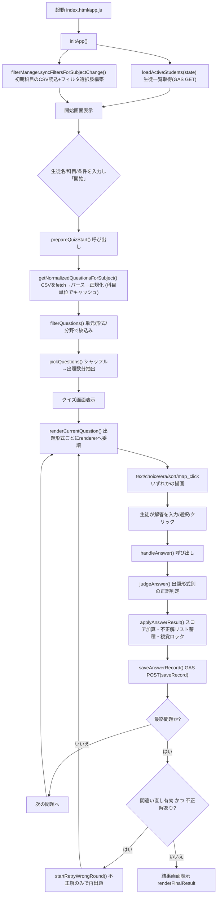
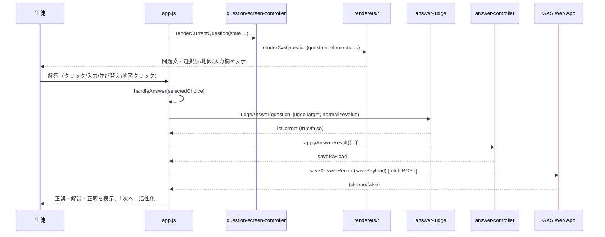
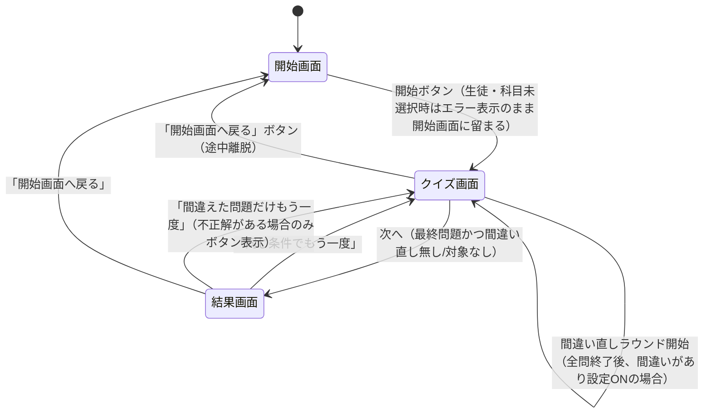

# 都立社会アプリ 現状分析レポート（Phase 0）

- 作成日: 2026-08-02
- 対象: 「都立 社会対策」アプリ（現行運用中） → 「LS総合テスト対策」への発展を検討するための現状分析
- フェーズ: Phase0（現状分析のみ）
- 本レポートの制約: **コード変更は一切行っていません**。調査・分析・レポート作成のみを実施しています。

### 改訂履歴

| 日付 | 内容 |
|---|---|
| 2026-08-02 | 初版作成 |
| 2026-08-02 | Phase0レビューにより、8.3の技術的負債#1〜#3を「可能性がある」という推測表現から、静的コード解析のみで断定できる確定事実の表現に修正。新たに確認された不整合（世界地理「豪州」問題のSVG id不一致）を8.3の#7として追加。8.6の記述を一部推測と明記する形に修正。（詳細は`docs/analysis/phase0-review.md`のレビュー記録を参照） |

---

## 0. Git状態の報告

```
$ git status
fatal: not a git repository (or any of the parent directories): .git
```

このプロジェクトフォルダは **Gitで管理されていません**。指示どおり `git init` / `git add` / `git commit` などは実行していません。バージョン管理が無い状態での長期運用・複数人開発は差分管理・ロールバックの面でリスクがあるため、Phase1着手前に検討することを推奨します（本レポートでは提案に留め、実行はしません）。

---

## 1. システム全体

### 1.1 フォルダ構成

```
socialstudies-app/
├── index.html                  … 唯一のHTMLエントリ（3画面をSPA的に切替）
├── app.js                      … アプリのエントリポイント（DOM結線・イベント配線）
├── style.css                   … 全画面共通スタイル（地図の視覚状態も含む）
├── filter-options.js           … ★ルート直下の空ファイル（未使用・重複名）
├── config/                     … 静的な設定値（マスタデータに近い）
│   ├── subjects.js             … 科目定義（CSVパス含む）
│   ├── modes.js                … 出題形式ラベル・科目別フィルタ選択肢
│   └── era-choices.js          … 時代当てモードの選択肢
├── core/                       … アプリのドメインロジック（画面非依存）
│   ├── state.js                … 集中状態オブジェクト（session/quiz/ui）
│   ├── question-loader.js      … CSV取得・パース（汎用デリミタ対応）
│   ├── question-normalizer.js  … CSV行→問題オブジェクトへの正規化
│   ├── question-filters.js     … 単元/形式/分野によるフィルタリング
│   ├── question-picker.js      … シャッフル・出題数抽出
│   ├── quiz-controller.js      … クイズ開始準備・復習ラウンド開始
│   ├── question-screen-controller.js … 出題形式ごとのレンダリング振り分け
│   ├── answer-controller.js    … 採点・正誤反映・保存ペイロード生成
│   ├── result-controller.js    … 結果メッセージ・最終結果画面テキスト生成
│   ├── session-controller.js   … 再スタート・メッセージリセット
│   └── screen-controller.js    … 画面切替（active class制御）
├── filters/                    … フィルタUI（単元/分野/形式セレクト）関連
│   ├── filter-manager.js       … フィルタ選択肢の同期・問題キャッシュ管理
│   └── filter-options.js       … セレクトボックス構築の汎用ユーティリティ
├── judges/
│   └── answer-judge.js         … 出題形式ごとの正誤判定ロジック
├── renderers/                  … 出題形式ごとのDOM描画（View層）
│   ├── text-renderer.js        … 記述式
│   ├── choice-renderer.js      … 選択式
│   ├── era-renderer.js         … 時代当て
│   ├── sort-renderer.js        … 並び替え
│   ├── map-click-renderer.js   … 地図クリックの統括（戦略パターンの窓口）
│   ├── map-click-config.js     … 地図マスタ定義・SVG読込・ラベル辞書
│   ├── map-click-prefecture.js … 都道府県（class方式）の地図操作
│   ├── map-click-line.js       … 河川・山脈（線・地物方式）の地図操作
│   ├── map-click-area.js       … 半島・海岸・世界国名等（id方式）の地図操作
│   └── map-click-coast.js      … ★未使用スタブ（中身は空実装）
├── services/                   … 外部システム（GAS）連携
│   ├── gas-service.js          … GAS Web App URL・POST共通処理
│   └── student-service.js      … 生徒一覧取得・解答送信・オートコンプリートUI
├── data/                       … 問題データ（CSV管理）
│   ├── japan_geo_questions.csv
│   ├── world_geo_questions.csv
│   └── history_questions.csv
└── assets/                     … 地図SVG・画像
    ├── map-full.svg / map-river-latest.svg / map-mountains.svg /
    │   map-peninsula-sea-current-tide.svg / map-coast.svg（日本地図系）
    ├── map-world.svg / map-asia.svg / map-europe.svg /
    │   map-world-physical.svg（世界地図系）
    ├── map-world-rivers.svg / map-world-rivers-mountains.svg（★未使用）
    └── 河川クリック問題テンプレ（完全版）.txt（作業メモ、アプリからは未参照）
```

規模の目安: JS/HTML/CSS 合計 **約4,150行**（41ファイル）、CSV 3本 **約200問**、SVG地図11枚（1ファイル最大4,416行）。GAS本体（.gsファイル）はこのリポジトリには含まれておらず、`services/gas-service.js` が参照するWeb App URL経由の外部システムとして存在します。

### 1.2 モジュール構成（責務レイヤー）

| レイヤー | フォルダ | 役割 |
|---|---|---|
| エントリ/配線 | `app.js`, `index.html` | DOM取得、イベント登録、各モジュールの呼び出し順序を決定するオーケストレーター |
| 設定 | `config/` | 科目・出題形式・時代選択肢などの静的マスタ |
| ドメインロジック | `core/` | 状態管理、CSV読込、フィルタ、出題選定、採点、結果生成（DOM操作は最小限） |
| フィルタUI連携 | `filters/` | 科目変更に応じたセレクトボックス（単元/分野/形式）の同期 |
| 判定 | `judges/` | 出題形式ごとの正誤判定（純粋関数に近い） |
| 描画（View） | `renderers/` | 出題形式ごとのDOM生成・地図SVG操作 |
| 外部連携 | `services/` | GAS（生徒管理・解答保存）との通信 |
| データ | `data/`, `assets/` | CSV問題データ、SVG地図・画像 |

### 1.3 モジュール依存関係図

```mermaid
graph TD
    HTML[index.html] --> APP[app.js]

    APP --> STATE[core/state.js]
    APP --> QC[core/quiz-controller.js]
    APP --> RC[core/result-controller.js]
    APP --> SC[core/session-controller.js]
    APP --> AC[core/answer-controller.js]
    APP --> QSC[core/question-screen-controller.js]
    APP --> SCR[core/screen-controller.js]
    APP --> QN[core/question-normalizer.js]
    APP --> FM[filters/filter-manager.js]
    APP --> JUDGE[judges/answer-judge.js]
    APP --> SS[services/student-service.js]
    APP --> ERA_CFG[config/era-choices.js]
    APP --> R_TEXT[renderers/text-renderer.js]
    APP --> R_CHOICE[renderers/choice-renderer.js]
    APP --> R_ERA[renderers/era-renderer.js]
    APP --> R_SORT[renderers/sort-renderer.js]
    APP --> R_MAP[renderers/map-click-renderer.js]

    QC --> SUBJ[config/subjects.js]
    QC --> QPICK[core/question-picker.js]
    QC --> QFILT[core/question-filters.js]
    QC --> STATE

    QSC --> R_TEXT
    QSC --> R_CHOICE
    QSC --> R_ERA
    QSC --> R_SORT
    QSC --> R_MAP

    FM --> SUBJ
    FM --> MODES[config/modes.js]
    FM --> QLOAD[core/question-loader.js]
    FM --> FOPT[filters/filter-options.js]

    RC --> SUBJ
    RC --> MODES

    R_MAP --> MCFG[renderers/map-click-config.js]
    R_MAP --> R_PREF[renderers/map-click-prefecture.js]
    R_MAP --> R_LINE[renderers/map-click-line.js]
    R_MAP --> R_AREA[renderers/map-click-area.js]

    R_PREF --> MCFG
    R_LINE --> MCFG
    R_AREA -.->|依存なし: 独自定義を保持| MCFG

    SS --> GAS[services/gas-service.js]

    QLOAD --> CSV[(data/*.csv)]
    MCFG --> SVG[(assets/*.svg)]
    GAS -->|fetch| GASAPI[[Google Apps Script Web App]]

    DEAD1[renderers/map-click-coast.js]:::dead
    DEAD2[filter-options.js ルート直下]:::dead

    classDef dead fill:#333,color:#fff,stroke:#f66,stroke-width:2px;
```



`map-click-coast.js` とルート直下の `filter-options.js` はどこからも `import` されておらず、依存グラフ上は孤立しています（詳細は「⑨ 未使用コード調査」）。

### 1.4 責務一覧（レイヤー横断の要約）

| 責務 | 担当モジュール | 備考 |
|---|---|---|
| 状態の一元管理 | `core/state.js` | `session`（受験条件・生徒・キャッシュ）/`quiz`（出題・採点）/`ui`（画面上の選択状態）の3ブロック |
| CSV取得・パース | `core/question-loader.js` | fetchしてカンマ/タブ自動判定でパースする汎用パーサ |
| 問題正規化 | `core/question-normalizer.js` | 型・trim・小文字化・pipe区切り分解・questionId補完 |
| フィルタ選択肢生成 | `filters/filter-manager.js`, `filters/filter-options.js` | 単元/分野/出題形式セレクトの動的構築、科目ごとの問題キャッシュ |
| 出題選定 | `core/question-filters.js`, `core/question-picker.js` | フィルタ適用→シャッフル→指定数抽出 |
| 出題フロー制御 | `core/quiz-controller.js` | 開始準備、間違い直しラウンド |
| 出題形式別描画 | `renderers/*` | 記述/選択/時代当て/並び替え/地図クリックそれぞれの専用レンダラ |
| 正誤判定 | `judges/answer-judge.js` | 出題形式ごとの判定アルゴリズムを集約 |
| 採点・履歴反映 | `core/answer-controller.js` | スコア加算、間違い問題リスト管理、保存用ペイロード生成 |
| 結果表示 | `core/result-controller.js` | 最終結果・進行中メタ情報のテキスト生成 |
| 画面遷移 | `core/screen-controller.js` | 3画面のactiveクラス切替のみ |
| 生徒管理連携 | `services/student-service.js` | 生徒一覧取得・オートコンプリート・解答送信 |
| GAS通信基盤 | `services/gas-service.js` | Web App URLとPOST共通処理 |

**総評**: `config / core / filters / judges / renderers / services` という命名どおりの責務分離は明確に機能しており、「1ファイル1責務」に近い粒度が保たれています。特に `renderers/map-click-*.js` は戦略パターン（prefecture / line / area）で地図の描画方式を切り替える設計になっており、拡張性の土台としては良好です。

---

## 2. モジュール分析（ファイル別）

### 2.1 config/

| ファイル | 役割/責務 | 依存 | 呼び出し元 | 責務の適切さ | 改善点 |
|---|---|---|---|---|---|
| `subjects.js` (15行) | 科目キー→表示名・CSVパスのマッピング | なし | `quiz-controller.js`, `filter-manager.js`, `result-controller.js` | ◎ 適切。単一の真実の情報源 | 理科追加時はここに1エントリ追加するだけで済む設計 |
| `modes.js` (22行) | 出題形式ラベル辞書、科目カテゴリ別の形式フィルタ選択肢 | なし | `filter-manager.js`, `result-controller.js` | △ **キー設計に不整合あり（後述の技術的負債参照）** | `MODE_FILTER_OPTIONS` のキーが `geography`/`history` だが、実際の科目キーは `japan_geo`/`world_geo`/`history` であり一致しない |
| `era-choices.js` (23行) | 時代当てモードの選択肢（前期/後期） | なし | `era-renderer.js`（`app.js`経由で注入） | ◎ 適切 | 単元追加のたびに配列を手動更新する必要があり、将来的にはCSV駆動化も検討余地 |

### 2.2 core/

| ファイル | 役割/責務 | 依存 | 呼び出し元 | 責務の適切さ | 改善点 |
|---|---|---|---|---|---|
| `state.js` (262行) | 状態の初期化・リセット、`session/quiz/ui`の3系統管理 | なし | ほぼ全モジュール | △ **後半約190行が未使用の互換レイヤー**（`Object.defineProperties`で`state.studentName`等のフラットな別名アクセサを定義しているが、コード全体でこの別名は一度も参照されていない。実際は`state.session.studentName`のように直接アクセスされている） | 未使用アクセサ群の整理を検討（削除はPhase1以降で判断） |
| `question-loader.js` (104行) | CSVフェッチ、カンマ/タブ自動判定パーサ、クォート対応 | なし | `filter-manager.js` | ◎ 良好。汎用性が高く再利用しやすい | 空行以外のパースエラー（列数不一致など）を検知する仕組みが無い |
| `question-normalizer.js` (55行) | CSV行→問題オブジェクトへの正規化、fallback ID生成 | なし | `app.js`, `filter-manager.js` | ◎ 良好 | `mapSelectionType`など一部の列は正規化対象外（後述） |
| `question-filters.js` (22行) | unit/mode/subunitでの絞り込み | なし | `quiz-controller.js`, `filter-manager.js`（部分的に類似ロジックを内包） | ○ 良好だが、`filter-manager.js`内にほぼ同じフィルタロジックが重複実装されている | 重複ロジックの共通化余地あり |
| `question-picker.js` (13行) | シャッフル、出題数抽出 | なし | `quiz-controller.js`, `session-controller.js` | ◎ シンプルで良好 | - |
| `quiz-controller.js` (82行) | クイズ開始準備の一連処理、復習ラウンド開始 | `subjects.js`, `question-picker.js`, `question-filters.js`, `state.js` | `app.js` | ◎ 良好。入力検証とデータ準備が集約されている | - |
| `question-screen-controller.js` (153行) | 出題形式→レンダラのディスパッチ（`QUESTION_MODE_HANDLERS`テーブル） | 各renderer（引数注入） | `app.js` | ◎ 良好。新形式追加時はハンドラを1エントリ追加するだけで済む設計 | 未知のmodeは`text`にフォールバックする仕様（暗黙的）；ログ等での可視化があるとなお良い |
| `answer-controller.js` (151行) | 採点、正誤反映、間違い問題蓄積、保存ペイロード生成 | 多数（コールバック注入） | `app.js` | ○ 機能はまとまっているが、**引数が17個**と多く可読性・テスト容易性がやや低下している | 関連する引数をオブジェクトにグルーピングする余地（例: 画面要素一式、コールバック一式） |
| `result-controller.js` (132行) | 結果メッセージ、保存用科目名、最終結果表示 | `subjects.js`, `modes.js` | `app.js`, `answer-controller.js` | ◎ 良好 | `buildSavedSubjectName`が「科目_単元_形式_分野」のような合成文字列を保存する設計のため、GAS側の集計がしづらい可能性（⑤⑥で後述） |
| `session-controller.js` (24行) | 再スタート、メッセージクリア | `question-picker.js`, `state.js` | `app.js` | ◎ シンプルで良好 | - |
| `screen-controller.js` (18行) | 画面切替（activeクラス制御） | なし | `app.js` | ◎ 理想的な単一責務 | - |

### 2.3 filters/

| ファイル | 役割/責務 | 依存 | 呼び出し元 | 責務の適切さ | 改善点 |
|---|---|---|---|---|---|
| `filter-manager.js` (112行) | 科目変更に応じた単元/分野/形式セレクトの同期、科目別問題キャッシュ（`state.session.questionCacheBySubject`） | `subjects.js`, `modes.js`, `question-loader.js`, `filter-options.js` | `app.js` | △ **`syncModeFilterOptions`が`MODE_FILTER_OPTIONS[subject]`を参照しているが、`subject`は`japan_geo`/`world_geo`/`history`であり、`MODE_FILTER_OPTIONS`のキー`geography`/`history`と一致しない（config/modes.jsの項参照）** | キー体系の統一が必要（Phase1で要修正候補） |
| `filter-options.js` (40行) | セレクトボックスのoptions構築・現在値の再適用ロジック | なし | `filter-manager.js` | ◎ 汎用的で良好 | - |

### 2.4 judges/

| ファイル | 役割/責務 | 依存 | 呼び出し元 | 責務の適切さ | 改善点 |
|---|---|---|---|---|---|
| `answer-judge.js` (77行) | 出題形式別（text/choice/era/sort/map_click）の正誤判定 | なし | `app.js` | ◎ 良好。純粋関数群でテストしやすい構造 | - |

### 2.5 renderers/

| ファイル | 役割/責務 | 依存 | 呼び出し元 | 責務の適切さ | 改善点 |
|---|---|---|---|---|---|
| `text-renderer.js` (24行) | 記述式入力欄の表示 | なし | `question-screen-controller.js` | ◎ 良好 | - |
| `choice-renderer.js` (68行) | 選択肢ボタン描画・ロック | なし | `question-screen-controller.js`, `app.js` | ◎ 良好 | - |
| `era-renderer.js` (50行) | 時代選択肢の描画（early/modernの自動判定） | なし | `question-screen-controller.js` | ○ 良好だが、`getEraChoices`が正解が`modern`集合に含まれるかどうかだけで前期/後期を判定しており、正解データの表記揺れに弱い | - |
| `sort-renderer.js` (133行) | 並び替えUI（↑↓ボタン方式） | なし | `question-screen-controller.js`, `app.js` | ◎ 良好。ドラッグ&ドロップではなくボタン方式なのでモバイル対応も容易 | - |
| `map-click-renderer.js` (251行) | 地図クリック問題の統括、prefecture/line/areaへの委譲 | `map-click-config.js`, `map-click-prefecture.js`, `map-click-line.js`, `map-click-area.js` | `app.js`, `question-screen-controller.js` | ◎ 戦略パターンで綺麗に分離。5出題形式の中で最も複雑だが破綻していない | `MAP_RENDERERS`に`coast`が無いため、半島・海岸問題は実質`area`方式で処理されている（設計としては妥当だが、ファイル名`map-click-coast.js`が誤解を招く） |
| `map-click-config.js` (552行) | 地図マスタ定義（`MAP_CONFIGS`）、都道府県/河川/山脈/半島/海岸/世界地図のID一覧、日本語ラベル辞書（`AREA_LABEL_MAP`）、SVGフェッチ＋キャッシュ | なし | `map-click-renderer.js`, `map-click-prefecture.js`, `map-click-line.js` | ○ ファイルが552行と大きく、「マップ定義」「ラベル辞書」「SVGロード」という3つの責務が1ファイルに同居している | 将来の理科・追加地図を見据えると、`MAP_CONFIGS`定義・`AREA_LABEL_MAP`・SVGローダーの3分割を検討する価値あり（Phase1以降の設計判断） |
| `map-click-prefecture.js` (115行) | 都道府県地図：SVGの`g.prefecture`要素にクラスベースでイベントバインド | `map-click-config.js` | `map-click-renderer.js` | ◎ 良好 | - |
| `map-click-line.js` (143行) | 河川・山脈：id指定の地物をクリック対象にし、対象外地物を非表示化 | `map-click-config.js` | `map-click-renderer.js` | ◎ 良好 | `WORLD_PHYSICAL_FEATURE_IDS`が`map-click-area.js`と全く同じ配列を重複定義（後述） |
| `map-click-area.js` (138行) | 半島・海岸・世界国名等：id指定の地物、単一/複数選択対応 | なし（`AREA_LABEL_MAP`未import） | `map-click-renderer.js` | ◎ 良好。単一/複数選択の切り替えが1つのハンドラで完結 | `hideNonTargetFeatures`用の`WORLD_PHYSICAL_FEATURE_IDS`が`map-click-line.js`と重複定義（DRY違反、37〜38行) |
| `map-click-coast.js` (10行) | 何もしない3つの空関数 | なし | **どこからも呼ばれていない** | ✕ **完全に未使用** | 削除候補（実施せず一覧化のみ、⑨参照） |

### 2.6 services/

| ファイル | 役割/責務 | 依存 | 呼び出し元 | 責務の適切さ | 改善点 |
|---|---|---|---|---|---|
| `gas-service.js` (17行) | GAS Web App URL定数、POST共通処理 | なし | `student-service.js` | ◎ シンプルで良好 | URLがハードコードされておりGAS側デプロイ更新のたびに書き換えが必要（環境変数化・設定ファイル化の余地） |
| `student-service.js` (128行) | 生徒一覧取得（GET）、解答保存（POST）、オートコンプリートUI | `gas-service.js` | `app.js` | ○ 「通信」と「オートコンプリートのDOM描画」が同一ファイルに同居しており、他serviceに比べ責務がやや広い | `renderStudentSuggestions`/`selectStudent`をrenderers寄りのモジュールへ分離する余地あり |

### 2.7 app.js / index.html / style.css

| ファイル | 役割/責務 | 評価 |
|---|---|---|
| `app.js` (482行) | DOM要素取得、イベント配線、`core/*`・`renderers/*`・`services/*`の呼び出し順序の決定、正規化関数(`normalizeValue`)の提供 | ○ 「配線役」としては妥当だが、482行の中に`handleAnswer`, `formatMapClickChoiceForDisplay`, `normalizeValue`など一部ロジックが直接書かれており、他コントローラと比べて責務がやや広い。Phase1以降で`core/`側への切り出しを検討する余地 |
| `index.html` (140行) | 3画面（start/quiz/result）の静的マークアップ | ◎ シンプルで良好。地図問題専用のcontainer/statusも用意済み |
| `style.css` (595行) | 全体レイアウト、地図の選択状態（`is-selected`/`is-correct`/`is-wrong`/`is-dim`）等の視覚表現 | ◎ 地図の状態クラス設計が統一されており、新しい地図タイプを追加しても既存CSSをほぼ流用できる |

---

## 3. データフロー

### 3.1 全体フロー（起動〜履歴保存）



### 3.2 出題〜採点のシーケンス（1問あたり）



**観察点**: 解答保存(`saveAnswerRecord`)は`await`されずに呼び出されており（`app.js`の`handleAnswer`内で`saveAnswerRecord(savePayload)`は非同期だがfire-and-forget）、保存失敗時はconsole.errorのみでUI上のフィードバックが無い。ネットワーク不安定時に生徒側は保存失敗に気づけない可能性がある。

---

## 4. 問題システム

### 4.1 出題形式一覧

| mode値 | 表示ラベル | 使用科目 | 概要 | 判定方式 |
|---|---|---|---|---|
| `text` | 記述 | 全科目 | テキスト入力、完全一致（正規化後） | `judgeAnswer`: `normalizeValue`比較 |
| `choice` | 選択 | 全科目 | `choices`列（pipe区切り）をシャッフル表示 | 選択文字列の正規化比較 |
| `era` | 時代当て | historyのみ | `eraCorrect`を基準にearly/modernの選択肢群を出し分け | `eraCorrect`優先、無ければ`answer` |
| `sort` | 並び替え | historyのみ | `sortItems`をシャッフルし↑↓で並び替え | 配列の順序一致判定 |
| `map_click` | 地図クリック | japan_geo/world_geoのみ | `mapId`で地図を特定し、`svgAreaId`/`svgAreaIds`をクリックさせる | id集合の完全一致（順不同） |

### 4.2 問題追加方法（現状のワークフロー）

1. 対象科目のCSV（`data/*.csv`）に1行追加する（GitHub Pages配信のため、CSVを差し替えてデプロイすれば反映）。
2. `mode`に応じて必要な列を埋める（4.3参照）。
3. `map_click`の場合は`mapId`が`renderers/map-click-config.js`の`MAP_CONFIGS`に存在するか、`svgAreaId`(`svgAreaIds`)がSVG内の対応する`id`/`class`と一致しているかを確認する必要がある（**現状はコード側の突合チェックが無く、不一致があっても実行時に静かにフォールバックする**。⑧で詳述）。
4. コード変更は不要（新規の地図・出題形式でなければ）。

### 4.3 共通処理と出題形式ごとの必須列（実務上）

| mode | 必須列（実質） | 備考 |
|---|---|---|
| `text` | `question`, `answer` | 最もシンプル |
| `choice` | `question`, `answer`, `choices`（pipe区切り） | `choices`が空だと「choices列が未設定です」とエラーメッセージ表示 |
| `era` | `question`, `eraCorrect`（無ければ`answer`） | `eraCorrect`が`ERA_CHOICES.modern`に含まれるかで表示群を分岐 |
| `sort` | `question`, `answer`（正順）, `sortItems` | `sortItems`が無い場合は`answer`から補完するフォールバックあり |
| `map_click` | `question`, `answer`, `mapId`, `svgAreaId`または`svgAreaIds` | `mapId`はMAP_CONFIGSのキーと一致必須（不一致は無警告フォールバック） |

### 4.4 拡張性評価

- **新しい出題形式の追加**: `QUESTION_MODE_HANDLERS`（`question-screen-controller.js`）に1エントリ追加＋対応する`renderers/*`と`judges/answer-judge.js`への分岐追加、という形で局所化されており、拡張しやすい設計。
- **新しい地図の追加**: `map-click-config.js`の`MAP_CONFIGS`に1エントリ追加＋SVGファイル配置、で対応可能。ただし552行の単一ファイルに追加し続ける構造のため、理科・追加地図で件数が増えるとファイル肥大化が進む。
- **新しい科目（理科など）の追加**: `config/subjects.js`にエントリを1つ追加し、対応CSVを`data/`に置くだけで、`choice`/`text`/`era`/`sort`/`map_click`の枠組みはそのまま再利用可能。ただし`config/modes.js`の`MODE_FILTER_OPTIONS`は科目個別ではなくカテゴリ単位（`geography`/`history`）を意図した設計になっており、**現状すでにこの意図通りに機能していない**（8.3参照）ため、理科追加時に同じ設計不備を引き継がないよう設計書で手当てする必要がある。

---

## 5. CSV仕様

3つのCSVはすべて同一の`core/question-loader.js`でパースされ、`core/question-normalizer.js`で正規化されます。カンマ/タブ自動判定・ダブルクォート対応の汎用パーサです。

### 5.1 `data/japan_geo_questions.csv` / `data/world_geo_questions.csv`（共通スキーマ）

| 列名 | 用途 | 必須 | 現状の利用状況 |
|---|---|---|---|
| `questionId` | 一意なID（間違い直し判定・保存キー） | 実質必須（無い場合fallback生成） | 使用 |
| `subject` | 科目キー | 必須 | 使用 |
| `unit` | 単元（フィルタの「単元」に対応） | 必須 | 使用 |
| `subunit` | 分野（フィルタの「分野」に対応） | 任意 | 使用 |
| `difficulty` | 難易度 | 任意 | **未使用**（将来の苦手問題・難易度別出題向けに温存されている可能性） |
| `mode` | 出題形式 | 必須 | 使用 |
| `question` | 問題文 | 必須 | 使用 |
| `answer` | 正解（modeにより意味が変化） | 必須 | 使用 |
| `choices` | 選択肢（pipe区切り、choiceモード用） | choiceモードのみ必須 | 使用 |
| `explanation` | 解説文 | 任意（無いと「未設定」表示） | 使用 |
| `status` | `active`/`inactive`/`hidden`等 | 任意 | **一部のみ使用**。`inactive`は除外されるが、CSV内に存在する`hidden`は除外対象外（⑧のバグ参照） |
| `answerGroup` | 関連グループ用ID | 任意 | **未使用**（コード内で一度も参照されない） |
| `relatedQuestionIds` | 関連問題ID | 任意 | **未使用** |
| `tags` | タグ | 任意 | **未使用** |
| `svgAreaId` | 地図クリックの単一対象ID | map_clickかつ単一選択のとき使用 | 使用 |
| `mapId` | 使用する地図（MAP_CONFIGSキー） | map_click必須 | 使用（キー不一致検知なし） |
| `answerAlias` | 正解の別表記（pipe区切り、現状は判定に未接続） | 任意 | **正規化はされるが判定(`judgeAnswer`)では未使用**（textモードの表記ゆれ救済に使えそうだが未接続） |
| `mapSelectionType` | 単一/複数選択の意図（CSV上の情報） | 任意 | **未使用**（実際の単一/複数はJS側`MAP_CONFIGS`の`selectionType`で決まり、CSVのこの列は読み捨てられている） |
| `svgAreaIds` | 地図クリックの複数対象ID（pipe区切り） | 複数選択のmap_click必須 | 使用 |

### 5.2 `data/history_questions.csv`（独自スキーマ）

| 列名 | 用途 | 必須 | 現状の利用状況 |
|---|---|---|---|
| `questionId`〜`status` | 上記と共通 | - | 使用 |
| `answerGroup`, `relatedQuestionIds`, `tags` | 共通だが | 任意 | **未使用** |
| `answerAlias` | 共通 | 任意 | 正規化のみ、判定未接続 |
| `sortGroup` | 並び替え問題のグルーピングID（表示除外に一部使用） | sortモードで参照 | 使用（`sort-renderer.js`で除外フィルタに利用） |
| `sortItems` | 並び替え対象（pipe区切り） | sortモード必須 | 使用 |
| `eraCorrect` | 時代当ての正解（時代名） | eraモード必須 | 使用 |
| `year` | 出来事の年 | 任意 | **未使用**（並び替えの自動検証や年表機能に転用できそうだが未接続） |
| `documentId` | 史料ID（想定） | 任意 | **未使用**。列としては存在するが対応する機能はコード内に無い |
| `timelineGroup` | 年表グルーピング（想定） | 任意 | **未使用** |

### 5.3 改善案（Phase1以降の検討材料。今回は変更しません）

1. **未使用列の扱いを決める**: `answerGroup`/`relatedQuestionIds`/`tags`/`documentId`/`timelineGroup`は「将来機能のための先行設計」なのか「設計時の名残」なのか切り分けが必要。前者なら設計書に用途を明記し、後者ならPhase1で削除候補にする。
2. **`difficulty`・`year`の活用**: 「苦手問題」「おすすめ問題」「時間ペナルティ」等の将来機能と相性が良い列のため、活用方針を設計書で明確化する価値が高い。
3. **`status`の値セットを固定化**: 現状`active`/`inactive`以外に`hidden`という値がすでにCSV内で使われているが、コードは`inactive`しか判定していない（8.3のバグ参照）。値と挙動の対応表をCSV仕様として明文化する必要がある。
4. **`mapId`・`svgAreaId(s)`の整合性検証**: 現状はCSVの値とコード側マスタ（`MAP_CONFIGS`, SVGのid/class）の不一致を検知する仕組みが無い。CSV側の入力ミスがサイレントに誤動作へつながる（8.3参照）。

---

## 6. GAS（Google Apps Script）連携

**注記**: GAS本体のソースコード（.gsファイル）はこのリポジトリに含まれていません。したがって以下はクライアント側コード（`services/gas-service.js`, `services/student-service.js`）から観測できる範囲の分析です。

### 6.1 利用API（クライアントからの呼び出し）

| 呼び出し | メソッド | エンドポイント | 用途 |
|---|---|---|---|
| `loadActiveStudents` | GET | `${GAS_WEB_APP_URL}?action=getActiveStudents` | 有効な生徒一覧の取得 |
| `saveAnswerRecord` | POST | `${GAS_WEB_APP_URL}` (body: `{action:"saveRecord", ...}`) | 1問ごとの解答結果保存 |

### 6.2 送受信データ

**GET `getActiveStudents` レスポンス（想定）**
```json
{ "ok": true, "students": [ { "student_id": "...", "display_name": "...", "grade": "...", "active": "TRUE" } ] }
```
→ `normalizeStudentRecord`で`studentId/displayName/grade/active(bool)`に変換。

**POST `saveRecord` リクエスト**
```json
{
  "action": "saveRecord",
  "studentId": "...",
  "name": "...",
  "subject": "japan_geo_都道府県_map_click",  // buildSavedSubjectNameで合成
  "questionId": "...",
  "unit": "...",
  "question": "...",
  "selectedChoice": "...",
  "correctAnswer": "...",
  "isCorrect": true
}
```

### 6.3 役割

- 生徒マスタ（ID・氏名・学年・在籍状態）の提供 … **既存の生徒管理システムをそのまま利用**（本分析でも新規構築は提案しません）。
- 解答ログの受け皿（Google Sheetsへの書き込みと推測されるが、シート構造はこのリポジトリからは確認不可）。

### 6.4 改善案（Phase1以降の検討材料）

1. `subject`列に「科目＋単元＋形式＋分野」を`_`連結した合成文字列を保存しているため（`buildSavedSubjectName`）、GAS/シート側で科目別・単元別集計をしようとすると文字列パースが必要になる可能性が高い。ランキングや学習履歴機能を拡張する際は、科目・単元・形式・分野を別カラムとして送る設計に見直す価値がある。
2. `saveAnswerRecord`のPOSTは`await`されずfire-and-forgetで呼ばれており、失敗時にUIへフィードバックが無い（3.2参照）。学習履歴を後続機能（苦手問題・ランキング）の基盤にするなら、保存失敗の検知・再送の仕組みが将来的に重要になる。
3. GAS Web App URLが`services/gas-service.js`にハードコードされている。デプロイURLが変わった際の更新箇所が1箇所に閉じている点は良いが、環境（開発/本番）切り替えの仕組みは無い。

---

## 7. UI

### 7.1 画面一覧

| 画面ID | 役割 |
|---|---|
| `start-screen` | 生徒選択、科目・単元・分野・出題形式・問題数・間違い直しの設定、開始ボタン |
| `quiz-screen` | 出題・解答・正誤表示・次へボタン |
| `result-screen` | 最終結果、同条件で再挑戦／間違えた問題だけ再挑戦／開始画面へ戻る |

### 7.2 共通コンポーネント

- `card`（`.card`）: 全画面で使う白背景カード
- `choice-button`: 選択式・時代当てで共用のボタン部品
- `sort-item` / `sort-controls`: 並び替え用の行コンポーネント
- `map-click-container` / `map-click-status`: 地図問題専用の描画領域
- `suggestion-item`: 生徒名オートコンプリートの候補行
- 地図の視覚状態クラス（`is-selected`/`is-correct`/`is-wrong`/`is-dim`）が prefecture/line/area の3方式で統一されており、新しい地図タイプを足しても既存CSSがそのまま使える設計になっている

### 7.3 画面遷移図



---

## 8. 設計評価

### 8.1 良い設計だと評価できる点

1. **ファイル＝責務の一致度が高い**: `config/core/filters/judges/renderers/services`という分割は名前と実態が一致しており、初見のエンジニアでも「どこに何があるか」を推測しやすい。
2. **地図クリック機能の戦略パターン化**: `map-click-renderer.js`が`prefecture`/`line`/`area`の3方式を`MAP_RENDERERS`テーブルで切り替える設計は、将来の地図追加（理科の地形図など）にも耐えられる骨格になっている。
3. **出題形式のディスパッチテーブル化**: `QUESTION_MODE_HANDLERS`（`question-screen-controller.js`）により、新形式追加時の変更箇所が局所化されている。
4. **CSV駆動の問題管理**: 問題追加がコード変更を伴わない設計になっており、非エンジニアでも（列の意味さえ理解すれば）問題を追加できる。
5. **判定ロジックの純粋関数化**: `judges/answer-judge.js`はDOM非依存の純粋関数群で、ユニットテストを書きやすい構造。
6. **視覚状態クラスの統一**: 地図の`is-selected`/`is-correct`/`is-wrong`/`is-dim`が方式をまたいで統一されており、CSSの再利用性が高い。

### 8.2 責務分離の評価

全体としては「良好」。ただし以下の3点はレイヤー原則からやや外れている。

- `app.js`（482行）が配線役に徹しきれておらず、`handleAnswer`・`normalizeValue`・`formatMapClickChoiceForDisplay`など一部ロジックを直接保持している。
- `services/student-service.js`が「GAS通信」と「オートコンプリートのDOM描画」を同居させている。
- `renderers/map-click-config.js`（552行）が「地図マスタ定義」「日本語ラベル辞書」「SVGロード＋キャッシュ」の3責務を1ファイルに同居させている。

いずれも致命的ではなく、現状の規模では実害は小さいが、理科追加や地図拡張で行数が増える前に分割を検討する価値がある。

### 8.3 技術的負債（今回の調査で発見した具体的な不整合・バグ）

**コードは変更していません。以下はPhase1での修正判断のための記録です。**

| # | 内容 | 該当箇所 | 影響 |
|---|---|---|---|
| 1 | `MODE_FILTER_OPTIONS`のキーが`geography`/`history`だが、実際に渡される`subject`は`japan_geo`/`world_geo`/`history`（`index.html`の`<option value="japan_geo">`等で確定）。`japan_geo`/`world_geo`は`MODE_FILTER_OPTIONS`のキーと一致せず、`MODE_FILTER_OPTIONS[subject]`は`undefined`になる。 | `config/modes.js:9-15`, `filters/filter-manager.js:39`, `core/result-controller.js:13`, `index.html:37-39` | **確定事実（静的コード解析のみで断定可）**: JSのオブジェクトキー参照は決定的であるため、日本地理・世界地理では`syncModeFilterOptions`が必ずフォールバックの`[{value:"all"}]`のみを返す。「出題形式」フィルタで記述/選択/地図クリックを絞り込むことは日本地理・世界地理では常にできない（ブラウザでの目視確認は未実施だが、挙動はコード上一意に定まる） |
| 2 | `world_geo_questions.csv`の中東問題（`geo_world_region_009`）の`mapId`が`world_regions_edu`だが、`MAP_CONFIGS`に存在するキーは`world_continents_edu`のみ（`awk`によるCSV全行の`mapId`列抽出でも他に一致漏れは無いことを確認済み）。 | `data/world_geo_questions.csv:85`, `renderers/map-click-config.js:262-347`（フォールバックは`renderers/map-click-config.js:541-545`） | **確定事実**: `getMapConfig`は`MAP_CONFIGS["world_regions_edu"]`が`undefined`のため`japan_full_pref`（都道府県地図）に無警告フォールバックする。この1問（`geo_world_region_009`）は必ず意図しない地図（都道府県地図）が表示される |
| 3 | `status`列に`hidden`という値が`world_geo_questions.csv`の2行（シンガポール`geo_world_country_010`、スイス`geo_world_country_019`）で実際に使われているが、フィルタ条件は`status !== "inactive"`のみ。 | `data/world_geo_questions.csv:11,20`, `filters/filter-manager.js:31` | **確定事実**: `"hidden" !== "inactive"`は常に`true`のため、この2問は出題対象から除外されない。「非表示」の意図でこの値を入力したのであれば、コードは意図通りに機能していない |
| 4 | `answerAlias`列は正規化されるが、`judgeAnswer`の判定ロジックには接続されていない。 | `core/question-normalizer.js:49`, `judges/answer-judge.js:1-31` | 「東京｜とうきょう」のような別解を許容する意図でCSVに入力されていても、実際の採点には反映されない（※これは「誤動作」ではなく「未接続の未実装機能」であり、レビューではバグと区別している） |
| 5 | `WORLD_PHYSICAL_FEATURE_IDS`配列が`map-click-line.js`と`map-click-area.js`に完全に同じ内容で重複定義されている。 | `renderers/map-click-line.js:3-22`, `renderers/map-click-area.js:1-20` | DRY違反。将来この配列を更新する際に片方だけ更新される事故リスク |
| 6 | `core/state.js`の後半約190行（`Object.defineProperties`によるフラットエイリアス）が全コードベースで一度も参照されていない。 | `core/state.js:70-263` | 実害は無いが、可読性を下げており「本当に使われているAPIはどれか」を誤解させるリスク |
| 7 | **（Phase0レビューで追加発見）** 世界地理「豪州」問題（`geo_world_region_007`）の正解対象`svgAreaIds=australia`に対応する`id="australia"`要素が`assets/map-world-physical.svg`に存在しない。オーストラリア大陸の図形は`id="AU"`（`data-name="Australia"`）としてのみ存在し、`WORLD_CONTINENT_IDS`が期待する小文字の地域名id命名規則（`oceania`等）には従っていない。 | `data/world_geo_questions.csv:83`, `assets/map-world-physical.svg:1421`, `renderers/map-click-config.js`（`WORLD_CONTINENT_IDS`）, `renderers/map-click-area.js:33-50`（`setupSvgForAreaMap`） | **確定事実**: `setupSvgForAreaMap`は`selectableAreaIds`の各値で`#id`セレクタ検索を行うため`#australia`は0件ヒット。この問題の正解エリアはクリックしても`map-area`クラスが付与されず選択不可能であり、生徒はこの問題に正しく解答できない |

### 8.4 保守性

- 各ファイルが小さく（多くが50〜150行）、影響範囲を局所化しやすい。
- 一方で`answer-controller.js`のように**コールバック・DOM要素・状態を1つの巨大な引数オブジェクトで受け渡す**箇所が複数あり（`applyAnswerResult`は17プロパティ、`renderCurrentQuestion`は14プロパティ）、関数シグネチャからは何が必須で何が任意か読み取りづらい。件数が増えるほど見通しが悪化するため、機能追加のたびにこのパターンを踏襲すると保守コストが緩やかに増える可能性がある。

### 8.5 拡張性

- 出題形式・地図・科目という3つの主要な拡張軸それぞれに対して、局所的な追加ポイントが用意されている（4.4参照）ため、設計自体の拡張余地は大きい。
- 一方、**科目カテゴリ（地理系/歴史系）という概念**（`config/modes.js`の`geography`/`history`）が`config/subjects.js`の実際の科目キー体系（`japan_geo`/`world_geo`/`history`）と噛み合っていない状態のまま理科を追加すると、同じ不整合を1箇所増やすことになる。設計書でこの「科目キー体系」を最初に確定させることが望ましい。

### 8.6 将来問題になりうる箇所

1. `map-click-config.js`の肥大化（552行）: 理科の地形図・追加の世界地図が増えるたびに、この1ファイルに`MAP_CONFIGS`・`AREA_LABEL_MAP`・SVGパスが積み上がる構造。
2. `app.js`の肥大化（482行）: ランキング・学習履歴・時間制限などの新機能をイベントハンドラとして追加し続けると、配線役のはずの`app.js`がさらに肥大化するリスク。
3. `buildSavedSubjectName`による合成文字列保存（6.4参照）: 学習履歴・苦手問題・ランキング機能の精度がこのデータ構造に強く依存するため、後から構造を変える場合、**（推測: GAS本体は本リポジトリから確認不可のため断定はできないが）** GAS/シート側に科目別集計ロジックが既に実装されていれば、それも連鎖的な変更が必要になる可能性がある。
4. CSVとコード側マスタ（`MAP_CONFIGS`、SVGのid/class、`AREA_LABEL_MAP`）の整合性を検証する仕組みが無いこと: 問題データが増えるほど、8.3の#2のようなサイレント不整合が発生する確率が上がる。

### 8.7 触らない方が良い箇所（現時点の判断）

- `renderers/map-click-prefecture.js` / `map-click-line.js` / `map-click-area.js`のSVG操作ロジック: 各SVGファイルの内部構造（class名・id名）と密結合しており、正しく動作している現状のロジックを変更すると47都道府県・河川・山脈など広範囲の地図問題が同時に壊れるリスクが高い。触る場合はSVGごとの回帰確認が必須。
- `core/question-loader.js`のCSVパーサ: カンマ/タブ自動判定・クォート対応など地味に作り込まれており、現状3つのCSV全てで正しく機能している。仕様変更（列追加程度）では触る必要が無い。
- `judges/answer-judge.js`: 採点の正しさに直結するため、変更する場合は全出題形式に対する回帰テストが必須。

---

## 9. 未使用コード調査（一覧のみ・削除はしません）

### 9.1 未使用ファイル

| ファイル | 状態 | 根拠 |
|---|---|---|
| `filter-options.js`（ルート直下） | 中身が空（改行のみ） | `filters/filter-options.js`という同名の別ファイルが実際に`import`されており、ルート直下のものはどこからも参照されていない |
| `renderers/map-click-coast.js` | 3関数とも空実装、コメントで「今回は未使用」と明記 | プロジェクト全体をgrepしても自分自身以外からの参照なし。海岸問題は実際には`map-click-area.js`（`createAreaMapConfig`）で処理されている |

### 9.2 未使用関数（ファイルは使われているが、特定の関数/エクスポートが未参照）

| 関数/エクスポート | ファイル | 根拠 |
|---|---|---|
| `state.studentName`, `state.studentId`, `state.subject`, `state.unitFilter`, `state.modeFilter`, `state.subunitFilter`, `state.requestedQuestionCount`, `state.retryWrongEnabled`, `state.activeStudents`, `state.questionCacheBySubject`, `state.allQuestions`, `state.quizQuestions`, `state.currentIndex`, `state.score`, `state.currentQuestion`, `state.wrongQuestions`, `state.retryMode`, `state.firstRoundScore`, `state.firstRoundTotal`, `state.answered`, `state.selectedChoice`, `state.currentSortOrder`, `state.selectedMapArea`, `state.selectedMapAreaId`（フラットアクセサ計23個） | `core/state.js:70-263` | 全コードベースでこれらのフラット形式（`state.xxx`）への参照が1件も無く、実際は常に`state.session.xxx`/`state.quiz.xxx`/`state.ui.xxx`が使われている |
| `setupSvgForCoastMap`, `bindCoastEvents`, `lockCoastMapVisuals` | `renderers/map-click-coast.js` | 9.1と同じ（ファイル自体が未使用） |

### 9.3 未使用CSV列

| 列 | 対象CSV | 根拠 |
|---|---|---|
| `answerGroup` | 全3CSV | コード内で参照なし（`{...question}`のスプレッドで正規化オブジェクトには含まれるが、判定・表示・保存いずれにも使われない） |
| `relatedQuestionIds` | 全3CSV | 同上 |
| `tags` | 全3CSV | 同上 |
| `mapSelectionType` | japan_geo, world_geo | 単一/複数選択は`MAP_CONFIGS`側の`selectionType`で決定されており、この列は読み捨て |
| `difficulty` | 全3CSV | 現状は表示・フィルタ・判定いずれにも未使用（将来機能向けの温存の可能性） |
| `year` | history | 同上 |
| `documentId` | history | 対応する機能がコード内に存在しない |
| `timelineGroup` | history | 対応する機能がコード内に存在しない |
| `answerAlias` | 全3CSV | 正規化はされるが判定ロジックに未接続（8.3の#4参照） |

### 9.4 未使用画像

| ファイル | 根拠 |
|---|---|
| `assets/map-world-rivers.svg` | `renderers/map-click-config.js`の`SVG_SOURCES`および全JSファイルのいずれからもファイル名の参照なし |
| `assets/map-world-rivers-mountains.svg` | 同上 |

### 9.5 削除候補まとめ（実施はしません・Phase1判断用）

- 即削除候補（実害なく安全性が高い）: `filter-options.js`（ルート直下、空ファイル）
- 削除候補（要最終確認）: `renderers/map-click-coast.js`、`assets/map-world-rivers.svg`、`assets/map-world-rivers-mountains.svg`
- 整理候補（削除ではなく設計判断が必要）: `core/state.js`のフラットアクセサ群、未使用CSV列群（将来機能で使う予定があるものは残す）

---

## 10. 将来追加予定との相性分析

凡例: 🟢流用可能（現設計のまま拡張パターンで対応可） / 🟡修正必要（既存箇所の設計変更・不整合修正が前提） / 🔴新規追加（現設計に受け皿が無く新規モジュール/データ構造が必要）

| 追加予定機能 | 判定 | 理由・現設計との関係 |
|---|---|---|
| 理科追加 | 🟢流用可能 | `config/subjects.js`にエントリ追加＋CSV追加で、`choice`/`text`/`era`/`sort`/`map_click`の仕組みはそのまま使える。ただし`config/modes.js`のカテゴリキー不整合（8.3 #1）は理科追加前に方針決定が必要 |
| 学校別テスト範囲 | 🟡修正必要 | 現状フィルタは単元/分野/形式の3軸のみで「学校」という軸が無い。生徒管理システム側に学校情報はあるとのことなので、CSVまたはフィルタ層に「学校別に出題範囲を絞る」ロジックを追加する必要がある |
| ランキング | 🔴新規追加 | 現状GASへは1問ごとの解答ログのみ送信しており、集計・ランキング表示の受け皿（画面・GAS API）が無い。`buildSavedSubjectName`の合成文字列保存（6.4）はランキング集計の障害になり得るため、送信データ構造の見直しが前提になりやすい |
| 年度ランキング | 🔴新規追加 | ランキング機能自体が無いことに加え、解答ログに年度を明示的に紐づける仕組みも無い（GAS側のタイムスタンプに依存する可能性はあるが本リポジトリからは未確認） |
| 歴代ランキング | 🔴新規追加 | 同上 |
| 問題セット単位ランキング | 🟡修正必要（ランキング自体は🔴） | 「問題セット」という概念（単元/分野/形式の組み合わせ）自体は`buildSavedSubjectName`で近いものを合成しているが、ランキング機能を作るなら明示的な「セットID」的な設計に寄せたほうが良い |
| 学習履歴 | 🟡修正必要 | 1問ごとの解答ログ自体はGASに送信済みなので土台はあるが、アプリ側に「履歴を閲覧する画面」が無く、GASの集計APIも本リポジトリからは確認できない（既存の生徒管理システム側にある可能性が高いため、そちらの仕様確認が前提） |
| 苦手問題 | 🟡修正必要 | `difficulty`列（未使用）や解答履歴（正誤）を組み合わせれば実現の土台はあるが、「苦手」を判定するロジック・保存先が現状無い |
| おすすめ問題 | 🔴新規追加 | 苦手問題判定に加えて推薦ロジックが必要で、現設計に該当する受け皿が無い |
| 時間制限 | 🟡修正必要 | `core/state.js`の`ui`ブロックにタイマー状態を追加し、`question-screen-controller.js`のレンダリングフローにタイマー処理を組み込む形で拡張は可能。既存の出題形式ごとのrendererには手を入れずに済む見込み |
| 時間ペナルティ | 🟡修正必要 | 時間制限機能と採点ロジック（`judges/answer-judge.js`または`answer-controller.js`）の接続が必要。判定ロジック自体は純粋関数なので影響範囲は絞りやすい |
| 画像問題 | 🟡修正必要 | 現状`renderers/`は5形式（text/choice/era/sort/map_click）専用。画像表示自体は``を挿入するだけで技術的難易度は低いが、CSVスキーマに画像パス列が無く、`QUESTION_MODE_HANDLERS`に新規ハンドラ追加が必要 |
| 並び替え（拡張） | 🟢流用可能 | `sort`モードは既に実装済み。地理版の並び替え（例: 標高順・流域面積順）も同じ`sort-renderer.js`を流用できる見込み |
| 地図問題強化 | 🟢流用可能 | `MAP_RENDERERS`の戦略パターン（prefecture/line/area）がそのまま使える。新しい地図はSVG追加＋`MAP_CONFIGS`エントリ追加で対応可能。ただし`map-click-config.js`の肥大化（8.6 #1）は先に手当てしたほうが良い |
| 先生配信問題 | 🔴新規追加 | 現状のCSVは「アプリに同梱してデプロイする」静的データ。教師が動的に問題を配信する仕組み（GAS経由の問題データ配信API、または生徒ごとの出題範囲制御）は現設計に存在せず、新規のデータ経路が必要 |

### 10.1 まとめ

- **流用可能（🟢）**: 理科追加、並び替え拡張、地図問題強化 → 現在の「CSV駆動＋出題形式ディスパッチ＋戦略パターン地図」という骨格の恩恵を最も受けやすい領域。
- **修正必要（🟡）**: 学校別テスト範囲、問題セット単位ランキング、学習履歴、苦手問題、時間制限、時間ペナルティ、画像問題 → いずれも「既存の受け皿はあるが、データ構造や1〜2箇所の設計不整合の解消が前提」という共通点がある。特に**GASへの送信データ構造（`buildSavedSubjectName`の合成文字列）**は複数の将来機能に影響するため、設計書で最優先に扱う価値が高い。
- **新規追加（🔴）**: ランキング、年度ランキング、歴代ランキング、おすすめ問題、先生配信問題 → 現設計に受け皿が無く、GAS側APIの新設・アプリ側の新規画面/データ構造が必要。既存の生徒管理システム（GAS）側で類似機能が既にあるかを先に確認することが望ましい。

---

## 付録: 用語・略称

- GAS: Google Apps Script
- SVG: Scalable Vector Graphics（地図描画に使用）
- mode: 出題形式（text/choice/era/sort/map_click）
- 🟢🟡🔴: 10章のみで使用する凡例（流用可能/修正必要/新規追加）

---

以上でPhase0（現状分析）を完了します。次のステップとして「LS総合テスト対策 システム設計書 Ver.1」の作成に進みます。設計書のレビュー後、Phase1から小さな単位での実装に着手する想定です。本レポート作成中もコードの変更は一切行っていません。
