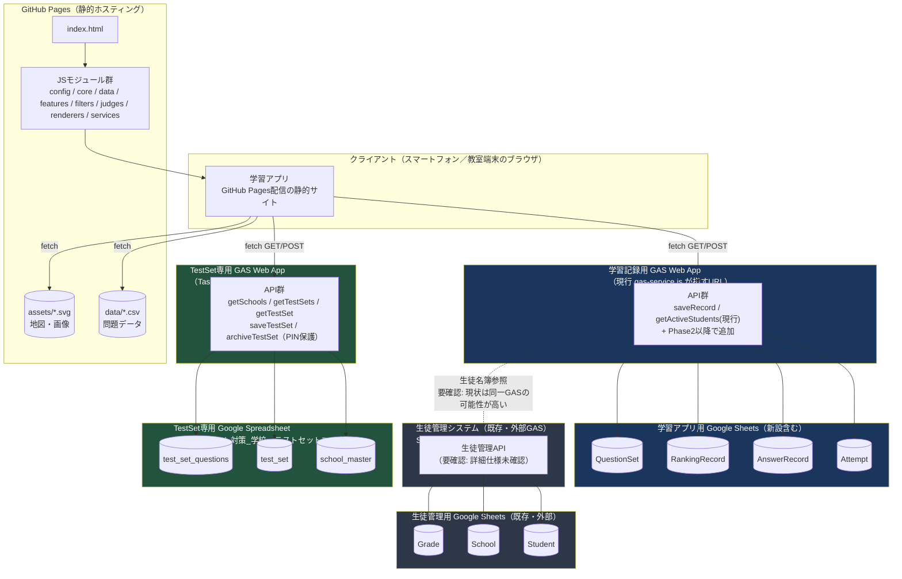
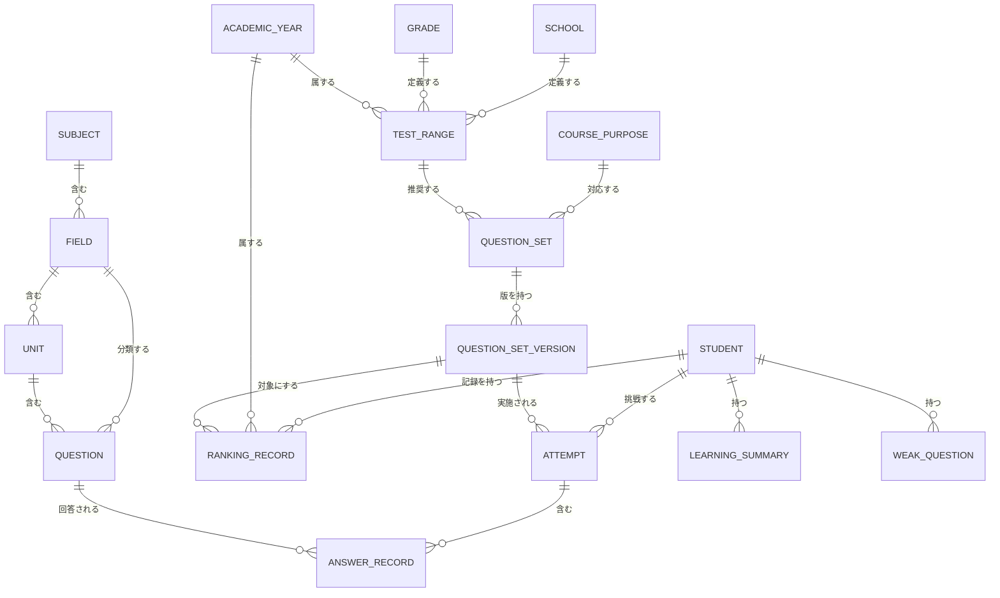
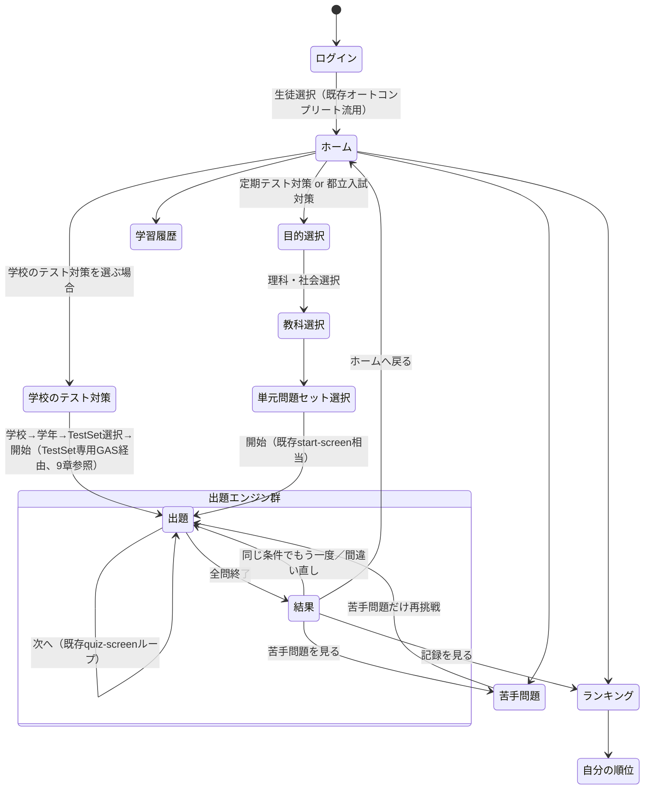

# LS総合テスト対策 システム設計書 Ver.1

- 作成日: 2026-08-03
- フェーズ: Phase1（システム設計）
- 前提ドキュメント: `docs/analysis/current-system-analysis.md`（Phase0現状分析）、`docs/analysis/phase0-review.md`（Phase0レビュー）
- 本設計書の制約: **コード・CSV・SVG・GAS関連ファイルの修正、リファクタリング、削除、移動、命名変更、Git初期化は一切行っていません**。本ドキュメント作成のみを実施しています。
- 詳細分離ドキュメント:
  - `docs/specification/domain-model-v1.md`（ドメインモデル全体・ER図・識別子設計の詳細）
  - `docs/specification/data-schema-v1.md`（CSV列設計の詳細・後方互換性方針）
  - `docs/specification/gas-api-contract-v1.md`（GAS API契約の詳細）
  - `docs/specification/ranking-spec-v1.md`（ランキングのデータ構造・更新フロー詳細）

### 表記ルール

本設計書の各設計判断には、以下のいずれかのラベルを付けます。

| ラベル | 意味 |
|---|---|
| **確定** | 現時点の情報だけで決定してよい設計判断 |
| **仮決定** | 本設計書内で暫定的に決めるが、実装時・運用開始後に見直す前提のもの（数値・閾値・命名細部など） |
| **要確認** | 外部システム（生徒管理GAS、Google Sheets）の実際の仕様を確認しないと確定できない事項 |

---

## 0. 既存設計の尊重方針（再確認）

Phase0で確認された以下の責務分離は、本設計でも**維持**します（**確定**）。

```
config / core / data / filters / judges / renderers / services
```

加えて、ユーザー指定の維持対象リストには現行コードに存在しない `features` が含まれています。これは今回の設計で**新設する拡張ポイント**として位置づけます（1.2節で詳細）。全面再設計・フレームワーク置き換えは行いません。

---

## 1. 全体アーキテクチャ

### 1.1 システム構成図



### 1.2 責務と境界

| コンポーネント | 責務 | 境界（やらないこと） |
|---|---|---|
| GitHub Pages | 静的ファイル（HTML/JS/CSS/CSV/SVG）の配信のみ | サーバーサイド処理・秘密情報の保持はしない |
| 学習アプリJS（`config/core/data/features/filters/judges/renderers/services`） | 出題・採点・UI制御・GAS呼び出し | 生徒マスタの正本を持たない、認証ロジックの正本を持たない |
| 学習記録用GAS | 学習アプリ固有データ（Attempt/AnswerRecord/RankingRecord/QuestionSet）の永続化・集計 | 生徒マスタ（氏名・学校・学年・在籍）の正本を持たない、TestSetは持たない（Task50で分離） |
| TestSet専用GAS（Task50新設） | 学校マスタ（`school_master`）・TestSet（`test_set`/`test_set_questions`）の永続化 | 生徒マスタ・学習記録・ランキングは持たない。学習記録用GASとは別プロジェクト |
| 生徒管理システム（外部GAS・既存） | 生徒ID・氏名・学校・学年・在籍状態・ログイン情報のSingle Source of Truth | 学習履歴・問題別成績・ランキングは持たない（学習アプリ側の責務） |

**重要な観察（事実・要確認）**: 現行コード（`services/gas-service.js`, `services/student-service.js`）を読むと、`loadActiveStudents`（生徒一覧取得）と`saveAnswerRecord`（解答保存）は**同一の`GAS_WEB_APP_URL`定数**に対して呼ばれています。つまり現状は「生徒管理」と「学習記録の保存」が物理的に同一のGAS Web Appを共有している可能性が高いという事実がコードから読み取れます。一方でユーザー要件では「生徒管理システムは別のGASで既に運用している」とあり、これは以下のいずれかを意味します。

1. 生徒管理と学習記録が実際に同一GASプロジェクト内に同居しており、将来分離するかどうかの判断が必要
2. この学習アプリ用GASが、内部で生徒管理システムのAPIを呼び出す中継役（プロキシ）になっている
3. 生徒管理システムのGASが、学習記録の保存機能も現状は肩代わりしている

**要確認**: 外部GAS（Apps Scriptエディタ）のソースコードを確認しない限り、上記のどれが実態か断定できません。この確認結果によって「新規GAS APIをどちらのGASプロジェクトに追加するか」という設計判断（7章）が変わるため、**Phase2着手前に確認することを強く推奨**します。

### 1.3 `features/` フォルダの新設方針（確定）

現行コードには存在しませんが、本設計書の指示に基づき新設します。既存の`renderers/`（出題形式ごとの描画）・`services/`（外部通信）とは目的が異なる、**横断的な新機能**をここに集約します。

```
features/
├── weak-questions/      … 苦手問題判定ロジック（Phase5）
├── ranking/            … ランキング取得・表示ロジック（Phase7、Task51.5でPhase6から変更）
├── timer/               … タイマー・ペナルティ計算（Phase7、スピードランと統合）
├── test-set/            … TestSet（学校テスト対策セット）の解決ロジック（Phase4、Task47でtest-range/から変更）
└── teacher-distribution/ … 先生配信問題の拡張ポイント（Phase9、雛形のみ）
```

**設計判断**

| 項目 | 内容 |
|---|---|
| 選択肢 | (A) 既存`core/`に機能追加を続ける／(B) 新設`features/`に分離／(C) `renderers/`配下にまとめる |
| 比較 | (A)は`core/`が肥大化し続け責務が曖昧になる。(C)は「描画」という既存の`renderers/`の意味と、ランキング計算等の「ロジック」が混在し責務が濁る |
| 推奨案 | (B) `features/`を新設し、機能単位（縦割り）でサブフォルダを持つ |
| 推奨理由 | `core/`は「出題エンジンそのもの」、`renderers/`は「出題形式の描画」という既存の意味を保ったまま、新機能を独立させられる。1機能=1フォルダの原則が既存の「1ファイル1責務」思想と一貫する |
| デメリット | フォルダが1つ増えるため、初見の開発者が「core/とfeatures/の境界」を最初は理解しにくい可能性がある（本設計書とCLAUDE.md等での説明が必要） |
| 将来変更の影響 | 各`features/*`配下は他の`features/*`と依存しない設計にしておけば、後から任意の機能だけを削除・入れ替えても影響範囲が閉じる |

---

## 2. ドメインモデル（要約）

詳細な属性表・ER図・更新主体は `docs/specification/domain-model-v1.md` を参照してください。ここでは全体像のみ示します。



**Studentは学習アプリ側で新規テーブルを持ちません**（studentIdのみを外部キーとして各記録に持たせる）。School・Gradeも同様に生徒管理システム側が正本であり、学習アプリ側はIDのみを参照します（**確定**）。

---

## 3. 識別子設計（要約）

詳細な全キー一覧・旧キーとの対応表は `docs/specification/domain-model-v1.md` の「識別子設計」章を参照してください。ここでは最重要判断のみ示します。

### 3.1 基本方針（確定）

- 表示名（日本語）を内部キーとして直接使わない。ただし**既存CSVの`unit`列は当面の例外**とする（3.3参照）。
- 既存の科目キー（`japan_geo` / `world_geo` / `history`）は**変更しない**（そのまま`fieldId`として再定義して流用する）。CSVの`subject`列の値を書き換える移行作業は発生しません。

### 3.2 config/modes.jsのキー不整合（確定バグ#1）の直し方

Phase0で確定した「`MODE_FILTER_OPTIONS`のキーが`geography`/`history`で、実際の科目キー`japan_geo`/`world_geo`/`history`と一致しない」というバグは、以下の**2段階**で解消します。

| 段階 | 内容 | 実施フェーズ |
|---|---|---|
| 第1段階（最小修正） | `MODE_FILTER_OPTIONS`のキーを`geography`から`japan_geo`・`world_geo`の2エントリへ分割し、既存の科目キーへ直接合わせる。CSV変更は不要、`config/modes.js`1ファイルの修正のみ | Phase1.5（安定化） |
| 第2段階（恒久設計） | 理科・公民などの新科目追加に備え、`fieldId`ごとに`modeGroup`（出題形式カテゴリ）を明示的に持たせる`config/fields.js`相当のマスタを新設し、`MODE_FILTER_OPTIONS`を`modeGroup`単位で定義し直す | Phase3（理科・社会統合） |

**設計イメージ（疑似コード、実装ではなく設計意図の説明用）**

```
// Phase3以降のイメージ（config/fields.js 相当）
FIELDS = {
  japan_geo:      { subjectId: 'social',  modeGroup: 'geo' },
  world_geo:      { subjectId: 'social',  modeGroup: 'geo' },
  history:        { subjectId: 'social',  modeGroup: 'history' },
  civics:         { subjectId: 'social',  modeGroup: 'text_choice' },
  biology:        { subjectId: 'science', modeGroup: 'text_choice' },
  chemistry:      { subjectId: 'science', modeGroup: 'text_choice' },
  physics:        { subjectId: 'science', modeGroup: 'text_choice' },
  earth_science:  { subjectId: 'science', modeGroup: 'geo' }
}
```

### 3.3 単元（Unit）キーの扱い（仮決定）

現状、`unit`列は日本語の単元名がそのまま値・表示名・フィルタキーを兼ねています。これは「表示名を内部キーに使わない」という原則の例外ですが、以下の理由から**当面は変更しません**。

- 既存の`normalizeValue`（空白除去・小文字化等）による緩やかな正規化が既に機能しており、実害となる表記ゆれは現状確認されていない
- 単元IDをマスタ化すると、CSV全行に新しい列を追加する大規模変更が必要になり「既存CSVを一度に全面変更しない」という方針に反する

**将来変更する場合の影響**: 表記ゆれによる実害（同じ単元が別々のフィルタ値として分裂する等）が実際に発生した場合にのみ、`unitId`マスタ化を再検討します。その場合も、CSVには`unitId`列を**追加**するだけで済み、既存の`unit`列（表示名）は残せる設計にしておくことを推奨します。

### 3.4 新規に確定させる識別子（一覧）

| 識別子 | 形式（仮決定） | 発行者 | 備考 |
|---|---|---|---|
| `subjectId` | `social` / `science` | 開発者（config） | Phase3で導入 |
| `coursePurposeId` | `regular_exam` / `entrance_exam` | 開発者（config） | Phase2で導入 |
| `questionSetId` | `<fieldId>__<coursePurposeId>__<slug>` 例: `japan_geo__regular_exam__prefecture_all` | 開発者 | Phase2で導入 |
| `questionSetVersion` | 整数、1始まり | 開発者/問題管理者 | 構成変更時にインクリメント |
| `schoolId` | **要確認**（生徒管理システムの採番方式に合わせる） | 生徒管理システム | 独自採番は行わない |
| `gradeId` | **要確認**（同上、現状`grade`が自由文字列かコード化済みか未確認） | 生徒管理システム | 同上 |
| `attemptId` | クライアント生成、`crypto.randomUUID()`推奨、非対応環境向けフォールバックあり | 学習アプリ（クライアント） | Attempt開始時に発行 |
| `academicYearId` | `AY<開始暦年>` 例: `AY2026`（4月始まり） | 開発者（算出ロジック） | 実体マスタを持たず算出のみで足りる可能性あり |

---

## 4. 問題データ設計（要約）

詳細な列一覧・初期必須/後回し/別マスタの仕分け表は `docs/specification/data-schema-v1.md` を参照してください。

### 4.1 方針（確定）

- 現在の「CSV見出し行あり・`core/question-loader.js`が汎用パースする」方式を維持する。列番号のハードコードは行わない。
- 既存3CSV（`japan_geo_questions.csv` / `world_geo_questions.csv` / `history_questions.csv`）は**列を維持したまま**とし、新規列は「末尾に追加していく」形で後方互換を保つ（`question-normalizer.js`は未知列があっても`{...question}`のスプレッドで壊れない設計になっているため、列追加は安全）。
- 理科用CSVは既存スキーマをベースに新規ファイルとして追加する（既存3ファイルに理科の行を混在させない）。

### 4.2 列の追加時期の仕分け（詳細はdata-schema-v1.md）

| 区分 | 該当列（例） |
|---|---|
| 初期段階で必須（既存のまま） | `questionId`, `subject`(=fieldId), `unit`, `mode`, `question`, `answer`, `status` |
| 後から追加（CSV列を増やす） | `questionSetId`（所属問題セット）, `timerSeconds`（問題単位の制限時間） |
| CSVではなく別マスタで管理 | `QuestionSet`定義、`TestSet`/`TestSetQuestion`（TestSet専用GAS/Spreadsheet、Task50確定）、`RankingRecord` |
| GASまたはSheetsで管理 | `Attempt`, `AnswerRecord`, `LearningSummary`, `WeakQuestion` |

### 4.3 画像要素の付加方針（確定、Task51.5）

画像問題を独立した新しい出題mode（例:「image」）として新設することは基本方針としない。画像は「問題形式」ではなく、**既存の出題mode（`choice`/`sort`/`text`等）に付加できる表示要素**として設計する。

- 既に`choice`モードでは`imagePath`列（Task32-36で実装済み、理科4分野40問）により画像付加が実現しており、この既存パターンを踏襲する。
- 将来的に`sort`（並び替え問題）や`text`へ画像を付加する場合も、新しいmode種別を追加するのではなく、既存modeへ`imagePath`相当の列・表示要素を拡張する形で実現する（`QUESTION_MODE_HANDLERS`のテーブル駆動構造は変更しない）。
- **`map_click`は例外**：画像・SVG上の位置を直接タップして判定する独立した操作形式であり、単に画像を表示するだけの付加要素とは性質が異なるため、既存の独立モードとして維持する。画像付加の一般方針の対象外とする。
- 上記のうち`sort`・`text`への画像付加、および画像付加問題の大規模な追加自体は**現時点では未実装**。将来拡張の方針を確定したのみであり、実装はPhase5（想起ファーストUXと合わせて）またはPhase6着手前を目安とする（16章ロードマップ参照）。

---

## 5. statusライフサイクル

### 5.1 選択肢と比較

| 選択肢 | 内容 |
|---|---|
| A | 現状候補5値（active/hidden/inactive/draft/archived）をすべて採用 |
| B | `hidden`と`inactive`を統合し4値（active/hidden/draft/archived）に絞る |
| C | 最小2値（active/inactive）のみ |

| 観点 | A（5値） | B（4値） | C（2値） |
|---|---|---|---|
| 表現力 | 高い | 十分 | 不足（下書き・恒久終了の区別ができない） |
| 現場運用の分かりやすさ | 低い（`hidden`と`inactive`の使い分けが曖昧になりやすい＝現に確定バグ#4の原因） | 高い | 高いが機能不足 |
| 既存バグとの整合 | 同じ混乱を残す | バグの根本原因（意味の重複）を解消する | 該当バグは解消するが「下書き」を別途表現できない |

### 5.2 推奨案（確定）

**B（4値: `draft` / `active` / `hidden` / `archived`）を採用し、`inactive`は廃止する。**

**推奨理由**: 確定バグ#4（`status: hidden`が除外されない）は、`hidden`と`inactive`という**意味的に重複した2つの値**が存在し、コードが片方（`inactive`）しか判定していなかったことが原因です。値を1つに統合すれば、この種のバグのクラス自体を構造的に防げます。また現行データを`awk`で全数調査した結果、実データで`inactive`は1件も使われておらず（Phase0レビュー参照）、`hidden`のみが実際に使われているため、`inactive`を廃止しても既存データへの影響はありません。

**デメリット**: 「一時的に隠す」と「恒久的に終了する」を両方`hidden`+`archived`で表現する場合、`hidden`と`archived`の使い分けを問題作成者に周知する必要がある（運用ドキュメントの整備が必要）。

**将来変更する場合の影響**: 値を増やす方向の変更（例: `review_pending`を追加）は後方互換的（既存値の意味は変わらない）だが、統合した`inactive`を復活させる場合は、当時の`hidden`データのどれが元々「非表示」でどれが「廃止」だったかが区別できなくなっている点に注意。

### 5.3 各値の定義

| status | 生徒への出題可否 | 管理画面等での表示可否 | ランキングへの影響 | 過去履歴からの参照可否 | 物理削除との違い |
|---|---|---|---|---|---|
| `draft` | 不可 | 可（下書きとして表示） | 新規記録は発生しない（出題されないため） | 該当なし（出題実績がない前提） | 削除ではなく未公開なだけ。誤公開防止の状態 |
| `active` | 可 | 可 | 可（新規記録される） | 可 | - |
| `hidden` | 不可 | 可（「非表示」バッジ付きで一覧表示） | 新規記録は停止するが、既存記録は保持 | 可（`active`だった間の履歴はそのまま参照可能） | 削除ではなく一時停止。復帰可能 |
| `archived` | 不可 | 可（「アーカイブ」バッジ、通常一覧では既定で非表示） | 新規記録は停止するが、既存記録は保持 | 可（必須。ランキングの正当性維持のため過去記録を残す） | 削除ではなく恒久的な運用終了。物理削除はしない |

**物理削除との違い（確定方針）**: AnswerRecord・RankingRecordが1件でも紐づく問題は、データ整合性のため**原則として物理削除しない**。CSVから行ごと消したい場合でも、まず`archived`にしてから、外部キー的な参照が本当に無いことを確認した上で削除する運用とする。

### 5.4 判定ロジックの設計方針（確定・実装はPhase1.5）

現行の除外条件`status !== "inactive"`（ブラックリスト方式）を、`status === "active"`（ホワイトリスト方式）に変更する。未知のstatus値が将来追加されても「出題しない」側に安全に倒れるため、確定バグ#4と同じ種類の不整合の再発を防げる。

---

## 6. CSV・コード・SVG整合性保証の設計

Phase0で発見した確定バグ4件のうち3件（#1中東mapId, #3 hidden除外, #4 豪州svgAreaId）は、いずれも「CSVの値とコード側マスタ（`MAP_CONFIGS`・SVGのid・`MODE_FILTER_OPTIONS`）が食い違っても実行時に気づけない」という共通の弱点から生じています。これを構造的に防ぐ検査の仕組みを設計します。

### 6.1 検査ルール一覧

| ルール | 重大度 | 実行タイミング |
|---|---|---|
| `mode`が有効な出題形式か | Critical | 開発時 + 実行時軽量 |
| `status`が許可値（5.3の4値）か | Critical | 開発時 + 実行時軽量 |
| `questionId`の重複が無いか | Critical | 開発時 + 実行時軽量 |
| mode別の必須列が充足しているか | Critical | 開発時 |
| `subject`（fieldId）がマスタに存在するか | Critical | 開発時 + 実行時軽量 |
| `mapId`が`MAP_CONFIGS`のキーに存在するか | Critical | 開発時（SVGフェッチ不要、config照合のみ） |
| `svgAreaId`/`svgAreaIds`が対象SVG内に実在するか | High | 開発時のみ（SVG解析が重いため） |
| `questionSetId`・`questionSetVersion`の妥当性 | Medium | 開発時（Phase2でQuestionSet導入後） |

### 6.2 実行タイミングの設計判断

| 選択肢 | 内容 |
|---|---|
| A | ブラウザ実行時に毎回フルチェック（起動のたびに全SVGをフェッチしてid照合） |
| B | 開発時のみNode.jsスクリプトでフルチェック、実行時は軽量チェックのみ |
| C | 検査自体を作らず、目視レビューのみに頼る |

| 観点 | A | B | C |
|---|---|---|---|
| 生徒の体感速度 | 悪化する（毎回全SVGフェッチは重い） | 影響なし | 影響なし |
| 不整合の再発防止力 | 高いが実装コストと実行コストが釣り合わない | 高い（コミット前に必ず検出できる） | 低い（今回のバグがまさにこれで見逃された） |
| 導入コスト（現状ビルドツール無し） | 中 | 低〜中（Node.js単体スクリプトで実現可能） | ゼロだが効果もゼロ |

**推奨案（確定）**: **B**。ブラウザ実行時は「モード有効性」「status許可値」「questionId重複」「subject存在」の軽量チェックのみ`console.warn`で警告する程度に留め、SVG解析を伴う重い検査は開発時のみのNode.jsスクリプトに任せる。

**推奨理由**: 生徒が使う本番画面の速度を犠牲にせず、かつ問題データを追加・変更するたびに機械的な検証ができる。現状`package.json`もビルドツールも無いが、Node.jsの`.mjs`ファイル1本（`type:"module"`不要、拡張子で判定される）で実現でき、既存の`core/question-loader.js`・`core/question-normalizer.js`をそのままNode側からimportして再利用できるため「CSV列番号を無秩序に直接記述する」ことを避けられる。

**デメリット**: 開発者がスクリプトの実行を忘れると、不整合が本番に混入する可能性が残る（Git導入後はコミット前フックやCI（GitHub Actions）での自動化が望ましいが、それはGit導入＝最優先課題#5の後になる）。

**将来変更する場合の影響**: Git導入後、同じスクリプトをGitHub Actionsのワークフローから呼び出すだけでCI化できる。スクリプト自体の設計変更は不要。

### 6.3 段階的導入案

| 段階 | 内容 | 前提 |
|---|---|---|
| 1 | `scripts/validate-questions.mjs`（仮称）をリポジトリに追加し、開発者が手動で`node scripts/validate-questions.mjs`を実行する運用から開始 | Node.jsがローカルにあればよい。package.json新設は最小限（無くても`.mjs`単体で動作可能） |
| 2 | Git導入後、pre-commitフックまたはGitHub Actionsに同スクリプトを組み込み、CSV変更時に自動実行する | Git導入（最優先課題#5）完了後 |

---

## 7. GAS API設計（要約）

詳細な契約（リクエスト/レスポンス/エラー/冪等性/認証/移行方法）は `docs/specification/gas-api-contract-v1.md` を参照してください。ここでは全体方針とAPI一覧のみ示します。

### 7.1 方針（確定）

- 既存の2API（`getActiveStudents`, `saveRecord`）は**置き換えず維持**し、必要なフィールドを後方互換的に追加していく。
- 新規APIは「論理契約」として設計するのみで、具体的なGASコードは書かない（実装はPhase2以降、各Phaseで対応するAPIのみ着手）。
- 1章で述べた「学習記録用GASと生徒管理GASが同一の可能性がある」点が未確認のため、新規APIをどちらのGASプロジェクトに追加すべきかは**要確認**として残す。

### 7.2 API一覧（詳細はgas-api-contract-v1.md）

| # | API（案） | 目的 | 対応フェーズ | 既存との関係 |
|---|---|---|---|---|
| 1 | `getActiveStudents`（既存） | 生徒一覧取得 | 現行 | 維持 |
| 2 | `saveRecord`（既存） | 解答保存 | 現行 | 維持しつつ段階拡張 |
| 3 | 生徒認証/本人確認 | ログイン強化 | 要検討（**要確認**: 現状の認証相当機能の有無） | 新規 |
| 4 | 生徒プロフィール取得（学校・学年） | ~~学校別テスト範囲の解決に必要~~ **Task47で不採用**（studentIdから学校・学年を自動判定しない方式へ変更したため不要） | Phase4 | 不採用 |
| 5 | `startAttempt` | 挑戦開始の記録・attemptId発行 | Phase2 | 新規 |
| 6 | `completeAttempt` | 挑戦完了・ランキング反映 | Phase2/Phase7 | 新規 |
| 7 | `getWeakQuestions` | 苦手問題取得 | Phase5 | 新規 |
| 8 | `getLearningSummary` | 学習サマリー取得 | Phase5 | 新規 |
| 9 | `getSchools`/`getTestSets`/`getTestSet`/`saveTestSet`/`archiveTestSet` | 学校別TestSetの取得・作成・更新（詳細は`gas-api-contract-v1.md` 9章） | Phase4 | 新規。**Task50確定：上記1-8・10-12とは別のTestSet専用GAS Web Appに実装する（既存/学習記録用GASへは追加しない）** |
| 10 | `getAnnualRanking` | 年度ランキング取得 | Phase7 | 新規（Task51.5でPhase6から変更） |
| 11 | `getAllTimeRanking` | 歴代ランキング取得 | Phase7 | 新規（Task51.5でPhase6から変更） |
| 12 | `upsertBestRecord` | ベスト記録更新（冪等） | Phase7 | 新規（Task51.5でPhase6から変更） |

---

## 8. 学習履歴の送信方式

### 8.1 選択肢

| 選択肢 | 内容 |
|---|---|
| A | 都度送信（現行方式。1問ごとにfire-and-forgetでPOST） |
| B | まとめ送信（ローカルに貯め、Attempt完了時に1回だけ送信） |
| C | ハイブリッド（都度送信を試み、失敗分だけローカルに一時保存し完了時・次回起動時に再送） |

### 8.2 比較

| 観点 | A（都度） | B（まとめ） | C（ハイブリッド） |
|---|---|---|---|
| スマホ回線切断への強さ | 中（切断中の1問だけ失われる） | 弱（完了時にまとめて失敗すると全問失う） | 強（失敗分だけ再送すればよい） |
| GAS呼び出し回数 | 多い（問題数分） | 少ない（1回） | 通常はAと同程度、失敗時のみ増加 |
| 保存漏れ | 現状すでに発生しうる（確定バグではないが中優先度の既知課題） | 送信自体の成否は分かりやすいが全滅リスクあり | 最も少ない |
| 操作テンポ | 良い | 良い | 良い |
| 重複送信 | 基本発生しない | 再送時に発生しうる | 発生しうる（冪等性設計が必要） |
| 後からの分析 | 問題ごとの正確なタイムスタンプが残る | クライアント側でタイムスタンプを別管理する必要がある | Aと同等の精度を維持できる |
| 実装の複雑さ | 低い（現状のまま） | 中 | 高い（ローカルキュー・冪等性設計が必要） |

### 8.3 推奨案（確定方針＋仮決定の範囲を明示）

**将来目標としてC（ハイブリッド）を採用する。ただしPhase2では「A＋失敗時のUIフィードバック＋最小限の再送キュー」から段階的に導入し、完全なオフライン耐性はPhase2以降に順次拡張する（仮決定: 導入順序）。**

**推奨理由**: 主な利用場所は教室内だが、生徒個人のスマートフォンからの利用も要件に含まれており、モバイル回線切断は現実的なリスクです。学習履歴は苦手問題・ランキングなど複数の将来機能の基盤になるため、保存漏れの最小化は優先度が高い一方、一度に完全な仕組みを作るとテスト容易性（現状55点）がさらに悪化するリスクがあるため、段階導入とします。

**デメリット**: 冪等性（同じ回答を2回送っても記録が重複しない）を担保するには、`attemptId + questionId`をサーバ側で一意キーとして扱う必要があり、これはGAS側の実装変更が前提になります。**要確認**: 現行GASにその仕組みがあるか、または新規実装が必要か。

**将来変更する場合の影響**: 完全にBへ寄せる場合、通信回数は減るが「全滅リスク」という最大の弱点が残るため、基本方針としてCの方向性（ローカル一時保存を併用する）を維持することを推奨します。

---

## 9. 学校別テスト範囲

**本章はTask47（2026-08-13）でTestSet方式へ全面改訂した。旧方式（studentIdからschoolId/gradeIdを自動判定し、TestRangeマスタでunit/subunit条件から動的に問題を抽出する方式）は不採用とし、講師が問題マスターから問題を選定してTestSetとして保存し、生徒が学校・学年・TestSetを自ら選択して実行する方式に変更した。**

### 9.1 基本方針（確定）

学校別テスト範囲の絞り込みは、生徒管理システムとの自動連携に依存しない。理由は主に3点。

1. **現場運用への適合**: 講師が学校からテスト範囲表を受け取り、口頭で生徒へ「○○中→中2→前期期末理科をやって」と指示する運用が実態であり、生徒の所属校をアプリが自動判定する必要性が薄い。
2. **個人情報リスクの回避**: `studentId`と実在の学校名・学年を恒久的に紐付けて公開GitHub Pages上へ配信することは、生徒が未成年であることを踏まえると避けるべきリスクと判断した（Task47での再評価）。
3. **未確定な外部依存の排除**: 生徒管理システムが本番GASと同一プロジェクトかどうか、`schoolId`をレスポンスに含められるかは未確認のまま（1.2節）であり、Phase4をこれに依存させると着手できない。

### 9.2 役割分担（確定）

```
講師：問題マスターから問題を選定 → TestSet（questionId固定集合）として保存
生徒：学校 → 学年 → 提示されたTestSetを選択 → 実行
```

- **TestSet**：講師が作成・保存する「学校テスト対策用の固定問題集合」。属性は`docs/specification/domain-model-v1.md`を参照。作成時点のquestionId集合で固定し、問題マスターへ後から問題が追加されても既存TestSetへは自動反映しない（講師の明示編集でのみ更新）。
- **unit/subunit**：永続的な絞り込み条件（旧`TestRange`）としては保存しない。講師がTestSet作成時に候補問題を探すための一時的なフィルタとしてのみ使用し、最終的な出題対象の正本は選定されたquestionIdの集合とする。
- **studentId**：学校・学年の自動判定には使用しない。Attempt/AnswerRecordなど学習記録の主体識別としての用途は従来どおり維持する。

### 9.3 学校マスタ（確定）

学校名の表記ゆれ対策として、学校名の文字列をキーに使わず、LS総合テスト対策が独自に発行する`schoolId`を使う。生徒管理システムへの接続・API拡張は行わない。`school_master`（schoolId/schoolName/active）は9.6節のTestSet専用Google Spreadsheetへ置く。

### 9.4 未設定時のフォールバック（確定）

該当する学校・学年に対応するTestSetが存在しない場合は、通常学習（TestSetを使わない従来の科目・単元選択フロー）を継続利用できる。TestSet取得に失敗した場合も同様に、通常学習には一切影響しない（9.7節参照）。

### 9.5 保存・取得方式（確定、Task50）

**問題マスターとTestSetは異なるデータフローを持つ。両者を混同しない。**

```
【問題マスター（既存運用を維持）】
Google Sheets → CSV → GitHub → GitHub Pages → LSアプリ

【TestSet（Task50で新規確定）】
講師用UI → TestSet専用GAS Web App → TestSet専用Google Spreadsheet
生徒用UI ← TestSet専用GAS Web App ← TestSet専用Google Spreadsheet
```

TestSetはGitへのcommit/pushを介さず、講師の保存操作がGAS経由で即座にGoogle Sheetsへ反映され、生徒側もその場で取得できる。理由は、問題マスターのCSV+Git+Push方式では「今日聞いたテスト範囲を今日中に生徒へ提示したい」という現場の即時性要件を満たせないため（Task49比較評価）。

問題本文（`question`/`answer`/`choices`/`explanation`等）はTestSet GASからは一切返さない。TestSetが保持・返却するのは`fieldId`と`questionId`の組のみであり、問題本文の正本は引き続き既存GitHub Pages側の問題CSVとする。

### 9.6 責務分離（確定、Task50）

既存GAS（`services/gas-service.js`の`GAS_WEB_APP_URL`）と、TestSet専用GASは**完全に分離する**。既存GASへTestSet関連のactionを追加しない。

| | 既存GAS | TestSet専用GAS（新設） |
|---|---|---|
| 責務 | active生徒一覧取得、解答履歴保存 | 学校一覧、TestSet一覧・詳細取得、TestSet作成・更新・archive |
| Spreadsheet | 既存（構造未確認、1.2節） | 「LS総合テスト対策_学校・テストセットマスター」（`school_master`/`test_set`/`test_set_questions`の3タブ） |
| 変更方針 | 変更しない | **Task52で構築完了** |

理由：既存GASの実体（同一プロジェクトか、管理者は誰か）が未確認のまま（1.2節）本番稼働中のスクリプトへ手を加えることは、「①既存機能を壊さない」という最優先原則に対するリスクを不必要に増やす。新設により責務分離・障害分離の両方を得られる（詳細はTask50報告）。

**構築状況（Task52、2026-08-15完了）**: TestSet専用Spreadsheet・GAS Web App（container-bound、Execute as: Me、Who has access: Anyone）を実際に構築し、`school_master`へ実データ1校（`SC001`）を登録済み。`getSchools`/`getTestSets`/`getTestSet`/`saveTestSet`（新規・更新）/`archiveTestSet`の5APIすべてを実環境でAPI単体疎通確認済み（不正PINでの書き込み拒否、archived TestSetの一覧除外・直接取得可否も確認済み）。疎通確認用TestSet（`TS001`）は削除せず`archived`状態のまま記録として保持している。講師PIN実値はrepositoryへ記載しない（Task52・53とも変更なし）。

**LSアプリ本体接続状況（Task53、2026-08-15完了）**: 講師用問題選定UI（`teacher-screen`）をLSアプリへ実装し接続した。**GAS Web App URLの扱いをここで確定：URL自体はブラウザから常に見える公開情報であり秘密情報ではないため、既存`GAS_WEB_APP_URL`（`services/gas-service.js`）と同じ扱いで`config/test-set-gas-config.js`へ実値をrepositoryへ保持する方針へ変更した（Task50-52時点の「URL非記載」は暫定方針であり、Task53で正式に確定）。講師PINは引き続きrepository・コード・docsのどこにも保持せず、講師がteacher-screenでその場入力した値のみをメモリ上に保持してAPIへ送信する。** 生徒用UI・TestSet→QuestionSet/Attempt連携はTask54以降で実施する。

### 9.7 GAS障害時のフォールバック（確定、Task50）

TestSet専用GASが応答しない場合でも、通常学習（従来の科目・単元選択フロー）・苦手復習等の既存機能には一切影響させない。「学校のテスト対策」機能のみが利用不可になる。

### 9.8 複数教科（fieldId）を横断するTestSetの実行方式（確定、Task50）

1つのTestSetは複数`fieldId`のquestionIdを保持できる（例:「前期期末 理科」が`physics`/`chemistry`/`earth_science`を横断）。ただし実行時は、既存の出題実行フロー（`core/quiz-controller.js`の`state.session.subject`、`features/question-set/question-set-model.js`の単一`fieldId`必須制約）を変更しない。TestSetを`fieldId`単位に分割し、既存のQuestionSet/Attempt生成の仕組みをそのまま複数回呼び出して連続実行する方式を採用する（生徒からは1つのTestSetとして見える）。この方式を選んだ理由は、Attempt/History/Ranking等が依存する既存QuestionSetモデルへ手を入れずに実現できるため（案の比較はTask50報告参照）。

### 9.9 講師書き込みAPIの保護（確定、Task50）

TestSet作成・更新・archiveの各APIは共有PIN（合言葉）を要求する。PINは公開されるGitHub Pages側のJavaScriptには一切含めず、GAS側の`PropertiesService`（Script Properties）にのみ保存する。読み取り系API（学校一覧・TestSet一覧・詳細）は個人情報を含まないため認証不要とする。詳細仕様は`docs/specification/gas-api-contract-v1.md`を参照。

---

## 10. 苦手問題・おすすめ問題（初期ルールベース案）

### 10.1 初期判定ルール（仮決定・数値はすべて暫定値）

以下のいずれか1条件を満たせば「苦手問題」候補としてマークする。該当条件数をそのまま優先度スコアとする単純な加算方式とする。

| 条件 | 暫定閾値 |
|---|---|
| A: 直近の解答が不正解 | 直近1回 |
| B: 低正答率 | 累計出題5回以上かつ正答率50%未満 |
| C: 累積誤答回数が多い | 誤答回数3回以上 |

「一定期間未出題」の問題は苦手問題とは別枠の**「復習推奨（久しぶり）」**として分離する（暫定閾値: 最終出題から30日以上）。平均回答時間は初期ルールには含めない（仮決定: 複雑化を避けるため、時間データが十分蓄積されるPhase7以降に再検討）。

### 10.2 将来の推薦ロジック交換に備えた構造（確定）

苦手問題判定は`features/weak-questions/`配下に、**入力=生徒の解答履歴配列、出力=問題ごとのスコア**という単一のシグネチャを持つ関数として実装する。既存の`MAP_RENDERERS`（地図描画の戦略パターン）・`QUESTION_MODE_HANDLERS`（出題形式ディスパッチ）と同じ「差し替え可能なテーブル駆動」の思想を踏襲し、将来ルールベースからAI推薦へ移行する場合も、この関数の中身だけを差し替えられるようにする。

### 10.3 想起状態と復習対象の関係（確定、Task51.5）

13.3節で定義する「想起ファーストUX」により、通常学習では**「思い出せた／わからない」という想起状態**と、**「正解／不正解」という正誤結果**を別概念として扱う。理論上は以下の4パターンが存在する。

| 想起状態 | 正誤 | 復習対象 |
|---|---|---|
| 思い出せた | 正解 | 対象外 |
| 思い出せた | 不正解 | 対象 |
| わからない | 正解 | **対象**（選択肢を見て正解しても「完全にできた問題」とは扱わない） |
| わからない | 不正解 | 対象 |

つまり通常学習終了後の復習対象は、原則として「不正解だった問題」**OR**「選択肢表示前に『わからない』を押した問題」とする。既存の「間違えた問題をもう一度」機能（`state.session.retryWrongEnabled`等）を壊さず、この条件を後から追加できる構造にする。

**注記（実装スコープ）**: 想起状態（`recallStatus`相当）を`AnswerRecord`等の既存データモデルへ追加するかどうかは、Task51.5では確定しない。既存schema・GAS保存形式・後方互換性を後続の実装Taskで確認したうえで、フィールド名を含めて最小変更で追加する（19章「未確認事項」に追記）。

---

## 11. ランキング（要約）

詳細なデータ構造・更新フロー図は `docs/specification/ranking-spec-v1.md` を参照してください。ここでは要点のみ示します。

| 論点 | 結論 |
|---|---|
| 完了判定 | Attemptが問題セットの全問終了し結果画面へ到達した場合のみ`completed=true`。途中で開始画面へ戻った場合は対象外（採用済み仕様どおり） |
| ベスト記録の更新条件 | 生徒×questionSetId×questionSetVersionごとに、(1)正答率が高い方 (2)同率ならペナルティ込みタイムが短い方、を新ベストとして上書き |
| 正答率の比較方法 | パーセント丸め誤差を避けるため、分数（正解数/問題数）または高精度小数のまま比較 |
| 年度ランキングと歴代ランキングの違い | 年度ランキングは`academicYearId`でフィルタしたベストの集計ビュー。歴代ランキングは全年度を跨いだ真のベスト |
| 卒業後の記録保持 | RankingRecordは在籍状態に依存せず保持し続ける。表示名は記録時点のスナップショットを保持する方式（改名・卒業後もマスタ側の変更の影響を受けない） |
| 問題セット改訂時の分離 | `questionSetVersion`をキーに含めることでバージョンごとに別ランキングとして扱う（採用済み仕様どおり） |
| 同点時の扱い | 記録日時が早い方を上位とする（仮決定） |
| 不正・異常タイムへの将来対応 | 初期実装では自動検知しない。将来「1問あたりの最小回答時間」を下回るタイムを除外するフィルタを追加できる拡張余地のみ残す（仮決定） |

---

## 12. タイマー・ペナルティ

### 12.1 区別する概念（確定）

| 概念 | 内容 |
|---|---|
| 1問ごとの制限時間 | `questionTimeLimitSeconds`。問題または問題セット単位で設定可（null=無制限） |
| 全体の実経過時間 | `rawTimeSeconds`。Attempt開始〜完了までの実測 |
| 誤答ペナルティ | `penaltySecondsPerMiss`。初期案10秒（仮決定、設定値として変更可能にする） |
| ペナルティ込みランキングタイム | `penalizedTimeSeconds = rawTimeSeconds + penaltySecondsPerMiss × missCount` |
| 時間切れ時の扱い | 12.2で決定 |

ライフ制は導入しない（採用済み方針）。

### 12.2 時間切れの扱い

| 選択肢 | 内容 |
|---|---|
| A | 不正解扱い（通常の誤答と同じ1回分のペナルティのみ） |
| B | 未回答扱い（誤答としてカウントしない特別な状態を新設） |

**比較**: Aは実装が単純で既存の`handleAnswer`相当のフローにそのまま乗せられ、間違い直しキューにも自然に載る。Bは「操作が遅れただけ」を救済できる反面、正答率計算・誤答カウントの分岐が増え実装が複雑化する。

**推奨案（確定）**: **A（不正解扱いとするが、時間切れ専用の追加罰則は設けず、通常の誤答と同じ1回分のペナルティに留める）**。

**推奨理由**: 「ライフ制は採用しない」「ミスを恐れて回答が慎重になりすぎる仕組みにしない」という採用済み方針は、時間切れが特別に重いペナルティにならない限り両立できます。時間切れを通常の誤答と同列（10秒ペナルティ1回分）に留めることで、方針を守りつつ実装もシンプルに保てます。正答率の分母にも通常どおり含めます（未回答を分母から除外する特別扱いはしません）。

**デメリット**: 「本当は分かっていたが時間切れだった」場合も不正解として履歴に残ります。これは苦手問題判定（10章）に影響しうるため、`AnswerRecord`に`timedOut: true`フラグを別途保持しておき、将来的に苦手問題判定側で「時間切れによる不正解」と「本当の誤答」を区別したくなった場合に備えます（データとしては区別して保存し、判定ロジック側の扱いは初期は同一とする）。

**将来変更する場合の影響**: 「未回答扱い」に変更したくなった場合も、`timedOut`フラグが残っていれば集計ロジック側の変更のみで対応可能（データの再収集は不要）。

---

## 13. UI・画面構成

### 13.1 既存画面の流用方針（確定）

現行の3画面（`start-screen` / `quiz-screen` / `result-screen`）は「出題エンジンの中核フロー」として**ほぼ無改造で流用**します。大規模なUI全面刷新は行いません。新規に必要なのは、その**前段のナビゲーション階層**（ログイン〜問題セット選択）と、**後段の分析系画面**（履歴・苦手問題・ランキング）です。

| 画面 | 流用度 | 備考 |
|---|---|---|
| 開始画面（`start-screen`） | 高（ほぼそのまま） | 生徒選択のオートコンプリートはそのまま流用。単元・分野・形式フィルタは既存`filter-manager.js`を拡張して問題セット選択に接続 |
| 出題画面（`quiz-screen`） | 高（ほぼそのまま） | タイマー表示のみ追加（Phase7） |
| 結果画面（`result-screen`） | 中〜高 | ランキング・苦手問題への導線を追加する程度の拡張 |
| ホーム／目的選択／教科選択 | 新規 | 開始画面の手前に新設する階層 |
| 学校のテスト対策（学校・学年・TestSet選択） | 新規 | Task47-50でTestRange方式からTestSet方式へ変更。TestSet専用GASから取得した学校一覧・TestSet一覧を生徒が自ら選択する（9章参照。studentIdからの自動判定はしない） |
| 苦手問題／学習履歴／ランキング／自分の順位 | 新規 | 分析系の新規画面 |

### 13.2 画面遷移図



### 13.3 通常学習の想起ファーストUX（確定、Task51.5・実装は未着手）

**通常学習とスピードランは目的が異なるため明確に分離する。** 通常学習の目的は「知識を思い出せる状態にすること」であり、スピードラン（Phase7以降）の目的は「既に定着した知識をどれだけ速く正確に取り出せるか」である。通常学習のUXを、スピードラン・ランキングの都合で妥協しない。

**通常学習の基本フロー（確定方針）**:

```
問題表示
↓（まだ選択肢は表示しない）
「思い出せたので選択肢を表示」／「わからない」の2ボタンを表示
↓（どちらを押しても選択肢を表示する）
選択肢を表示
↓
生徒が選択肢を選択
↓
既存の正誤判定（choiceの採点方式は変更しない）
↓
次の問題
```

目的は「選択肢を見る前に一度自力で答えを想起する」こと。choice形式の採点自体は従来どおり選択肢選択後に行う。

**text問題の位置づけ**: 今後の通常学習で新規追加する基本問題は、自由記述`text`ではなく`choice`を主力とする。理由：スマホでの文字入力の手間・回答時間の長さ・日本語表記ゆれによる正誤判定の難しさ・スマホ予測変換で答えが露出する問題・教室でテンポよく解かせる用途に不向き、という複数の実務上の制約による。**既存の`text`問題・`text-renderer`等は削除しない**（既存互換のため維持）。既存`text`問題を`choice`へ変換する作業も今回は行わない。

**実装スコープ（未着手）**: 上記の想起ファーストUXは方針確定のみであり、`app.js`・`renderers/`・出題フローへの実装はTask51.5の範囲外。想起状態のデータモデルへの追加方法は10.3節を参照。実装時期はPhase5（16章ロードマップ参照）を目安とする。

---

## 14. セキュリティ・個人情報

| 項目 | 方針 | ラベル |
|---|---|---|
| 生徒名・学校名を静的ファイルへ埋め込まない | 現行どおりGAS経由で都度取得し、CSV/JSへの事前埋め込みは行わない | 確定（現行維持） |
| GAS URLの扱い | クライアントJSにURLが含まれること自体は前提とし、秘密情報（APIキー等）は含めない | 確定 |
| パスワード等をJSへ保存しない | 現行は氏名+ID選択のみで完結。将来的な本人確認強化でもクライアント側にパスワードを保持しない方針とする | 仮決定 |
| 生徒IDの推測対策 | 「本人のstudentIdでしか自分の履歴を取得できない」認可チェックがAPI側に必要 | 要確認（現行にその仕組みがあるか不明） |
| ランキング表示名 | 生徒管理マスタの表示名をそのまま使うが、将来ニックネーム機能を追加できる拡張余地を残す | 仮決定 |
| 卒業生記録の公開範囲 | データとしては保持するが、既定のランキング画面では現役生中心とし、卒業生を含む歴代表示は範囲を分離できる余地を残す | 要確認（塾側の個人情報方針次第） |
| Google Sheetsへの直接アクセス防止 | GAS Web Appを唯一の窓口とし、SheetsのURL・認証情報をクライアントに含めない | 確定（現行維持） |
| ログに残してよい情報 | 現行`saveAnswerRecord`のエラーログは生徒名を含むオブジェクトをそのまま`console.error`している。将来的にはID程度に留める見直しの余地がある | 改善提案（今回は修正しない） |

---

## 15. テスト戦略（段階的導入）

現状のテスト容易性は55点（Phase0レビュー）。大規模な環境構築は行わず、Node.js標準機能を中心に段階導入する。

| 段階 | 内容 | 前提 |
|---|---|---|
| 1（Phase1.5と並行） | CSV整合性テスト＝6章の`validate-questions.mjs`が兼ねる | Node.jsのみ、追加パッケージ不要 |
| 2（Phase2以降） | judges・filters・問題正規化の単体テスト | Node.js 18+標準の`node:test`モジュールを使用（**要確認**: 開発環境のNode.jsバージョン）。package.json/バンドラ不要 |
| 3（Phase7以降、Task51.5でPhase番号更新） | ranking計算・timer/penalty計算テスト（スピードラン＋ランキング統合） | 同上の`node:test`を継続利用 |
| 4（各Phaseの新規GAS API導入時） | GAS API契約テスト | 実GASを呼ぶE2Eではなく、レスポンス形状のスキーマ検証に限定 |
| 横断的（毎Phase） | スマートフォン実機確認、GitHub Pages公開後のスモークテスト | 手動。各Phaseの受け入れ条件に明記（16章） |

---

## 16. 段階的移行計画

既存機能を壊さないことを最優先とします。Phase0で判明した確定バグ4件を安全に修正するため、**Phase1完了後・Phase2開始前に「Phase1.5 安定化フェーズ」を新設**します。

### Phase1.5: 安定化フェーズ（新設）

| 項目 | 内容 |
|---|---|
| 目的 | 確定バグ4件の修正、および科目キー体系・statusライフサイクルなど以降の全Phaseの土台となる設計課題を、大規模な機能追加とは独立した小さな単位で安全に適用する |
| 前提条件 | 本設計書（Ver.1）のレビュー完了・承認。Git導入（0章／最優先課題#5）の実施 |
| 主な変更対象 | (1)`config/modes.js`のキー体系修正（バグ#1） (2)`world_geo_questions.csv`の中東行`mapId`修正（バグ#2） (3)`world_geo_questions.csv`の豪州行`svgAreaIds`修正または対応SVGのid修正（バグ#4） (4)`filter-manager.js`のstatus除外条件修正（バグ#3） (5)`scripts/validate-questions.mjs`の新規導入。いずれも独立コミットとする |
| 完了条件 | 4バグそれぞれの再現条件が解消したことを手動確認。`validate-questions.mjs`がエラー0件で通過 |
| 回帰確認 | 3科目×5出題形式それぞれ最低1問ずつ、開始→解答→結果の一連の流れが従来どおり動作すること。地図クリックは47都道府県・河川・山脈・世界地図の代表点を各1つ確認 |
| ロールバック方法 | 各修正を独立コミットにしているため、問題のあったコミットのみをrevertできる |
| 次Phaseへ進む判定 | 4バグ修正の手動確認完了＋回帰確認完了＋人間によるレビュー承認 |

### Phase2: 基盤整備（生徒ID・学校・学年・学習履歴）

| 項目 | 内容 |
|---|---|
| 目的 | `Attempt`/`AnswerRecord`の正式なデータ構造を導入し、生徒管理システムとの接続（studentId経由）を整理する |
| 前提条件 | Phase1.5完了。生徒管理GASの詳細仕様確認（1.2節の要確認事項） |
| 主な変更対象 | `services/`層の拡張（`startAttempt`/`completeAttempt`呼び出し追加）、学習記録用Sheetsの新設、8章の送信方式（A＋最小再送キュー）導入 |
| 完了条件 | 1回の挑戦がAttempt単位で正しく記録され、既存の間違い直し機能が壊れていないこと |
| 回帰確認 | Phase1.5と同様の3科目×5出題形式確認＋間違い直し機能の確認 |
| ロールバック方法 | Sheets側は新設タブのため既存データに影響しない。コード側は独立コミットでrevert可能 |
| 次Phaseへ進む判定 | 実機（スマートフォン）でのAttempt記録確認＋人間レビュー承認 |

### Phase3: 理科・社会統合

| 項目 | 内容 |
|---|---|
| 目的 | `subjectId`/`fieldId`の正式なマスタ化（3.2節第2段階）、理科CSVの新規追加 |
| 前提条件 | Phase2完了 |
| 主な変更対象 | `config/fields.js`相当の新設、理科用CSV新規追加、`config/subjects.js`の役割整理 |
| 完了条件 | 理科の最低1分野（例: 生物）で既存5出題形式のうち文字入力・選択が動作すること |
| 回帰確認 | 既存3科目（社会）が引き続き正常動作すること |
| ロールバック方法 | 理科CSV・新設configファイルの削除で切り戻し可能（既存社会データは触らない） |
| 次Phaseへ進む判定 | 理科1分野の動作確認＋人間レビュー承認 |

### Phase4: 学校別テスト範囲

**Task47（2026-08-13）でTestSet方式へ再設計、Task50（2026-08-13）でTestSet専用GAS方式として保存・取得方式を確定。以下は確定後の内容（詳細は9章参照）。**

| 項目 | 内容 |
|---|---|
| 目的 | 学校別のテスト範囲に合わせて、講師が問題マスターから必要な問題を選定してTestSetを作成し、生徒が学校・学年・指定されたTestSetを選択して、選定済み問題のみを学習できるようにする |
| 前提条件 | Phase3完了。生徒プロフィールAPI（`schoolId`/`gradeId`自動取得）は不要（studentIdから学校・学年を自動判定しない方式のため） |
| 主な変更対象 | TestSet専用GAS Web App＋専用Google Spreadsheet（`school_master`/`test_set`/`test_set_questions`、既存GASとは分離）—**Task52で構築・API単体疎通確認完了**、講師用問題選定UI（`features/teacher/`、共有PIN保護）—**Task53実装完了**、生徒用TestSet選択UI（`features/test-set-student/`、学校→学年→TestSet一覧→開始前確認）—**Task54実装完了**、TestSet→既存QuestionSet/Attempt接続—**未着手（Task55）** |
| 完了条件 | 最低1校・1学年について、講師が問題マスターから問題を選定してTestSetを作成し、生徒側からそのTestSetを選択して、選定された問題だけを正常に出題できること |
| 回帰確認 | TestSet未設定校・未設定学年でも、通常学習（従来の科目・単元選択フロー）に全く影響がないこと |
| ロールバック方法 | TestSetが空でも通常学習が動作するフォールバック設計のため、機能フラグ的に無効化可能 |
| 次Phaseへ進む判定 | 実データでのTestSet作成・出題確認＋人間レビュー承認 |

### Phase5: 学習分析＋通常学習の想起ファーストUX実装（Task51.5で範囲拡張）

| 項目 | 内容 |
|---|---|
| 目的 | 10章のルールベース苦手問題判定・学習履歴画面の実装に加え、13.3節「想起ファーストUX」（思い出せた／わからない→選択肢表示）と4.3節「画像要素の付加方針」を実装する |
| 前提条件 | Phase2完了（AnswerRecordが十分蓄積されていること） |
| 主な変更対象 | `features/weak-questions/`新設、学習履歴・苦手問題画面新設、想起状態（`recallStatus`相当、フィールド名は実装時に既存schema確認のうえ確定）の記録機構、既存`choice`等のrendererへの想起ファーストUX組み込み、画像付加要素の既存modeへの拡張（`sort`等） |
| 完了条件 | 実データで苦手問題が妥当な範囲で抽出されること（暫定閾値の妥当性を人間が確認）／想起ファーストUXが既存の正誤判定・間違い直し機能を壊さず動作すること／復習対象が10.3節の条件（不正解 OR わからない→正解）で正しく判定されること |
| 回帰確認 | 既存の間違い直し機能（直近の不正解のみ再出題）が引き続き動作すること。既存`text`問題・`text-renderer`が引き続き動作すること（削除・変換しない） |
| ロールバック方法 | 新規画面・新規モジュールの削除のみで切り戻し可能。想起ファーストUXは選択肢の即時表示に戻せば実質無効化できる |
| 次Phaseへ進む判定 | 暫定閾値の妥当性確認＋想起ファーストUXの動作確認＋人間レビュー承認 |

### Phase6: 問題マスター大規模拡充（Task51.5で新設。旧Phase6「ランキング」はPhase7へ統合・移動）

| 項目 | 内容 |
|---|---|
| 目的 | 教室実機試用に必要な問題量を確保するため、問題マスターを本格的に拡充する |
| 前提条件 | Phase5完了（想起ファーストUX・画像付加の実装が済み、拡充する問題がその仕組みへ正しく乗ること） |
| 主な変更対象 | 既存の`data/*.csv`・Google Sheets問題マスター運用（`docs/operations/question-management-v1.md`）をそのまま使用し、コード変更は原則不要。問題追加は(1)Claude Code/AIが作成する問題 (2)ユーザーが教材・授業経験をもとに自作する問題、の2系統。`choice`を主力としつつ、必要に応じて`sort`/`map_click`/画像付き問題も追加する |
| 完了条件 | 教室実機試用に十分な問題量が`scripts/validate-questions.mjs`をError/Warning/Critical 0で通過した状態で確保されていること |
| 回帰確認 | 既存の`questionId`不変原則・CSV管理ルール・`subject`/`unit`/`subunit`/`mode`等の既存仕様を維持すること。AI生成問題を無検証で本番投入しないこと（内容確認・選別を必須とする） |
| ロールバック方法 | 追加した行の削除のみで切り戻し可能（既存問題には影響しない） |
| 次Phaseへ進む判定 | 下記「教室実機試用（Phase6→Phase7ゲート）」の完了＋問題修正の反映＋人間レビュー承認 |

**教室実機試用（Phase6→Phase7ゲート、Task51.5で新設）**

Phase6の問題拡充後、正式公開・ランキング拡張（Phase7）より先に、教室で実際の生徒による実機試用期間を独立した工程として置く。実機試用で問題が見つかった場合はPhase7へ進む前に修正する。

確認対象：

| 分類 | 確認項目 |
|---|---|
| UI/UX | スマホ375px前後での視認性、タップ領域、選択肢表示までのテンポ、「思い出せた」「わからない」の使われ方、生徒が説明なしで操作できるか、1問あたりの所要時間、復習量が多すぎないか |
| 問題品質 | 問題文の長さ、選択肢の紛らわしさ、sort操作性、map_click操作性、画像問題を追加した場合の視認性 |
| TestSet（Phase4） | 講師が現場で3〜5分程度でTestSetを作成できるか、生徒が迷わず開始できるか、GAS通信失敗時の挙動 |
| 通信・環境 | 教室Wi-Fi/スマホ実機でのレスポンス |

### Phase7: スピードラン＋ランキング（Task51.5で新設。旧Phase6「ランキング」＋旧Phase7「時間制限・タイムアタック」を統合）

| 項目 | 内容 |
|---|---|
| 目的 | 通常学習とは別モードの「スピードラン」（既に定着した知識をどれだけ速く正確に取り出せるかを競う）を実装し、11章のランキング・12章のタイマー・ペナルティ仕様を組み合わせて提供する |
| 前提条件 | Phase6完了＋教室実機試用完了（通常学習側の想起ファーストUX・問題量が固まっていること） |
| 主な変更対象 | `features/speedrun/`（または`features/ranking/`+`features/timer/`）新設、`RankingRecord`用Sheets新設、`getAnnualRanking`/`getAllTimeRanking`/`upsertBestRecord`API、タイマー・スコア算出・開始終了条件・正答率条件・不正/連打対策・choice表示方式の設計 |
| 完了条件 | 完了判定・ベスト記録更新・同点処理が仕様どおり動作すること／時間切れ時の挙動（12.2の推奨案どおり）が仕様どおり動作すること |
| 回帰確認 | 途中終了したAttemptがランキングに反映されないこと／タイマー無効設定の問題セットでは従来どおり無制限で動作すること／**通常学習側のAttempt/AnswerRecord/QuestionSetへ、スピードラン都合の大規模変更を波及させないこと**（通常学習とスピードランの分離、13.3節参照） |
| ロールバック方法 | ランキング・タイマー画面/APIの無効化のみで切り戻し可能（既存Attempt/AnswerRecordは無関係） |
| 次Phaseへ進む判定 | 複数生徒での実データ確認＋実機での時間切れ挙動確認＋人間レビュー承認 |

### Phase8: （廃止、Task51.5）旧「画像・地図・並び替え強化」

**Task51.5で単独Phaseとしては廃止。** 画像付加の仕組みはPhase5（4.3節）へ、実験手順並び替え・地図問題拡張等の追加コンテンツ作業はPhase6（問題マスター大規模拡充）へ、それぞれ統合した。Phase番号は欠番とせず、以降Phase9はそのまま維持する（先生配信問題という無関係な機能の番号を今回の都合で繰り上げない）。

### Phase9: 先生配信問題

| 項目 | 内容 |
|---|---|
| 目的 | `features/teacher-distribution/`の本実装（Phase1では拡張ポイントの設計のみ） |
| 前提条件 | Phase2（学習履歴基盤）・Phase4（学校別範囲）完了 |
| 主な変更対象 | 教師が対象校・学年・生徒を指定して問題セットを配信する仕組み、配信専用GAS API |
| 完了条件 | 1件の配信テストで対象生徒にのみ問題が表示されること |
| 回帰確認 | 配信対象外の生徒には影響が出ないこと |
| ロールバック方法 | 配信機能の無効化のみで切り戻し可能（既存問題セットには影響しない） |
| 次Phaseへ進む判定 | 実運用担当者（教師役）による確認＋人間レビュー承認 |

**先生配信問題の拡張ポイント設計（今回設計する範囲・実装はPhase9）**

| 観点 | 設計方針 |
|---|---|
| 将来追加できる拡張ポイント | `features/teacher-distribution/`として独立フォルダを用意（1.3節）。既存の`QuestionSet`/`QuestionSetVersion`の仕組みをそのまま利用し、「配信元が教師である問題セット」という属性を`QuestionSet`に持たせる想定 |
| 問題セットとの関係 | 配信問題も通常の`QuestionSet`の一種として扱う（別の概念を新設しない）。配信の可視範囲（対象校・学年・生徒）を制御する属性を`QuestionSet`または関連テーブルに追加する設計とする |
| 対象学校・学年・生徒の指定方法 | `schoolId`/`gradeId`/`studentId`の組み合わせによるスコープ指定を想定（**要確認**: 個別生徒単位の配信が必要か、学年単位で十分か、は運用要件次第） |

---

## 17. 確定バグ4件の扱い

| # | バグ | 影響 | 修正すべきフェーズ | 他の設計変更と分離すべきか | 修正時に必要な回帰確認 | 既存データ互換性への影響 |
|---|---|---|---|---|---|---|
| 1 | 出題形式フィルタが機能しない（`config/modes.js`キー不一致） | 日本地理・世界地理で形式別の絞り込みができない | Phase1.5 | 分離すべき（`config/modes.js`1ファイルの独立コミット） | 3科目×形式フィルタの選択肢が正しく表示されること | 無し（コードのみの修正、CSV変更不要） |
| 2 | 中東問題で誤った地図表示（`mapId`不一致） | 該当1問（`geo_world_region_009`）のみ、教育的な悪影響 | Phase1.5 | 分離すべき（CSV1行修正の独立コミット） | 中東問題を実際に出題し正しい世界地図が表示されること | 無し（該当行の`mapId`値のみ変更、`questionId`は不変のため過去の解答履歴との整合性に影響しない） |
| 3 | `hidden`問題が除外されない | 該当2問（シンガポール・スイス）が出題され続ける | Phase1.5 | 分離すべき（`filter-manager.js`の条件式修正の独立コミット） | `hidden`設定した問題が出題されないこと、`active`問題は引き続き出題されること | 無し（除外条件のロジック変更のみ） |
| 4 | 豪州問題が正解不可能（`svgAreaIds`とSVGのid不一致） | 該当1問（`geo_world_region_007`）が常に不正解にしかならない | Phase1.5 | 分離すべき（CSVまたはSVGどちらか一方の修正、独立コミット） | 豪州問題を実際に出題し正解操作で正解になること | 修正方法により異なる（下記参照） |

**バグ#4の修正方法の選択（Phase1.5実施時に決定、今回は決定のみ先送りせず方針を示す）**

| 選択肢 | 内容 | 比較 |
|---|---|---|
| A | CSVの`svgAreaIds`値を`australia`から`AU`に変更する | SVG側は無改造で済むが、`WORLD_CONTINENT_IDS`の命名規則（他は`oceania`等の小文字地域名）から`AU`だけ浮くため、将来の可読性が落ちる |
| B | SVG側の該当`<path>`要素に`id="australia"`を追加する（`data-name="Australia"`はそのまま残す） | CSV・`WORLD_CONTINENT_IDS`の命名規則を崩さずに済むが、SVGファイル（4,416行規模のことがある大きなファイル）への直接編集が必要で、8.7（Phase0レポート）で「触らない方が良い箇所」とされたSVG操作ロジックに隣接する変更になるため、より慎重な確認が必要 |

**推奨（仮決定）**: **B（SVG側にid追加）**。理由: `WORLD_CONTINENT_IDS`の命名規則の一貫性を保てることに加え、CSVの`svgAreaIds`値は他の問題との対応関係（`AREA_LABEL_MAP`の`australia: "オーストラリア大陸"`は既に存在しない点も含め要再確認）を壊さない。ただしSVGファイルの直接編集はPhase0の「触らない方が良い箇所」に近接するため、Phase1.5実施時に該当SVG（`map-world-physical.svg`）のみを対象にした限定的な回帰確認（世界の地形・大陸・海洋問題すべての再確認）を必須とする。

---

## 18. Git・GitHubアカウント統一方針

現在のローカルフォルダはGitリポジトリではありません（Phase0で確認済み）。過去に別のGitHubアカウントからGitHub Pagesへ公開した可能性があるとのことです。本節では実装開始前の準備作業として、3つの選択肢を比較します。**本節に基づく実際のGit操作（`git init`等）は今回一切行っていません。**

### 18.1 選択肢

| 選択肢 | 内容 |
|---|---|
| A | 旧リポジトリを現在のアカウントへ移管する（GitHubの「Transfer repository」機能） |
| B | 現在のアカウントで新規リポジトリを作成する（過去のコミット履歴は持ち込まない） |
| C | 旧リポジトリをcloneし、履歴を維持したまま現在のアカウント配下の新規リポジトリへpushする |

### 18.2 比較

| 観点 | A（移管） | B（新規作成） | C（clone→新remote） |
|---|---|---|---|
| 過去履歴の維持 | 維持される（GitHub機能として完全移管） | 維持されない | 維持される（コミット履歴ごと複製） |
| GitHub Pages URLへの影響 | ほぼ確実に変わる（アカウント名が変わるため。カスタムドメイン使用時は影響が異なる、**要確認**） | 変わる | 変わる |
| 現場運用の手間 | 低い（GitHub標準機能、旧アカウントへのアクセスが前提） | 最も低い（初回コミットのみ） | 高い（clone・remote追加・全ブランチ/タグのpushが必要） |
| 誤操作リスク | 低い（GitHub側が移管処理を保証） | 最も低い | 高い（remote指定ミス・push漏れの可能性） |
| 今後のClaude Code運用 | 移管後は単一アカウントに閉じるため良好 | 最初から単一アカウントで良好 | 移管が完了するまでの間、旧アカウントの残存に注意が必要 |
| 複数PCでの利用 | 移管後は新アカウントの認証情報のみで良好 | 同左 | 同左（ただし移行完了までは旧remoteの扱いに注意） |
| アカウント管理の分かりやすさ | 良好（最終的に1アカウントに統一） | 最も良好（最初から1アカウント） | 良好だが、旧リポジトリを削除・アーカイブし忘れると「生きている複製が2つ」存在する状態になりうる |
| 前提条件 | 旧アカウントの認証情報・管理権限が今も使えること（**要確認**） | 前提条件なし | 旧リポジトリが少なくとも読み取り可能であること（**要確認**） |

### 18.3 推奨案

**B（現在のアカウントで新規リポジトリを作成する）を推奨する（仮決定。18.4の条件が確認できた場合はAに切り替える）。**

**推奨理由**: 現在のローカルフォルダには`.git`が存在せず、Phase0時点でコミット履歴を一切持っていません（事実）。つまり、少なくともこのフォルダを起点にする限り「維持すべき過去履歴」はローカルには存在しません。旧GitHubリポジトリ側に価値ある履歴が残っている可能性はありますが、その存在・アクセス可否は本リポジトリの調査だけでは確認できません（**要確認**、18.4参照）。誤操作リスク・現場運用の手間の観点では、A・Cはいずれも旧アカウントへの依存（認証情報の所在、pushの正確性）を伴う一方、Bはそれらに依存せず最も低リスクです。今後のClaude Code運用・複数PC利用・アカウント管理の分かりやすさの観点でも、最初から単一アカウントに閉じるBが最も単純です。

**デメリット**: 旧リポジトリに実際に価値ある変更履歴（例えば過去のCSV修正の経緯など）が残っていた場合、Bを選ぶとその履歴を追えなくなります。また、旧リポジトリを放置すると「同じアプリの複製が2箇所に存在する」状態が残り、将来の混乱の元になりえます（旧リポジトリのアーカイブ化・削除は本設計書の範囲外の判断として別途検討が必要）。

**将来変更する場合の影響**: 後から旧リポジトリの履歴が必要になった場合でも、旧リポジトリをcloneして新リポジトリに`git subtree`等で部分的に履歴を取り込むことは技術的に可能ですが、手間は大きくなります。そのため18.4の確認だけは、Git導入（Phase1.5）に着手する前に済ませておくことを推奨します。

### 18.4 Aへの切り替え条件（要確認）

以下がすべて確認できた場合は、AをBより優先することを推奨します。

- 旧GitHubアカウントの認証情報（ログイン・2段階認証を含む）に今もアクセスできる
- 旧リポジトリの内容・コミット履歴に、残す価値のある情報（例: 過去のCSV変更の経緯、Issue等）が実際にある
- GitHub Pagesにカスタムドメインを設定していない、またはカスタムドメイン設定ごと問題なく移管できる

Cは、旧リポジトリが読み取り可能だが「移管（Transfer）」の実行権限が無い（例: 組織アカウントの制約等）という限定的な状況でのみ、Aの代替として検討する位置づけとします（今回は主推奨としません）。

---

## 19. 未確認事項・仮決定事項・確定事項の総括

### 19.1 要確認（外部GAS・運用側への確認が必要）

| # | 事項 | 関連節 |
|---|---|---|
| 1 | 学習記録用GASと生徒管理GASが実際に同一プロジェクトか別プロジェクトか | 1.2 |
| 2 | 生徒管理システムのAPIレスポンスに`schoolId`が含まれるか（現行は`grade`のみ） | 9.3 |
| 3 | `schoolId`/`gradeId`の採番方式（生徒管理システム側の仕様） | 3.4 |
| 4 | 生徒管理システムは卒業後に`studentId`を再利用しないか、レコードを削除しないか | 11（ranking-spec-v1.md） |
| 5 | 現行GASのAPIに「本人のstudentIdでしか自分の履歴を取得できない」認可チェックがあるか | 14 |
| 6 | 冪等な保存（同じ回答の重複送信を防ぐ仕組み）が現行GASにあるか | 8.3 |
| 7 | 卒業生記録の公開範囲に関する塾側の個人情報方針 | 14 |
| 8 | 先生配信問題は個別生徒単位の配信が必要か、学年単位で十分か | 16（Phase9） |
| 9 | 開発環境のNode.jsバージョン（`node:test`が使えるか） | 15 |
| 10 | 過去に別アカウントで公開したGitHubリポジトリが現在も存在しアクセス可能か | 18.4 |

### 19.2 仮決定（暫定値・実装時に見直す前提）

| # | 事項 | 関連節 |
|---|---|---|
| 1 | 誤答ペナルティ: 10秒/回 | 12.1 |
| 2 | 苦手問題判定の閾値（正答率50%未満、誤答3回以上等） | 10.1 |
| 3 | 「一定期間未出題」の閾値: 30日 | 10.1 |
| 4 | ランキング同点時: 記録日時が早い方を上位 | 11 |
| 5 | 学年度ID形式: `AY<開始暦年>` | 3.4 |
| 6 | 問題セットID形式: `<fieldId>__<coursePurposeId>__<slug>` | 3.4 |
| 7 | テスト範囲未設定校のフォールバック: 全単元表示 | 9.4 |
| 8 | 学習履歴送信方式の段階導入順序（A→C） | 8.3 |
| 9 | 豪州問題バグの修正方法（SVG側にid追加） | 17 |

### 19.3 確定（本設計書内で決定済み）

| # | 事項 | 関連節 |
|---|---|---|
| 1 | `config/core/data/filters/judges/renderers/services`の維持、`features/`新設 | 0, 1.3 |
| 2 | 既存科目キー（`japan_geo`/`world_geo`/`history`）は変更しない | 3.1 |
| 3 | statusライフサイクルは4値（draft/active/hidden/archived）、`inactive`廃止 | 5.2 |
| 4 | status判定はホワイトリスト方式（`status === "active"`）に変更 | 5.4 |
| 5 | CSV/コード/SVG整合性検査はNode.js単体スクリプトで開発時実施 | 6.2 |
| 6 | 既存3画面（開始/出題/結果）はほぼ無改造で流用 | 13.1 |
| 7 | 時間切れは不正解扱い（追加罰則なし） | 12.2 |
| 8 | 確定バグ4件はPhase1.5で、大規模拡張と分離した独立コミットとして修正 | 16, 17 |

---

以上でPhase1（システム設計）を完了します。設計書のレビュー後、Phase1.5の準備（人間による承認・Git導入）を経て、Phase2以降の実装に着手する想定です。本ドキュメント作成中もアプリのコード・CSV・SVG・GASは一切変更していません。
