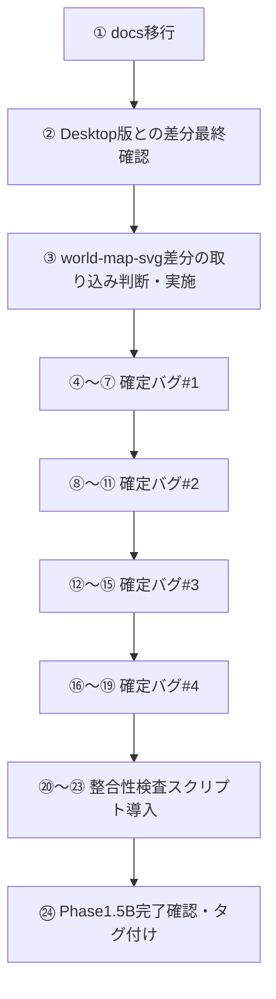

# Phase1.5B 実装計画書 Ver.1

- 作成日: 2026-08-03
- フェーズ: Phase1.5B（確定バグ4件の修正・実装計画のみ）
- 位置づけ: `docs/architecture/ls-total-test-system-design-v1.md` 16章・17章の詳細実行計画版。`docs/operations/git-github-operations-v1.md` のブランチ運用・コミット規約・タグ運用を適用する。
- 本ドキュメントの制約: **本ドキュメントは計画のみであり、記載されたコード変更・CSV変更・SVG変更・GAS変更・コミット・pushはいずれも未実施です。** 実装はユーザーの承認後、別セッションで着手します。
- 前提となる開発環境: `C:\Users\<ユーザー名>\Documents\GitHub\ls-total-test`（`docs/operations/git-github-operations-v1.md` 11章の手順でセットアップ済み、または教室PCでのセットアップ後）

### 表記ルール

これまでのドキュメントと同じく、**確定** / **仮決定** / **要確認** のラベルを使用します。

---

## 0. 前提状況の整理（本セッションまでに確認済みの事実）

| 項目 | 状態 |
|---|---|
| 正式リポジトリ | `https://github.com/minkyumimm-sketch/socialstudies`（確定） |
| GitHub Pages | `https://minkyumimm-sketch.github.io/socialstudies/`（確定、今回の作業では未変更） |
| 開発用ローカル環境 | `Documents\GitHub\ls-total-test`（新clone、`main`ブランチ、clean、`origin`は上記リポジトリ） |
| `docs/`フォルダ | **新clone側に存在しない**（1章で詳細） |
| Desktop版（`Desktop\socialstudies-app`）・旧アカウント版（`Documents\GitHub\socialstudies`） | 比較・バックアップ専用。変更・削除しない（確定） |
| 確定バグ4件 | `docs/architecture/ls-total-test-system-design-v1.md` 17章、`docs/analysis/phase0-review.md` 4章を参照。新clone側にすべて再現することを確認済み |

---

## 1. docs/ の存在確認結果と安全な移行方法（提案のみ・未実施）

### 1.1 確認結果（確定・事実）

```
$ ls ls-total-test/docs
No such file or directory

$ git log --all --oneline -- docs/
（該当コミットなし）
```

`docs/`フォルダは新clone（`ls-total-test`）の作業ツリーにもGit履歴にも一切存在しません。理由は、Phase0〜Phase1.5Aで作成した全ドキュメント（下記8ファイル）が、これまで一貫して`Desktop\socialstudies-app\docs\`側でのみ作成されており、新clone側へは一度もコピーされていないためです（**確定・事実**）。

```
docs/analysis/current-system-analysis.md
docs/analysis/phase0-review.md
docs/architecture/ls-total-test-system-design-v1.md
docs/operations/git-github-operations-v1.md
docs/specification/data-schema-v1.md
docs/specification/domain-model-v1.md
docs/specification/gas-api-contract-v1.md
docs/specification/ranking-spec-v1.md
```

（本ドキュメント`phase1.5b-implementation-plan-v1.md`も現時点ではDesktop側にのみ存在し、同じ移行対象になります。）

### 1.2 安全な移行方法（選択肢と比較）

| 選択肢 | 内容 |
|---|---|
| A | Desktop側`docs/`フォルダをそのままファイルコピーし、`ls-total-test/docs/`として配置する |
| B | Desktop側フォルダをGitリポジトリ化し、`ls-total-test`側へ`git remote add`＋`git pull`で取り込む |
| C | 各ファイルを1つずつ手動で新規作成し直す |

**推奨（仮決定）: A（単純なファイルコピー）。**

**推奨理由**: `docs/`はテキストのドキュメントのみで構成されており、Gitの差分管理機能（マージ等）を使う必要がある複雑さは無い。Bは、Desktop側を今さらGit管理下に置くこと自体が「Desktop版は比較・バックアップ専用として一切変更しない」という今回の方針（ユーザー指定）に反するため不適切。Cは手間が大きく、内容の転記ミスのリスクがある。

**具体的な手順（Phase1.5B ①で実施、今回は未実施）**

```bash
# 例: PowerShellでのフォルダコピー（Aの具体化、Phase1.5B①で実施予定・今回は未実行）
Copy-Item -Path "C:\Users\PC_User\Desktop\socialstudies-app\docs" `
          -Destination "C:\Users\PC_User\Documents\GitHub\ls-total-test\docs" `
          -Recurse
```

コピー後、`git status`で8ファイル（新規追加）のみが差分として現れることを確認してからコミットする（3章④参照）。

**デメリット**: コピー元（Desktop側）とコピー先（ls-total-test側）が今後別々に編集されると再び差分が生じる。**Phase1.5B以降、ドキュメントの追加・更新は`ls-total-test/docs/`側のみで行い、Desktop側の`docs/`は「移行前の最終スナップショット」として更新を止める運用とする（仮決定）**。

---

## 2. Desktop版との差分の分類（必要 / 不要 / 要検討）

前回セッションで発見した4項目について、Phase1.5B開始前の最終分類を行います。**分類のみであり、コピー・コード変更・コミットは今回行っていません。**

| # | 項目 | 所在 | 分類 | 理由 |
|---|---|---|---|---|
| 1 | `world-map-svg`クラス付与処理（`renderers/map-click-renderer.js`） | Desktop版のみに存在、新clone側に無し | **要検討** | `style.css`には`.world-map-svg .is-selected`等の専用スタイルが両バージョンに存在するが、これは`.map-area.is-selected`等の**汎用スタイルへの上乗せ（特別な見た目の上書き）**であり、クラスが付与されなくても汎用スタイルによる色分け自体は機能すると推測される（**未検証**、ブラウザでの実機確認が必要）。「完全に壊れている」と断定できる材料が無いため、実機確認のうえで要否を判断すべき項目として`要検討`に分類する。Phase1.5Bの③で判断・対応する |
| 2 | `.map-hit`/`.line-hit`によるクリック当たり判定拡大（`style.css`＋対応するSVG） | 新clone側（GitHub公式）のみに存在、Desktop版に無し | **不要（対応不要）** | Phase1.5B以降の開発基盤は新clone（`ls-total-test`）を正とするため、この改善は**既に取り込まれた状態**にある。Desktop側へ逆輸入する必要も、新clone側で何かを追加する必要も無い |
| 3 | `CLAUDE.md` | 旧アカウント版ローカルフォルダ（`Documents\GitHub\socialstudies`）のみに存在 | **必要（要移行）** | 内容を確認した結果、既存の責務分離原則・「触れてはいけない箇所」・個人情報の取り扱い注意など、Claude Codeがこのプロジェクトで作業する際に毎回参照すべき実務的なガードレールが整理されている。加えて確定バグ#1が2026-07-16時点で独立に発見・記録されており、資料的価値も高い。Phase1.5Bの①（docs移行と同じタイミング）で、内容を`docs/`の内容と整合させたうえで`ls-total-test`直下へ配置することを推奨する |
| 4 | `AGENTS.md` | 同上 | **要検討** | `CLAUDE.md`と内容がほぼ同一（差分は「Claude」→「Codex」という呼称のみ）。将来的に他のAIコーディングツールを併用する予定があるかどうかで要否が変わる。**要確認**: 今後Claude Code以外のツール（Codex CLI等）を使う想定があるか。無い場合は`CLAUDE.md`のみを採用し、`AGENTS.md`は不要と判断してよい |

### 2.1 対応方針のまとめ（仮決定）

- 項目3（`CLAUDE.md`）は Phase1.5B ①で`docs/`移行と合わせて取り込む方向で進める。
- 項目1（`world-map-svg`）は Phase1.5B ③で実機確認のうえ、取り込むか否かを確定する。
- 項目2（`.map-hit`/`.line-hit`）は対応不要。
- 項目4（`AGENTS.md`）はユーザーの利用ツール方針の確認後に決定する（Phase1.5B ①のタイミングで確認・決定を推奨）。

---

## 3. Phase1.5B 実装計画（① 〜 ㉔、1変更 = 1タスク = 1コミット）

`docs/operations/git-github-operations-v1.md` のブランチ運用（GitHub Flow、6章）・コミットメッセージ規約（7章）を適用します。各バグ修正は独立したfeatureブランチで行い、`main`へマージしてから次のタスクに進みます。

### 全体シーケンス図



### ① docs移行

| 項目 | 内容 |
|---|---|
| 作業内容 | 1章の方法（A）でDesktop側`docs/`を`ls-total-test/docs/`へコピー。`CLAUDE.md`を（内容整合のうえ）新規配置。`AGENTS.md`の要否をユーザーに確認 |
| ブランチ | `docs/migrate-phase0-phase1-docs` |
| コミットメッセージ（仮決定） | `docs: Phase0〜Phase1.5Aのドキュメントをls-total-testへ移行` |
| テスト | 8（または9）ファイルがすべて正しくコピーされ、内容が欠落していないことを目視確認 |
| ロールバック | ブランチごと破棄すれば`main`に影響しない |

### ② Desktop版との差分最終確認

| 項目 | 内容 |
|---|---|
| 作業内容 | ①の状態で改めて`diff -rq`相当の比較を行い、2章で分類した4項目以外に新たな差分が発生していないことを確認する（読み取りのみ、コード変更なし） |
| ブランチ | 不要（調査のみ、コミット無し） |
| テスト | 差分レポートをユーザーへ提示し、2章の分類（必要/不要/要検討）に変更が無いか確認 |

### ③ world-map-svg差分を取り込むか最終判断・実施

| 項目 | 内容 |
|---|---|
| 作業内容 | 実機（ブラウザ）で新clone側の世界地図（`world_countries_edu`）問題を1問出題し、正誤クリック時の色分け表示（`is-selected`/`is-correct`/`is-wrong`）が実際に機能しているかを確認する。機能していない場合、Desktop側の3行相当のコード（`renderers/map-click-renderer.js`）を移植するかどうかをユーザーに確認のうえ判断する |
| ブランチ（取り込む場合） | `fix/world-map-svg-class-missing` |
| コミットメッセージ（取り込む場合・仮決定） | `fix: 世界地図のworld-map-svgクラス付与漏れを修正` |
| テスト | 世界地図の問題（`world_countries_edu`）を正解・不正解それぞれ1回ずつ試し、意図した色分けになることを確認 |
| ロールバック | 独立コミットのためrevertのみで対応可能 |

### ④〜⑦ 確定バグ#1: 出題形式フィルタが機能しない

| # | 内容 |
|---|---|
| ④ 修正 | `config/modes.js` の `MODE_FILTER_OPTIONS` のキーを `geography`/`history` から `japan_geo`/`world_geo`/`history` へ修正（設計書8.3節#1、3.2節の第1段階） |
| ⑤ テスト | 開始画面で「日本地理」「世界地理」「歴史」それぞれを選択し、出題形式フィルタ（すべて/記述/選択/地図クリック 等）の選択肢が正しく表示・機能することを確認 |
| ⑥ コミット | ブランチ`fix/mode-filter-key-mismatch`、メッセージ `fix: 出題形式フィルタのキー不一致を修正（確定バグ#1）` |
| ⑦ push | `main`へマージ後、リモートへpush |

### ⑧〜⑪ 確定バグ#2: 中東問題で誤った地図が表示される

| # | 内容 |
|---|---|
| ⑧ 修正 | `data/world_geo_questions.csv` の中東行（`geo_world_region_009`）の`mapId`を`world_regions_edu`から`world_continents_edu`へ修正（設計書17章） |
| ⑨ テスト | 世界地理・地域単元で中東の問題を出題し、世界大陸地図が正しく表示されることを確認 |
| ⑩ コミット | ブランチ`fix/world-geo-mapid-middle-east`、メッセージ `fix: 中東問題のmapId不一致を修正（確定バグ#2）` |
| ⑪ push | 同上 |

### ⑫〜⑮ 確定バグ#3: hidden問題が除外されない

| # | 内容 |
|---|---|
| ⑫ 修正 | `filters/filter-manager.js` の除外条件を `status !== "inactive"` から `status === "active"` （ホワイトリスト方式）へ修正（設計書5.4節） |
| ⑬ テスト | `status: hidden`の2問（シンガポール・スイス）が出題されないこと、`active`の問題は引き続き出題されることを確認 |
| ⑭ コミット | ブランチ`fix/hidden-status-not-excluded`、メッセージ `fix: hidden状態の問題が出題される不具合を修正（確定バグ#3）` |
| ⑮ push | 同上 |

### ⑯〜⑲ 確定バグ#4: 豪州問題が正解不可能

| # | 内容 |
|---|---|
| ⑯ 修正 | 設計書17章の推奨（仮決定: 選択肢B）に従い、`assets/map-world-physical.svg`のオーストラリア図形要素に`id="australia"`を追加する（`data-name="Australia"`は残す）。CSV側（`svgAreaIds=australia`）は変更しない |
| ⑰ テスト | 世界地理・地域単元で豪州の問題を出題し、地図上のオーストラリア大陸をクリックして正解になることを確認。**加えて世界の地形・大陸・海洋関連の他の問題（`map-world-physical.svg`を使う全問題）が壊れていないことを回帰確認する（設計書17章の注記どおり）** | 
| ⑱ コミット | ブランチ`fix/australia-svg-id-missing`、メッセージ `fix: 豪州問題のSVG id不足を修正（確定バグ#4）` |
| ⑲ push | 同上 |

### ⑳〜㉓ CSV・コード・SVG整合性検査スクリプトの導入

設計書6章（`scripts/validate-questions.mjs`）に対応するタスクです。確定バグ4件と異なりバグ修正ではないため、独立した1タスクとして扱います。

| # | 内容 |
|---|---|
| ⑳ 実装 | `scripts/validate-questions.mjs`を新規作成。既存の`core/question-loader.js`・`core/question-normalizer.js`を再利用し、設計書6.1節の検査ルール（mode有効性、status許可値、questionId重複、mode別必須列、mapId存在確認、svgAreaIds実在確認、subject存在確認）を実装 |
| ㉑ テスト | `node scripts/validate-questions.mjs`を実行し、④〜⑲の修正がすべて反映された状態でエラー0件になることを確認 |
| ㉒ コミット | ブランチ`chore/add-csv-svg-validation-script`、メッセージ `chore: CSV/SVG整合性検査スクリプトを追加` |
| ㉓ push | 同上 |

### ㉔ Phase1.5B完了確認・タグ付け

| 項目 | 内容 |
|---|---|
| 作業内容 | `docs/architecture/ls-total-test-system-design-v1.md` 16章のPhase1.5「完了条件」「回帰確認」をすべて満たしていることを最終確認する |
| タグ | `docs/operations/git-github-operations-v1.md` 8章の方式に従い `phase1.5-stable` を作成 |
| 次フェーズ判定 | 人間によるレビュー承認後、Phase2（基盤整備）へ進む |

---

## 4. タスク一覧（サマリー表）

| # | タスク | 種別 | ブランチ | コミット有無 |
|---|---|---|---|---|
| ① | docs移行 | docs | `docs/migrate-phase0-phase1-docs` | あり |
| ② | 差分最終確認 | 調査 | なし | なし |
| ③ | world-map-svg判断・実施 | fix（条件付き） | `fix/world-map-svg-class-missing` | 条件付き |
| ④〜⑦ | 確定バグ#1 | fix | `fix/mode-filter-key-mismatch` | あり |
| ⑧〜⑪ | 確定バグ#2 | fix | `fix/world-geo-mapid-middle-east` | あり |
| ⑫〜⑮ | 確定バグ#3 | fix | `fix/hidden-status-not-excluded` | あり |
| ⑯〜⑲ | 確定バグ#4 | fix | `fix/australia-svg-id-missing` | あり |
| ⑳〜㉓ | 整合性検査スクリプト | chore | `chore/add-csv-svg-validation-script` | あり |
| ㉔ | 完了確認・タグ付け | リリース | （`main`上で実施） | タグのみ |

---

## 5. 未確認事項（本計画の実行前に確定させるべきもの）

| # | 事項 | 関連箇所 |
|---|---|---|
| 1 | `AGENTS.md`を採用するか（Claude Code以外のツール利用予定の有無） | 2章 |
| 2 | world-map-svgクラス欠落の実機での実際の見た目への影響 | ③ |
| 3 | `CLAUDE.md`の内容とこれまでの設計書（`docs/architecture/`, `docs/specification/`）の記述に矛盾が無いかの突き合わせ（特に`studyType`という命名と、設計書で採用した`coursePurposeId`の表記差異、設計書3.4節で既に指摘済み） | ①、設計書3.4節 |

---

以上がPhase1.5Bの実装計画です。**本ドキュメント作成中もコード変更・CSV変更・SVG変更・GAS変更・コミット・pushは一切行っていません。** 実装は、ユーザーの承認を得てから、教室PCでのclone・環境確認完了後に着手します。
