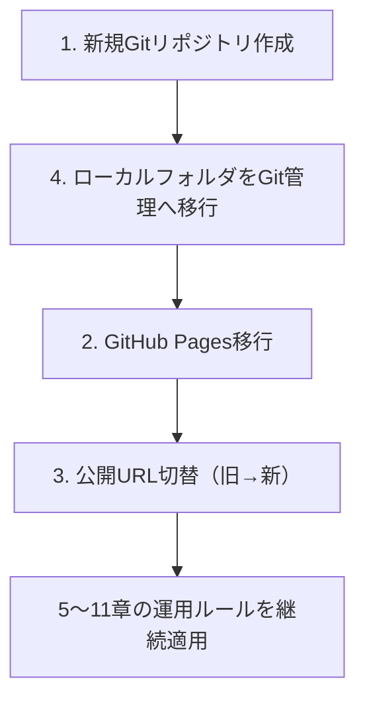
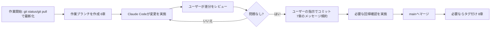

# Git・GitHub運用設計書 Ver.1

- 作成日: 2026-08-03
- フェーズ: Phase1.5A（安定化フェーズ・準備作業）
- 位置づけ: `docs/architecture/ls-total-test-system-design-v1.md` 18章（Git・GitHubアカウント統一方針）の実行手順版
- 前提の確認: 18.3節の推奨案（**B: 現在のアカウントで新規リポジトリを作成する**）を正式方針として採用。旧GitHubアカウントは今後の開発に使用しない。
- 本ドキュメントの制約: **本ドキュメント作成中、Git操作（`git init`等）・コード変更は一切行っていません。** 以下の手順はすべて「将来実行するための手順書」であり、コマンド例はすべて未実行の参考情報です。

### 表記ルール

`docs/architecture/ls-total-test-system-design-v1.md` と同じく、**確定** / **仮決定** / **要確認** のラベルを使用します。

---

## 0. 全体の流れ（本ドキュメントの章立てと実行順序の対応）



1章・4章・2章・3章がPhase1.5Aで実施する一連の初期セットアップ、5章以降は初期セットアップ後に**継続的に**適用される運用ルールです。

---

## 1. 新規Gitリポジトリ作成手順

### 1.1 事前に決めておくこと

| 項目 | 選択肢 | 推奨 |
|---|---|---|
| リポジトリ名 | (a) 現行フォルダ名を踏襲し`socialstudies-app`のまま (b) 新プロジェクト名にちなみ`ls-total-test-app`等へ変更 | **仮決定: (b)** 新プロジェクト名「LS総合テスト対策」を見据え、早い段階で名称を揃えておく方が、後からの改名（＝URLが再度変わる）を避けられる。ただし最終的な名称は**要確認**（ユーザー確定） |
| 公開範囲 | Public / Private | **確定: Public**。GitHub Pagesを無料プランで使う場合、Publicリポジトリである必要がある（Privateリポジトリの無料公開はGitHub Pro等が必要）。教育目的の静的サイトでソースコード自体に秘匿すべき情報が無いこと（14章セキュリティ方針でも確認済み）を踏まえPublicを推奨 |
| デフォルトブランチ名 | `main` / `master` | **確定: `main`**（GitHubの現行デフォルトに合わせる） |
| README・LICENSEの初期生成 | GitHub上で自動生成するか否か | **推奨: 生成しない**。既存ローカルフォルダの中身をそのまま初回コミットするため、空リポジトリとして作成し、後から4章の手順でpushする |

### 1.2 手順（GitHub Web UI）

1. 現在使用しているGitHubアカウントでログインする。
2. 右上の「+」→「New repository」を選択する。
3. Repository name に1.1で決めた名称を入力する。
4. 「Public」を選択する。
5. 「Add a README file」「Add .gitignore」「Choose a license」はいずれも**チェックしない**（空リポジトリとして作成し、ローカルの中身をそのままpushするため）。
6. 「Create repository」を実行する。
7. 作成後に表示される`https://github.com/<新アカウント>/<リポジトリ名>.git`（またはSSH URL）を控えておく（4章で使用）。

**この時点ではローカル側のファイルには一切触れません。**

---

## 2. GitHub Pages移行手順

### 2.1 前提

- 現行アプリはビルドツールを持たない静的サイト（`index.html`がリポジトリ直下に存在、Phase0確認済み）。
- そのため、GitHub Pagesは**ビルドなしでリポジトリのブランチをそのまま配信する設定**で完結する（Jekyll等のビルドは使わない）。

### 2.2 手順（GitHub Web UI、4章のpush完了後に実施）

1. 新規リポジトリの「Settings」タブを開く。
2. 左メニューの「Pages」を選択する。
3. 「Build and deployment」の「Source」で「Deploy from a branch」を選択する。
4. 「Branch」で`main`を選択し、フォルダは`/ (root)`を選択する（`index.html`が直下にあるため）。
5. 「Save」を実行する。
6. 数分待つと、`https://<新アカウント>.github.io/<リポジトリ名>/`形式のURLが表示される。これが新しい公開URLとなる。
7. 実際にブラウザで新URLへアクセスし、開始画面が表示されること、CSV・SVGが正しく読み込まれることを確認する（相対パスで読み込んでいるため、リポジトリ名がURLパスに含まれても現行コードの修正は不要と見込まれるが、**要確認**: 実際にPages公開後の一度の動作確認は必須）。

### 2.3 カスタムドメインについて

**要確認**: 現行の公開URLにカスタムドメイン（独自ドメイン）が設定されているかは本リポジトリの調査からは確認できていない（`docs/architecture/ls-total-test-system-design-v1.md` 18.4節と同じ未確認事項）。カスタムドメインが設定されている場合は、新リポジトリのPages設定でも同じドメインをCNAME登録し直す追加手順が必要になる。設定されていない場合、本節の手順のみで完結する。

---

## 3. 現在の公開URLから新URLへの切替手順

旧アカウント・旧リポジトリへのアクセス可否によって手順が変わります。`ls-total-test-system-design-v1.md` 18.4節の「要確認」事項の結果に応じて、以下のいずれかを選択してください。

### 3.1 パターンA: 旧アカウント・旧リポジトリに今もアクセスできる場合

| 手順 | 内容 |
|---|---|
| 1 | 新URL（2章で確認したURL）が正常に動作することを先に確認する |
| 2 | 旧リポジトリの`index.html`に、新URLへの案内（リダイレクトまたは案内文言）を追加する（**仮決定案**: `<meta http-equiv="refresh" content="5;url=新URL">`と「新しいURLに移動しました」という文言を表示するだけの単純なページに差し替える。ただし旧リポジトリ側の変更は本ドキュメントの対象外＝別途、旧リポジトリ上で実施する） |
| 3 | 一定期間（**仮決定: 30日程度**）、旧URLと新URLを並行稼働させ、生徒・保護者・教室スタッフへ新URLを周知する期間を設ける |
| 4 | 周知期間終了後、旧リポジトリをアーカイブ化（GitHubの「Archive this repository」機能。削除はしない＝いつでも参照できる状態を残す） |

### 3.2 パターンB: 旧アカウント・旧リポジトリにアクセスできない場合

| 手順 | 内容 |
|---|---|
| 1 | 技術的なリダイレクトは実施不可能なため、周知のみで切替を行う |
| 2 | 教室内の掲示・生徒への直接案内・保護者連絡手段（要確認: 塾の既存連絡手段）を使って新URLを周知する |
| 3 | 新URLをブックマークし直してもらうよう案内する。QRコード等での再配布も検討する（**改善提案**、実施は運用側の判断） |
| 4 | 旧URLは自然に更新が止まり、いずれアクセスできなくなる想定（旧アカウントの状態次第、**要確認**） |

### 3.3 切替時の確認チェックリスト（共通）

- [ ] 新URLで開始画面が表示される
- [ ] 3科目（日本地理・世界地理・歴史）それぞれでCSVが読み込める
- [ ] 地図クリック問題でSVGが表示される
- [ ] GAS通信（生徒一覧取得・解答保存）が新URLからでも正常に動作する（GAS側にオリジン制限が無いか要確認）
- [ ] スマートフォン実機で1回、教室のタブレット/PCで1回、それぞれ動作確認する

---

## 4. ローカルフォルダをGit管理へ移行する手順

### 4.1 事前チェック（コミット前の安全確認）

1. `git status`相当のファイル一覧を目視確認し、意図しないファイル（個人のメモ、ローカル専用の設定等）が含まれていないか確認する。
2. 現行`services/gas-service.js`にはGAS Web App URLがハードコードされている。これはクライアント側で常に公開される情報（ブラウザの開発者ツールから誰でも参照可能）であり、Gitに含めても新たな漏洩は生まないと判断できる（**確定**）。ただし、将来的にAPIキー等の真に秘匿すべき情報を追加する場合は、この時点の判断を流用しないこと（別途`.gitignore`等での除外が必要になる）。
3. `.gitignore`の作成を検討する（**仮決定**）。現時点でビルド成果物・依存パッケージは存在しないため必須ではないが、将来のNode.js導入（`docs/architecture/...` 6章・15章のvalidate-questions.mjsやnode:testの導入）に備え、以下を先に用意しておくことを推奨する。

```
# 仮決定: 将来のNode.js導入に備えた最小限の.gitignore
node_modules/
.DS_Store
Thumbs.db
```

### 4.2 手順（将来実行、今回は未実行）

```bash
# 1. 対象フォルダに移動（既にカレントディレクトリの場合は不要）
cd /path/to/socialstudies-app

# 2. Gitリポジトリとして初期化
git init -b main

# 3. .gitignoreを配置（4.1の内容を反映したファイルを作成）

# 4. ユーザー情報の確認（PC単位で未設定の場合のみ）
git config user.name "任意の表示名"
git config user.email "任意のメールアドレス"

# 5. 全ファイルをステージング
git add .

# 6. ステージ内容を確認（意図しないファイルが無いか再確認）
git status

# 7. 最初のコミット
git commit -m "chore: initial commit"

# 8. 1章で作成したリモートリポジトリを登録
git remote add origin https://github.com/<新アカウント>/<リポジトリ名>.git

# 9. push
git push -u origin main
```

### 4.3 初回コミットの粒度についての設計判断

| 選択肢 | 内容 |
|---|---|
| A | 現状の全ファイルを1回の「initial commit」としてまとめて登録する |
| B | Phase0/Phase1で作成した`docs/`と、既存アプリ本体（`app.js`等）を別コミットに分ける |

**推奨（仮決定）: A**。理由: 現状はまだ一度もGit管理されていない「ゼロからのスタート地点」であり、そこに人為的な分割を加えても実質的な意味（レビューのしやすさ等）が薄い。むしろ「これが移行時点のスナップショットである」ことが1コミットで明確になる方が、後から履歴を追う際に分かりやすい。Phase1.5Bの確定バグ修正から、6章のコミット粒度ルールを適用する。

---

## 5. Claude Codeで運用する標準ワークフロー

### 5.1 基本原則（確定）

1. **Claude Codeは指示なくコミット・pushを行わない**（既存の運用ルールを踏襲。Git操作はユーザーが明示的に依頼した場合のみ実施）。
2. 1回の作業セッションは、`docs/architecture/ls-total-test-system-design-v1.md` 16章のPhase単位、またはさらに細かい「1つの確定バグ修正」「1つの小機能」単位で区切る。
3. 各セッションの開始時に現状のブランチ・変更差分を確認してから着手する。
4. 変更が完了したら、ユーザーが差分を確認し、問題なければユーザーの指示でコミットする。

### 5.2 標準フロー（将来の1タスクあたりの流れ）



### 5.3 Claude Codeとの役割分担

| 作業 | 実施者 |
|---|---|
| コードの提案・実装 | Claude Code |
| 差分の最終確認 | ユーザー（人間） |
| コミット・push・マージの実行判断 | ユーザーが明示的に指示 |
| 各Phaseの「次Phaseへ進む判定」（設計書16章） | ユーザー（人間レビュー） |

---

## 6. ブランチ運用方針

### 6.1 選択肢

| 選択肢 | 内容 |
|---|---|
| A | トランクベース（`main`へ直接コミット） |
| B | GitHub Flow（`main` + 短命なfeatureブランチ + マージ） |
| C | Git Flow（`main`+`develop`+`feature`+`release`+`hotfix`のフルセット） |

### 6.2 比較

| 観点 | A | B | C |
|---|---|---|---|
| 運用の手間 | 最小 | 小〜中 | 大（このプロジェクト規模には過剰） |
| 誤操作時のロールバックしやすさ | 低い（`main`に直接影響） | 高い（ブランチ単位でrevert・破棄できる） | 高いが複雑 |
| Phase単位の開発（設計書16章）との相性 | 低い（Phaseの境界が履歴上見えにくい） | 高い（1 Phase = 1ブランチ、または1バグ修正 = 1ブランチと対応させやすい） | 高いが小規模プロジェクトには複雑すぎる |
| 開発体制 | 1人開発ならシンプルで良い | 1人開発でも安全網として機能する | 複数人・複数リリースラインが前提 |

### 6.3 推奨案（確定）

**B（GitHub Flow）を採用する。**

**推奨理由**: `main`は常に「GitHub Pagesで公開されている状態と一致する」ブランチとして扱い、確定バグ修正・各Phaseの変更はすべて短命なfeatureブランチで作業してからマージする。これにより、設計書16章で定義した「各Phaseのロールバック方法」（該当コミット/ブランチのみをrevertできる）と自然に対応し、1人開発であっても「作業中の変更が誤って公開されない」安全網になる。

**デメリット**: Aに比べてブランチ作成・マージという一手間が毎回発生する。ただしこのプロジェクトの規模・変更頻度であれば許容範囲と判断する。

**将来変更する場合の影響**: 開発者が増えて並行作業が増えた場合は、C（Git Flow）的な`develop`ブランチの追加を再検討してもよいが、現時点では過剰設計と判断する。

### 6.4 ブランチ命名規則（仮決定）

| 種別 | 命名パターン | 例 |
|---|---|---|
| バグ修正 | `fix/<内容>` | `fix/mode-filter-key-mismatch`（確定バグ#1） |
| Phase単位の機能追加 | `phase<番号>/<内容>` | `phase2/attempt-answer-record` |
| ドキュメントのみ | `docs/<内容>` | `docs/operations-runbook` |
| 緊急の小修正 | `hotfix/<内容>` | `hotfix/csv-typo` |

---

## 7. コミットメッセージ規約

### 7.1 基本形式（仮決定）

軽量版のConventional Commitsを採用する。

```
<type>: <変更内容の要約（日本語可）>

<必要に応じて本文（why中心、whatはdiffで分かるため省略可）>
```

| type | 用途 |
|---|---|
| `fix` | バグ修正（確定バグ#1〜#4を含む） |
| `feat` | 新機能追加（Phase2以降の各機能） |
| `docs` | ドキュメントのみの変更（`docs/`配下） |
| `chore` | 雑務（初期設定、依存整理等） |
| `refactor` | 挙動を変えないコード整理 |
| `test` | テスト追加（15章のテスト戦略対応） |

### 7.2 確定バグ修正時の規約（確定）

Phase1.5Bで確定バグ4件を修正する際は、`docs/architecture/ls-total-test-system-design-v1.md` の8.3節・17章と対応づけられるよう、バグ番号を必ずメッセージに含める。

```
fix: 出題形式フィルタのキー不一致を修正（確定バグ#1）

config/modes.js の MODE_FILTER_OPTIONS を japan_geo/world_geo/history の
実際の科目キーに合わせて修正。詳細は docs/architecture/ls-total-test-system-design-v1.md 8.3節#1、17章を参照。
```

### 7.3 やらないこと（確定）

- 1コミットに複数の無関係な変更を混在させない（特に確定バグ4件は設計書17章の方針どおり、必ず1バグ=1コミットとする）。
- コミットメッセージだけで意図が分からない大きな変更は避け、必要ならPR説明文（8.2節参照は無いため、GitHub上のPull Request descriptionを使う）で補足する。

---

## 8. タグ運用

### 8.1 タグ体系（仮決定）

セマンティックバージョニング（`v1.2.3`）ではなく、**Phaseベースのタグ**を採用する。理由は、このプロジェクトが外部に配布されるライブラリではなく、`docs/architecture/ls-total-test-system-design-v1.md` 16章で定義された段階的Phaseに沿って進む単一の運用アプリであるため、Phase番号とタグを直接対応させた方が運用上わかりやすいため。

| タグ名パターン | 用途 | 例 |
|---|---|---|
| `phase1.5-stable` | Phase1.5（確定バグ修正）完了時点 | `phase1.5-stable` |
| `phase2-stable` | Phase2完了時点 | `phase2-stable` |
| `phase<N>-stable` | 以降同様 | `phase6-stable` |

### 8.2 タグ付けのタイミング（確定）

各Phaseの「次Phaseへ進む判定」（設計書16章の各Phase表）が完了し、人間のレビュー承認を得た時点でタグを打つ。

```bash
# 将来実行、今回は未実行
git tag -a phase1.5-stable -m "Phase1.5完了: 確定バグ4件修正 + CSV/SVG整合性検査スクリプト導入"
git push origin phase1.5-stable
```

### 8.3 タグの使い道

- 障害発生時に「どのPhase完了状態まで安全に戻せるか」を即座に判断できる基準点にする。
- 8章のリリース運用（9章）における「リリースノート」の起点として使う。

---

## 9. リリース運用

### 9.1 「リリース」の定義（確定）

このプロジェクトはビルド成果物を持たない静的サイトであり、`main`ブランチへのマージ＝GitHub Pagesへの反映（実質的なリリース）となる。したがって「リリース」とは、**featureブランチが`main`にマージされ、GitHub Pagesに反映された状態**を指す。

### 9.2 リリース手順（将来実行時の流れ）

1. featureブランチでの変更完了、ユーザーによる差分レビュー完了（5章）。
2. 該当Phaseの「回帰確認」項目（設計書16章の各Phase表）をすべて実施し、チェックリストとして記録する。
3. `main`へマージする（GitHub Flow、6章）。
4. GitHub Pagesへの反映を実URLで確認する（2章のチェックリストを再利用）。
5. Phase完了に該当する場合は8章のタグを打つ。
6. GitHubの「Releases」機能で、タグに対応するリリースノートを作成する（**仮決定**: 必須ではないが、Phase単位の区切りごとに作成することを推奨。設計書16章の「目的」「主な変更対象」をそのまま転記すれば流用できる）。

### 9.3 リリース前チェックリスト（確定・設計書16章と対応）

- [ ] 該当Phaseの「完了条件」を満たしている
- [ ] 該当Phaseの「回帰確認」をすべて実施した
- [ ] `scripts/validate-questions.mjs`（導入済みの場合）がエラー0件で通過する
- [ ] スマートフォン実機で最低1回確認した
- [ ] ロールバック方法（該当コミット/ブランチ/タグ）を確認済み

---

## 10. バックアップ方針

### 10.1 バックアップの層（確定）

| 層 | 内容 | 復旧に使えるか |
|---|---|---|
| GitHub本体 | リモートリポジトリ自体がクラウド上の一次バックアップとして機能する | 通常時の復旧元 |
| 開発者PCのローカルクローン | 各PCに存在するフルクローン（11章） | GitHubが一時的に利用不可の場合の代替 |
| タグ（8章） | Phase完了時点のスナップショット | 特定時点への確実な復旧ポイント |
| GitHubブランチ保護（推奨、仮決定） | `main`への force-push・削除を禁止する設定（Settings→Branches→Branch protection rules） | 誤操作による履歴破壊の予防 |

### 10.2 Gitの管理範囲外のデータについて（重要な注意・確定）

**学習履歴・解答記録・ランキング等（Attempt/AnswerRecord/RankingRecord）はGoogle Sheets側に存在し、本リポジトリのGit管理・バックアップの対象外です。** これらのバックアップ方針（Sheetsの自動保存機能への依存で十分か、定期エクスポートが必要か等）は、`docs/architecture/ls-total-test-system-design-v1.md` の19.1節に挙げた外部GAS確認事項と合わせて別途検討が必要です（**要確認**、本ドキュメントのスコープ外）。

### 10.3 推奨運用（仮決定）

- Phase完了ごと（タグ付けのタイミング、8.2節）に、念のためローカルにも該当時点のzipスナップショットを1つ残す（GitHub障害等の極端なケースへの備え。必須ではないが低コストなので推奨）。
- `main`ブランチの保護設定を有効化する（10.1節）。

---

## 11. 複数PCでの開発手順

### 11.1 前提

Claude Codeの利用環境が複数PCにまたがる可能性がある（環境情報に複数の作業ディレクトリが見られることからも、複数マシン運用の可能性を考慮）。

### 11.2 新しいPCでのセットアップ手順（将来実行）

```bash
# 1. リポジトリをクローン
git clone https://github.com/<新アカウント>/<リポジトリ名>.git

# 2. フォルダに移動
cd <リポジトリ名>

# 3. ユーザー情報が未設定なら設定
git config user.name "任意の表示名"
git config user.email "任意のメールアドレス"
```

認証方式（HTTPS+Personal Access Token、またはSSH鍵）はPCごとに設定が必要（**要確認**: どちらを標準とするかはユーザーの環境次第、GitHub CLIの`gh auth login`を使う方法も選択肢）。

### 11.3 日常の作業フロー（確定）

1. 作業開始時に必ず`git pull`（または対象ブランチの最新化）を行ってから作業を始める。
2. 複数PCで同時に同じブランチを編集しない（6章のfeatureブランチ運用により、PCごとに別ブランチで作業すれば衝突を避けやすい）。
3. 作業を中断してPCを切り替える場合は、中断前に必ずコミットしてpushしておく（作業内容をローカルにのみ残さない）。

### 11.4 コンフリクト発生時の対応方針（確定）

このプロジェクトはCSV（テキスト）とJS（テキスト）が主体で、バイナリ資産（SVG）は基本的に単一の担当作業になる想定のため、コンフリクトの発生頻度は低いと見込まれる。発生した場合は、該当ファイルを目視で確認し、意図しないデータ（他方の変更の消失）が無いことを確認してからマージを完了する。判断に迷う場合は、両方の変更を残す形で一旦マージし、後続のコミットで整理する。

---

## 12. 総括（要確認・仮決定の一覧）

### 12.1 要確認

| # | 事項 |
|---|---|
| 1 | GitHub Pagesにカスタムドメインが設定されているか（2.3節） |
| 2 | GAS側にオリジン制限（呼び出し元URLの制限）が無いか、新URLからでも通信できるか（3.3節） |
| 3 | 旧アカウント・旧リポジトリへの現在のアクセス可否（3.1/3.2節の分岐に影響） |
| 4 | 塾の既存連絡手段（保護者・生徒への新URL周知方法）（3.2節） |
| 5 | 複数PCでの認証方式（HTTPS+PAT or SSH）の標準化（11.2節） |
| 6 | Google Sheets側データのバックアップ方針（10.2節、本ドキュメントのスコープ外） |

### 12.2 仮決定

| # | 事項 |
|---|---|
| 1 | 新リポジトリ名を新プロジェクト名にちなみ変更する（最終名称は要確認） |
| 2 | URL切替の並行稼働期間: 30日 |
| 3 | 初回コミットは全ファイルをまとめて1コミット |
| 4 | ブランチ命名規則（`fix/`, `phase<N>/`, `docs/`, `hotfix/`） |
| 5 | タグ体系はPhaseベース（`phase<N>-stable`） |
| 6 | Phase完了ごとにローカルzipスナップショットも残す |

---

以上がPhase1.5A（安定化フェーズ・準備作業）の運用設計書です。本ドキュメント作成中もGit操作・コード変更は一切行っていません。実際の`git init`等の実行は、本ドキュメントの内容についてユーザーの確認・指示を受けてから着手します。
