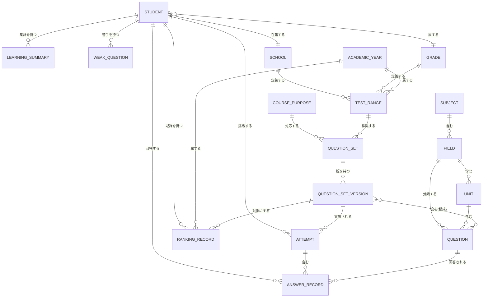

# ドメインモデル仕様書 Ver.1

- 作成日: 2026-08-03
- 位置づけ: `docs/architecture/ls-total-test-system-design-v1.md` の2章・3章の詳細版
- 表記ルール（確定/仮決定/要確認）はメイン設計書と共通

---

## 1. ER図（全体）

---

## 2. 識別子設計（詳細）

### 2.1 全キー一覧

| 識別子 | 形式 | ラベル | 発行者 | 例 |
|---|---|---|---|---|
| `subjectId` | `social` \| `science` | 確定（値は仮決定） | 開発者（config） | `social` |
| `coursePurposeId` | `regular_exam` \| `entrance_exam` | 確定（値は仮決定） | 開発者（config） | `regular_exam` |
| `fieldId` | 既存3値はそのまま流用、新規は英語スネークケース | 確定（既存3値）／仮決定（新規値） | 開発者（config） | `japan_geo`（既存）, `biology`（新規） |
| `unitKey` | 既存踏襲、日本語文字列そのまま | 確定（当面変更しない） | 問題作成者（CSV編集） | `都道府県` |
| `questionId` | 既存の命名踏襲（`<接頭辞>_<連番>`）。**既存値は不変** | 確定 | 問題作成者 | `geo_pref_001` |
| `questionSetId` | `<fieldId>__<coursePurposeId>__<slug>` | 仮決定 | 開発者/問題管理者 | `japan_geo__regular_exam__prefecture_all` |
| `questionSetVersion` | 整数、1始まり | 確定（形式）仮決定（初期値運用） | 問題管理者 | `1` |
| `schoolId` | 生徒管理システムの採番方式に従う | 要確認 | 生徒管理システム | 不明 |
| `gradeId` | 生徒管理システムの採番方式に従う | 要確認 | 生徒管理システム | 不明 |
| `attemptId` | `crypto.randomUUID()`推奨、非対応時は`<studentId>-<epochms>-<rand>` | 仮決定 | 学習アプリ（クライアント） | `a1b2c3d4-...` |
| `academicYearId` | `AY<開始暦年>`（4月始まり） | 仮決定 | 開発者（算出ロジック） | `AY2026` |
| `examRoundLabel` | 自由文字列（正式なマスタ化は先送り） | 仮決定 | 塾スタッフ | `1学期期末` |

### 2.2 既存キーとの移行関係（旧→新の対応表）

| 旧キー | 出典 | 新設計での扱い | 変更要否 |
|---|---|---|---|
| `japan_geo`（`subject`列の値） | `config/subjects.js`, CSV | そのまま`fieldId`として採用 | **変更不要（確定）** |
| `world_geo` | 同上 | そのまま`fieldId`として採用 | **変更不要（確定）** |
| `history` | 同上 | そのまま`fieldId`として採用 | **変更不要（確定）** |
| `geography`（`config/modes.js`のカテゴリキー。CSVには存在しない） | `config/modes.js`の`MODE_FILTER_OPTIONS` | 廃止。`japan_geo`/`world_geo`それぞれに対応するエントリへ分割（Phase1.5でバグ修正として実施） | **変更必要（バグ修正）** |
| （存在しない）`civics`, `biology`, `chemistry`, `physics`, `earth_science` | - | 新規`fieldId`として追加（Phase3） | 新規追加 |
| （存在しない）教科レベルの概念 | - | 新規`subjectId`（`social`/`science`）として追加（Phase3の`config/fields.js`相当導入時） | 新規追加 |
| （存在しない）`unit`の正式キー化 | 現状は`unit`列の日本語文字列がキーを兼ねる | 当面変更しない。表記ゆれの実害が出た場合にのみ`unitId`マスタ化を検討 | 変更なし（仮決定） |

**確定事項**: 既存の`japan_geo_questions.csv` / `world_geo_questions.csv` / `history_questions.csv`の`subject`列の値は、本設計のいかなる段階でも書き換えを必要としません。

---

## 3. 主要概念（エンティティ）一覧

各概念について「役割／一意なID／主な属性／他概念との関係／管理場所／更新主体」を整理します。

### 3.1 Student（生徒）

| 項目 | 内容 |
|---|---|
| 役割 | 学習アプリの利用者。生徒管理システムが正本（Single Source of Truth） |
| 一意なID | `studentId`（生徒管理システム発行、形式は要確認） |
| 主な属性 | 表示名、`schoolId`、`gradeId`、在籍状態、（ログイン情報は学習アプリ側で保持しない） |
| 他概念との関係 | Attempt・AnswerRecord・RankingRecord・LearningSummary・WeakQuestionをstudentId経由で持つ |
| 管理場所 | **生徒管理システム（外部GAS・Sheets）**。学習アプリは複製を持たない |
| 更新主体 | 生徒管理システムの運用者（教室スタッフ等、既存運用） |

### 3.2 School（学校）

**Task47（2026-08-13）で管理場所を変更。旧方針（生徒管理システムが発行するschoolIdを使う）は不採用とし、LS総合テスト対策が独自にschoolIdを発行する方式へ変更した（理由は`docs/architecture/ls-total-test-system-design-v1.md` 9.1節）。**

| 項目 | 内容 |
|---|---|
| 役割 | TestSetの絞り込みキーとなる学校 |
| 一意なID | `schoolId`（形式: `^SC\d{3}$`、LS総合テスト対策が独自採番） |
| 主な属性 | 学校名（表示用。TestSetマスタのキーには使わない） |
| 他概念との関係 | TestSetが`schoolId`で参照する |
| 管理場所 | TestSet専用Google Spreadsheet「LS総合テスト対策_学校・テストセットマスター」の`school_master`タブ（本番正本）。`data/school_master.csv`はschema基準・validator・backup用途 |
| 更新主体 | 塾スタッフ（学校追加は低頻度のためSheetsへの直接追記を想定） |

### 3.3 Grade（学年）

| 項目 | 内容 |
|---|---|
| 役割 | 生徒の学年。テスト範囲・年度の絞り込みキー |
| 一意なID | `gradeId`（要確認: 現状`grade`が自由文字列かコード化済みか未確認） |
| 主な属性 | 学年表示名（例: 中2） |
| 他概念との関係 | TestSetが`gradeId`で参照する。ただしTestSet利用時のgradeIdは生徒がその場で自己選択する値であり、本エンティティ（生徒管理システム側の在籍学年）から自動取得するわけではない（Task47確定、`docs/architecture/ls-total-test-system-design-v1.md` 9.1節参照） |
| 管理場所 | **生徒管理システム（外部）** |
| 更新主体 | 生徒管理システムの運用者 |

### 3.4 Subject（教科）

| 項目 | 内容 |
|---|---|
| 役割 | 社会／理科という最上位の教科区分 |
| 一意なID | `subjectId`（`social` / `science`） |
| 主な属性 | 表示名 |
| 他概念との関係 | Fieldを複数持つ |
| 管理場所 | 学習アプリ側config（Phase3新設） |
| 更新主体 | 開発者（コード変更） |

### 3.5 CoursePurpose（学習目的）

| 項目 | 内容 |
|---|---|
| 役割 | 定期テスト対策／都立入試対策の区分 |
| 一意なID | `coursePurposeId`（`regular_exam` / `entrance_exam`） |
| 主な属性 | 表示名 |
| 他概念との関係 | QuestionSetが1つのCoursePurposeに対応する |
| 管理場所 | 学習アプリ側config（Phase2新設） |
| 更新主体 | 開発者 |

### 3.6 Field（分野）

| 項目 | 内容 |
|---|---|
| 役割 | 日本地理・世界地理・歴史・公民・生物・化学・物理・地学という中分類。現行コードの「科目キー」に相当 |
| 一意なID | `fieldId`（既存3値は不変、新規は追加） |
| 主な属性 | 表示名、所属`subjectId`、`modeGroup`（出題形式カテゴリ）、CSVパス |
| 他概念との関係 | Subjectに属する、Unitを複数持つ、Questionを分類する |
| 管理場所 | 学習アプリ側config（`config/subjects.js`を踏襲、Phase3で`config/fields.js`相当に発展） |
| 更新主体 | 開発者 |

### 3.7 Unit（単元）

| 項目 | 内容 |
|---|---|
| 役割 | 分野内の学習単元。既存の単元フィルタに対応 |
| 一意なID | 当面は日本語表示名文字列がキーを兼ねる（`unitId`マスタ化は将来検討、2.2参照） |
| 主な属性 | 表示名、所属`fieldId` |
| 他概念との関係 | Fieldに属する、Questionを複数含む |
| 管理場所 | CSV内の`unit`列（既存踏襲） |
| 更新主体 | 問題作成者（CSV編集、非エンジニア可） |

### 3.8 Question（問題）

| 項目 | 内容 |
|---|---|
| 役割 | 個々の設問。現行の`normalizeQuestion`の出力に相当 |
| 一意なID | `questionId`（既存の命名規則を踏襲。**既存の値は不変**） |
| 主な属性 | `fieldId`, `unit`, `mode`, `question`, `answer`, `status`, `difficulty`等（詳細は`data-schema-v1.md`） |
| 他概念との関係 | Unit・Fieldに分類される、AnswerRecordとして回答される、QuestionSetVersionに含まれる |
| 管理場所 | CSV（既存踏襲） |
| 更新主体 | 問題作成者 |

### 3.9 QuestionSet（問題セット）

| 項目 | 内容 |
|---|---|
| 役割 | 「単元×分野×学習目的」または教師配信などにより束ねられた出題プールの定義。現行にはこの概念自体が存在しない（新規） |
| 一意なID | `questionSetId` |
| 主な属性 | 表示名、対象`fieldId`、対象`coursePurposeId`、選定条件（単元リスト等） |
| 他概念との関係 | QuestionSetVersionを複数持つ。TestSetはQuestionSetを直接参照しない（TestSetのquestionIdsをもとに、実行時に既存の`loadQuestionSet`等でQuestionSetを生成する。Task47/50確定） |
| 管理場所 | 学習アプリ用Sheets（新設、詳細は下記4章の設計判断参照） |
| 更新主体 | 開発者または問題管理担当者（塾スタッフを想定） |

### 3.10 QuestionSetVersion（問題セットバージョン）

| 項目 | 内容 |
|---|---|
| 役割 | QuestionSetの構成（問題の組み合わせ）のスナップショット。ランキングの公平性維持のキー |
| 一意なID | `questionSetId` + `questionSetVersion`（整数）の複合キー |
| 主な属性 | 構成問題のリストまたは選定条件、作成日時 |
| 他概念との関係 | QuestionSetに属する、Attempt・RankingRecordから参照される |
| 管理場所 | 学習アプリ用Sheets（新設） |
| 更新主体 | 開発者または問題管理担当者。**構成変更時は必ずバージョンをインクリメントし、既存バージョンは変更しない（確定）** |

### 3.11 Attempt（挑戦）

| 項目 | 内容 |
|---|---|
| 役割 | 1回のクイズ実施全体（開始〜完了または途中終了まで） |
| 一意なID | `attemptId` |
| 主な属性 | `studentId`, `questionSetId`, `questionSetVersion`, `startedAt`, `completedAt`, `completed`(bool), `score`, `totalCount`, `rawTimeSeconds`, `penalizedTimeSeconds`, `sourceType`（オプション、Phase5-0で追加確定）, `testSetId`（オプション、Phase5-0で追加確定） |
| 他概念との関係 | Studentが実施する、AnswerRecordを複数含む、完了時にRankingRecordの更新候補になる |
| 管理場所 | Attempt/AnswerRecord専用GAS Web App＋専用Google Spreadsheet（新設、Phase5-0確定。既存`saveRecord`のSheetsは拡張しない。9章のTestSet専用GASとは別プロジェクト。詳細は`docs/architecture/ls-total-test-system-design-v1.md` 10.4節） |
| 更新主体 | 学習アプリ（自動記録） |

#### 3.11.1 `sourceType` / `testSetId`（オプション属性、確定・Phase5-0）

| 属性 | 内容 |
|---|---|
| `sourceType` | Attemptの起点を表す。候補: `normal`（通常学習）／`weak_review`（苦手復習）／`dormant_review`（久しぶり復習）／`testset`（TestSet実行）。省略可能（未設定のAttemptは起点不明として扱う） |
| `testSetId` | `sourceType="testset"`のときのみ値を持つ。それ以外は`null` |

`schoolId`/`gradeId`/`academicYearId`はAttemptへ重複保存しない。TestSet起点のAttemptについては、`testSetId`からTestSet専用GAS（9章）を逆引きすれば取得できるため、将来TestSet別・学校別分析が必要になった時点で参照する。Phase5-0時点では設計確定のみであり、既存のAttempt生成箇所（`app.js`の`startAttemptForQuiz`呼び出し、`startTestSetGroupQuiz`等）への配線はまだ行っていない（`docs/architecture/ls-total-test-system-design-v1.md` Phase5 Task内訳のPhase5-6で実施予定）。

### 3.12 AnswerRecord（回答記録）

| 項目 | 内容 |
|---|---|
| 役割 | 1問ごとの解答結果。現行の`saveRecord`ペイロードに相当 |
| 一意なID | `attemptId` + `questionId`の複合キー |
| 主な属性 | `studentId`, `fieldId`, `unit`, `selectedChoice`, `correctAnswer`, `isCorrect`, `answeredAt`, `responseTimeSeconds`, `timedOut`(bool) |
| 他概念との関係 | Attemptに属する、Questionを参照する、LearningSummary・WeakQuestionの集計元 |
| 管理場所 | Attempt/AnswerRecord専用GAS Web App＋専用Google Spreadsheet（新設、Phase5-0確定。既存の解答保存シートは拡張しない） |
| 更新主体 | 学習アプリ（自動記録） |

**Phase5-0確定事項**: `attemptId::questionId`の複合キー・同一Attempt内での最新回答upsert仕様は変更しない（3.12.1節）。Phase5ではraw回答履歴（同一問題への全解答試行の時系列ログ）を別途保存する設計は追加しない。理由: 現在のHistory/Weaknessロジックは「Attempt内で1問1件」を前提として実装されており、raw履歴を保持する場合は集計ロジック側の作り直しが必要になるため。raw履歴が必要になった場合はPhase7以降で再検討する。

#### 3.12.1 TestSet実行結果とHistory/Weaknessの意味の違い（2026-08-16追記、Task56）

AnswerRecordの一意キーは前項のとおり`attemptId` + `questionId`の複合キーであり、同一Attempt内で同一問題へ再回答（復習）した場合、最新の回答が前の回答を上書きする（本節のキー設計自体は変更しない）。

この結果、TestSet完了画面とHistory/Weaknessでは、参照する時点が異なる。

| 画面 | 基準 |
|---|---|
| TestSet完了画面（`features/test-set-student-screen`） | 各グループの**初回ラウンドの成績**（`firstRoundScore`/`firstRoundTotal`等、実行時点のin-memory集計。`docs/architecture/ls-total-test-system-design-v1.md` 9.8節参照） |
| History / Weakness | AnswerRecordの複合キーに基づく、**Attempt内の最新回答を基準とした現在の理解度** |

例：初回3問中2問正解 → 間違えた1問を復習して正解、の場合、TestSet完了画面は初回の「2問正解」を表示するのに対し、History/Weaknessは復習後の最新回答を反映した理解度になる。**これはAnswerRecordの複合キー設計上意図された意味の違いであり、不整合ではない。**

#### 3.12.2 AttemptProgress（進行中学習状態、Phase3A/3B-1確定・GAS未反映）

| 項目 | 内容 |
|---|---|
| 役割 | 未完了Attemptを「続きから」再開するために必要な進行状態。中断・ブラウザ終了後の再開基盤（Phase3A設計、Phase3B-1でGAS側保存基盤を確定） |
| 一意なID | `attemptId`（`attempts.attemptId`と同一。主キー） |
| 主な属性 | `studentId`, `fieldId`, `unit`（任意）, `sourceType`, `testSetId`, `questionIds`（開始時点の出題順snapshot、JSON配列）, `currentQuestionIndex`（0-based、次に表示すべき問題のindex）, `wrongQuestionIds`（retry対象の順序付き配列、JSON配列）, `retryRound`（0=通常、1以上=retry巡数）, `retryWrongEnabled`（開始時点のretry可否設定のsnapshot、boolean、Phase3C前提で追加）, `status`（`in_progress`/`abandoned`）, `startedAt`, `updatedAt` |
| 他概念との関係 | Attemptに1:1で対応する。Attempt/AnswerRecordの内容は一切変更・重複保存しない（`completed`・`score`等はAttempt側を正とし、AttemptProgress側には持たない） |
| 管理場所 | Attempt/AnswerRecord専用GAS Web App＋専用Google Spreadsheet内の新規シート`attempt_progress`（Phase3B-1確定、`docs/operations/learning-record-gas/README.md`参照。**2026-09-01時点で本番Spreadsheet・本番GASへは未反映**、ローカルNode vmサンドボックスでの検証のみ完了） |
| 更新主体 | 学習アプリ（自動記録。Phase3B-1時点ではGAS側APIのみ確定、Web側からの送信配線はPhase3B-2で実施予定） |

**Phase3A確定事項（設計のみ）・Phase3B-1確定事項（GAS実装・ローカル検証のみ、本番未反映）**:
- `questionIds`はTestSetを含む全`sourceType`で、Attempt開始時点のsnapshotとして保存する（TestSetの`getTestSet`再取得結果を進行中学習の正本にはしない。TestSetが後からarchived・内容変更された場合でも、生徒が実際に開始した時点の出題集合を復元できるようにするため）。
- `currentQuestionIndex`は常に「次に表示すべき問題のindex」を意味する（現在表示中/最後に回答した問題のindexではない）。配列長と同値は「現在ラウンドの全問回答済み・次状態遷移直前」として有効な値。
- `status`は`in_progress`/`abandoned`の2値のみ。正常完了は新しいstatus値を追加せず、既存`Attempt.completed`を参照して判定する（`getAttemptProgress`は`Attempt.completed===true`の候補を再開候補から除外する）。
- 新規GAS API3本（`saveAttemptProgress`/`getAttemptProgress`/`abandonAttemptProgress`）を追加する。既存4API（`startAttempt`/`saveAnswerRecord`/`completeAttempt`/`getStudentHistory`）の契約は無変更（`docs/specification/gas-api-contract-v1.md` 5.7-5.9節）。
- **Phase3C前提確定事項**: `retryWrongEnabled`（学習開始時点のretry可否設定）は、`retryRound`や`sourceType`から再計算・推測しない独立した保存値とする。「中断→続きから再開」時に、中断前と同一のretry判定を再現するために必須（`retryRound>=1`のprogressは、過去に`retryWrongEnabled===true`だったことが構造的に確定するが、`retryRound===0`の途中経過だけからは判別不能なため、値そのものを保存する方針とした）。

### 3.13 LearningSummary（学習サマリー）

| 項目 | 内容 |
|---|---|
| 役割 | 生徒×分野×単元単位の正答率・出題回数等の集計結果（導出データ） |
| 一意なID | `studentId` + `fieldId` + `unit`の複合キー |
| 主な属性 | 出題回数、正答数、正答率、最終出題日時 |
| 他概念との関係 | AnswerRecordから再計算可能。Studentに属する |
| 管理場所 | 導出データ。初期は都度計算、パフォーマンス次第でSheetsへキャッシュ化（仮決定） |
| 更新主体 | 学習記録用GAS（都度計算またはバッチ） |

### 3.14 WeakQuestion（苦手問題）

| 項目 | 内容 |
|---|---|
| 役割 | 生徒×問題の苦手判定結果（ルールベーススコア） |
| 一意なID | `studentId` + `questionId`の複合キー |
| 主な属性 | 苦手スコア、該当条件（10章参照） |
| 他概念との関係 | AnswerRecordの履歴から算出される。Studentに属する |
| 管理場所 | 導出データ（都度計算を基本とする） |
| 更新主体 | 学習アプリ（`features/weakness/`のロジック、Phase5-0で`weak-questions/`から訂正） |

### 3.15 TestSet（学校テスト対策セット）

**Task47（2026-08-13）でTestRangeから置き換え。旧TestRange（unit/subunit条件からの動的抽出）は不採用とし、講師が確認・選定したquestionIdの固定集合を保存する方式に変更した。**

| 項目 | 内容 |
|---|---|
| 役割 | 学校×学年×学年度×定期テスト回に対応する、講師が選定した固定問題集合の定義 |
| 一意なID | `testSetId`（形式: `^TS\d{3}$`） |
| 主な属性 | `schoolId`, `gradeId`, `academicYearId`, `examRoundLabel`, `label`（表示名）, `status`（active/archived） |
| 他概念との関係 | School・Gradeに紐づく。TestSetQuestionを介してQuestionを参照する。QuestionSetとは別概念（3.9節参照。TestSetのquestionIdsをもとにQuestionSetを生成する想定） |
| 管理場所 | **本番正本：TestSet専用Google Spreadsheet「LS総合テスト対策_学校・テストセットマスター」の`test_set`タブ（Task50確定）。アクセスはTestSet専用GAS Web App経由（既存GASとは分離、`docs/architecture/ls-total-test-system-design-v1.md` 9.5-9.6節参照）。`data/test_set.csv`はschema基準・`scripts/validate-test-set.mjs`によるvalidator・定期バックアップ用途であり、本番正本ではない** |
| 更新主体 | 塾スタッフ（講師用問題選定UI、共有PIN保護。詳細はTask52以降） |

### 3.15.1 TestSetQuestion（TestSet構成問題）

| 項目 | 内容 |
|---|---|
| 役割 | TestSetと問題マスター上のQuestionを紐付ける |
| 一意なID | `testSetId` + `questionId`の複合キー（`fieldId`はquestionIdの由来教科を示す表示用属性。questionIdは全7科目CSVを横断してグローバルに一意なため、重複検出キーには含めない。`scripts/validate-test-set.mjs`・`scripts/compare-master-csv.mjs`の実装と一致） |
| 主な属性 | `fieldId`（出題順は保存しない。既存の出題ロジックが毎回シャッフルするため） |
| 他概念との関係 | TestSetに属する。同一TestSetが複数`fieldId`のQuestionIdを保持できる（例:「理科」として物理・化学・地学を横断。実行時は`fieldId`単位に分割し、既存QuestionSet/Attemptを連続実行する。9.8節参照） |
| 管理場所 | TestSetと同じ（本番正本：TestSet専用Spreadsheet／`data/test_set_questions.csv`はschema基準・backup用途） |
| 更新主体 | 塾スタッフ |

### 3.16 RankingRecord（ランキング記録）

| 項目 | 内容 |
|---|---|
| 役割 | 生徒×問題セット×バージョン×年度のベスト記録 |
| 一意なID | `studentId` + `questionSetId` + `questionSetVersion` + `academicYearId`の複合キー |
| 主な属性 | 正答率、`penalizedTimeSeconds`、記録日時、表示名スナップショット |
| 他概念との関係 | QuestionSetVersionを対象にする、AcademicYearに属する、Studentが持つ |
| 管理場所 | 学習アプリ用Sheets（新設） |
| 更新主体 | 学習記録用GAS（Attempt完了処理内で自動更新） |

詳細な更新フロー・完了判定は `docs/specification/ranking-spec-v1.md` を参照。

### 3.17 AcademicYear（学年度）

| 項目 | 内容 |
|---|---|
| 役割 | 4月始まりの学年度区分。年度ランキング・テスト範囲の期間キー |
| 一意なID | `academicYearId`（`AY<開始暦年>`） |
| 主な属性 | 開始日・終了日（4月1日〜翌3月31日、算出可能） |
| 他概念との関係 | TestSet・RankingRecordから参照される |
| 管理場所 | 学習アプリ側config（実体マスタを持たず、日付からの算出ロジックのみで足りる可能性が高い） |
| 更新主体 | 開発者（算出ロジックのみのため、通常は更新不要） |

---

## 4. QuestionSetの管理場所に関する設計判断

### 4.1 選択肢

| 選択肢 | 内容 |
|---|---|
| A | CSVで管理する（既存の問題データと同じ方式） |
| B | Google Sheetsで管理する（GAS経由で取得） |
| C | コード内定数として定義する |

### 4.2 比較

| 観点 | A（CSV） | B（Sheets） | C（コード定数） |
|---|---|---|---|
| 更新の容易さ | GitHub Pagesへの再デプロイが必要 | 塾スタッフがSheetsを直接編集でき、即座に反映可能 | 開発者のコード変更が必要、最も硬直的 |
| 既存パターンとの一貫性 | 既存の問題CSVと同じ流儀で一貫性が高い | 新しい「Sheetsを直接読む」パターンが加わる | 既存パターンから外れる |
| オフライン耐性 | 高い（静的配信） | GAS呼び出しが必要 | 高い |
| 実装コスト | 低い（既存の`question-loader.js`をほぼ流用可能） | 中（新規GAS API`getQuestionSets`が必要） | 低い |

### 4.3 推奨案

**B（Google Sheetsで管理する）を推奨する（仮決定）。**

**推奨理由**: QuestionSetは「塾スタッフが問題を見ずに範囲だけ調整したい」という運用が想定され、CSVのように毎回GitHub Pagesへ再デプロイする方式は現場の手間が大きい。GASとの親和性も高く、将来の先生配信問題（Phase9）とも管理方式を統一できる。

**TestSetとの関係（Task50追記）**: 同じ理由（塾スタッフによる高頻度・即時の更新）から、TestSetもCSV配信ではなくSheets＋GASでの管理を採用した。ただしTestSetは学習アプリ用GAS（本節のQuestionSet等が使う既存/将来のGAS）とは別の、TestSet専用GAS Web App・専用Spreadsheetを新設して管理する（既存GASへの影響を避けるため。詳細は`docs/architecture/ls-total-test-system-design-v1.md` 9.6節、Task50比較評価）。「Sheetsで管理する」という結論は共通だが、「どのGAS/Spreadsheetで管理するか」はQuestionSetとTestSetで異なる。

**デメリット**: 既存の「CSVを静的配信する」という一貫したパターンから外れ、初めて「Sheetsをマスタとして直接読む」ケースになるため、キャッシュ戦略（毎回GASを叩くか、一定時間キャッシュするか）を別途設計する必要がある。

**将来変更する場合の影響**: 逆にCSV化したくなった場合は、Sheetsの内容をエクスポートしてCSV化するだけで済むため、B→Aへの移行は低リスクです。
