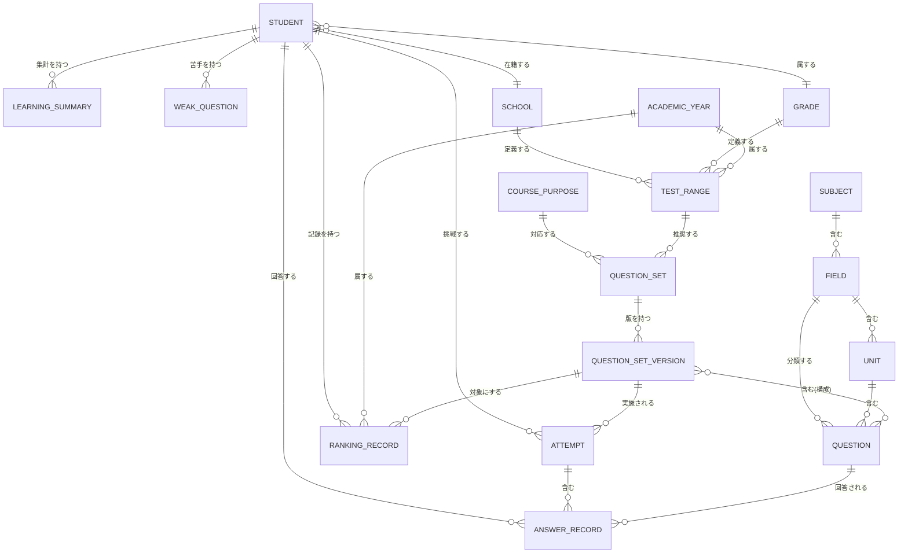

# ドメインモデル仕様書 Ver.1

- 作成日: 2026-08-03
- 位置づけ: `docs/architecture/ls-total-test-system-design-v1.md` の2章・3章の詳細版
- 表記ルール（確定/仮決定/要確認）はメイン設計書と共通

---

## 1. ER図（全体）

---

## 2. 識別子設計（詳細）

### 2.1 全キー一覧

| 識別子 | 形式 | ラベル | 発行者 | 例 |
|---|---|---|---|---|
| `subjectId` | `social` \| `science` | 確定（値は仮決定） | 開発者（config） | `social` |
| `coursePurposeId` | `regular_exam` \| `entrance_exam` | 確定（値は仮決定） | 開発者（config） | `regular_exam` |
| `fieldId` | 既存3値はそのまま流用、新規は英語スネークケース | 確定（既存3値）／仮決定（新規値） | 開発者（config） | `japan_geo`（既存）, `biology`（新規） |
| `unitKey` | 既存踏襲、日本語文字列そのまま | 確定（当面変更しない） | 問題作成者（CSV編集） | `都道府県` |
| `questionId` | 既存の命名踏襲（`<接頭辞>_<連番>`）。**既存値は不変** | 確定 | 問題作成者 | `geo_pref_001` |
| `questionSetId` | `<fieldId>__<coursePurposeId>__<slug>` | 仮決定 | 開発者/問題管理者 | `japan_geo__regular_exam__prefecture_all` |
| `questionSetVersion` | 整数、1始まり | 確定（形式）仮決定（初期値運用） | 問題管理者 | `1` |
| `schoolId` | 生徒管理システムの採番方式に従う | 要確認 | 生徒管理システム | 不明 |
| `gradeId` | 生徒管理システムの採番方式に従う | 要確認 | 生徒管理システム | 不明 |
| `attemptId` | `crypto.randomUUID()`推奨、非対応時は`<studentId>-<epochms>-<rand>` | 仮決定 | 学習アプリ（クライアント） | `a1b2c3d4-...` |
| `academicYearId` | `AY<開始暦年>`（4月始まり） | 仮決定 | 開発者（算出ロジック） | `AY2026` |
| `examRoundLabel` | 自由文字列（正式なマスタ化は先送り） | 仮決定 | 塾スタッフ | `1学期期末` |

### 2.2 既存キーとの移行関係（旧→新の対応表）

| 旧キー | 出典 | 新設計での扱い | 変更要否 |
|---|---|---|---|
| `japan_geo`（`subject`列の値） | `config/subjects.js`, CSV | そのまま`fieldId`として採用 | **変更不要（確定）** |
| `world_geo` | 同上 | そのまま`fieldId`として採用 | **変更不要（確定）** |
| `history` | 同上 | そのまま`fieldId`として採用 | **変更不要（確定）** |
| `geography`（`config/modes.js`のカテゴリキー。CSVには存在しない） | `config/modes.js`の`MODE_FILTER_OPTIONS` | 廃止。`japan_geo`/`world_geo`それぞれに対応するエントリへ分割（Phase1.5でバグ修正として実施） | **変更必要（バグ修正）** |
| （存在しない）`civics`, `biology`, `chemistry`, `physics`, `earth_science` | - | 新規`fieldId`として追加（Phase3） | 新規追加 |
| （存在しない）教科レベルの概念 | - | 新規`subjectId`（`social`/`science`）として追加（Phase3の`config/fields.js`相当導入時） | 新規追加 |
| （存在しない）`unit`の正式キー化 | 現状は`unit`列の日本語文字列がキーを兼ねる | 当面変更しない。表記ゆれの実害が出た場合にのみ`unitId`マスタ化を検討 | 変更なし（仮決定） |

**確定事項**: 既存の`japan_geo_questions.csv` / `world_geo_questions.csv` / `history_questions.csv`の`subject`列の値は、本設計のいかなる段階でも書き換えを必要としません。

---

## 3. 主要概念（エンティティ）一覧

各概念について「役割／一意なID／主な属性／他概念との関係／管理場所／更新主体」を整理します。

### 3.1 Student（生徒）

| 項目 | 内容 |
|---|---|
| 役割 | 学習アプリの利用者。生徒管理システムが正本（Single Source of Truth） |
| 一意なID | `studentId`（生徒管理システム発行、形式は要確認） |
| 主な属性 | 表示名、`schoolId`、`gradeId`、在籍状態、（ログイン情報は学習アプリ側で保持しない） |
| 他概念との関係 | Attempt・AnswerRecord・RankingRecord・LearningSummary・WeakQuestionをstudentId経由で持つ |
| 管理場所 | **生徒管理システム（外部GAS・Sheets）**。学習アプリは複製を持たない |
| 更新主体 | 生徒管理システムの運用者（教室スタッフ等、既存運用） |

### 3.2 School（学校）

| 項目 | 内容 |
|---|---|
| 役割 | 生徒の在籍校。学校別テスト範囲の絞り込みキー |
| 一意なID | `schoolId`（要確認: 採番方式） |
| 主な属性 | 学校名（表示用。テスト範囲マスタのキーには使わない） |
| 他概念との関係 | TestRangeが`schoolId`で参照する |
| 管理場所 | **生徒管理システム（外部）** |
| 更新主体 | 生徒管理システムの運用者 |

### 3.3 Grade（学年）

| 項目 | 内容 |
|---|---|
| 役割 | 生徒の学年。テスト範囲・年度の絞り込みキー |
| 一意なID | `gradeId`（要確認: 現状`grade`が自由文字列かコード化済みか未確認） |
| 主な属性 | 学年表示名（例: 中2） |
| 他概念との関係 | TestRangeが`gradeId`で参照する |
| 管理場所 | **生徒管理システム（外部）** |
| 更新主体 | 生徒管理システムの運用者 |

### 3.4 Subject（教科）

| 項目 | 内容 |
|---|---|
| 役割 | 社会／理科という最上位の教科区分 |
| 一意なID | `subjectId`（`social` / `science`） |
| 主な属性 | 表示名 |
| 他概念との関係 | Fieldを複数持つ |
| 管理場所 | 学習アプリ側config（Phase3新設） |
| 更新主体 | 開発者（コード変更） |

### 3.5 CoursePurpose（学習目的）

| 項目 | 内容 |
|---|---|
| 役割 | 定期テスト対策／都立入試対策の区分 |
| 一意なID | `coursePurposeId`（`regular_exam` / `entrance_exam`） |
| 主な属性 | 表示名 |
| 他概念との関係 | QuestionSetが1つのCoursePurposeに対応する |
| 管理場所 | 学習アプリ側config（Phase2新設） |
| 更新主体 | 開発者 |

### 3.6 Field（分野）

| 項目 | 内容 |
|---|---|
| 役割 | 日本地理・世界地理・歴史・公民・生物・化学・物理・地学という中分類。現行コードの「科目キー」に相当 |
| 一意なID | `fieldId`（既存3値は不変、新規は追加） |
| 主な属性 | 表示名、所属`subjectId`、`modeGroup`（出題形式カテゴリ）、CSVパス |
| 他概念との関係 | Subjectに属する、Unitを複数持つ、Questionを分類する |
| 管理場所 | 学習アプリ側config（`config/subjects.js`を踏襲、Phase3で`config/fields.js`相当に発展） |
| 更新主体 | 開発者 |

### 3.7 Unit（単元）

| 項目 | 内容 |
|---|---|
| 役割 | 分野内の学習単元。既存の単元フィルタに対応 |
| 一意なID | 当面は日本語表示名文字列がキーを兼ねる（`unitId`マスタ化は将来検討、2.2参照） |
| 主な属性 | 表示名、所属`fieldId` |
| 他概念との関係 | Fieldに属する、Questionを複数含む |
| 管理場所 | CSV内の`unit`列（既存踏襲） |
| 更新主体 | 問題作成者（CSV編集、非エンジニア可） |

### 3.8 Question（問題）

| 項目 | 内容 |
|---|---|
| 役割 | 個々の設問。現行の`normalizeQuestion`の出力に相当 |
| 一意なID | `questionId`（既存の命名規則を踏襲。**既存の値は不変**） |
| 主な属性 | `fieldId`, `unit`, `mode`, `question`, `answer`, `status`, `difficulty`等（詳細は`data-schema-v1.md`） |
| 他概念との関係 | Unit・Fieldに分類される、AnswerRecordとして回答される、QuestionSetVersionに含まれる |
| 管理場所 | CSV（既存踏襲） |
| 更新主体 | 問題作成者 |

### 3.9 QuestionSet（問題セット）

| 項目 | 内容 |
|---|---|
| 役割 | 「単元×分野×学習目的」または教師配信などにより束ねられた出題プールの定義。現行にはこの概念自体が存在しない（新規） |
| 一意なID | `questionSetId` |
| 主な属性 | 表示名、対象`fieldId`、対象`coursePurposeId`、選定条件（単元リスト等） |
| 他概念との関係 | QuestionSetVersionを複数持つ、TestRangeから参照される |
| 管理場所 | 学習アプリ用Sheets（新設、詳細は下記4章の設計判断参照） |
| 更新主体 | 開発者または問題管理担当者（塾スタッフを想定） |

### 3.10 QuestionSetVersion（問題セットバージョン）

| 項目 | 内容 |
|---|---|
| 役割 | QuestionSetの構成（問題の組み合わせ）のスナップショット。ランキングの公平性維持のキー |
| 一意なID | `questionSetId` + `questionSetVersion`（整数）の複合キー |
| 主な属性 | 構成問題のリストまたは選定条件、作成日時 |
| 他概念との関係 | QuestionSetに属する、Attempt・RankingRecordから参照される |
| 管理場所 | 学習アプリ用Sheets（新設） |
| 更新主体 | 開発者または問題管理担当者。**構成変更時は必ずバージョンをインクリメントし、既存バージョンは変更しない（確定）** |

### 3.11 Attempt（挑戦）

| 項目 | 内容 |
|---|---|
| 役割 | 1回のクイズ実施全体（開始〜完了または途中終了まで） |
| 一意なID | `attemptId` |
| 主な属性 | `studentId`, `questionSetId`, `questionSetVersion`, `startedAt`, `completedAt`, `completed`(bool), `score`, `totalCount`, `rawTimeSeconds`, `penalizedTimeSeconds` |
| 他概念との関係 | Studentが実施する、AnswerRecordを複数含む、完了時にRankingRecordの更新候補になる |
| 管理場所 | 学習アプリ用Sheets（新設） |
| 更新主体 | 学習アプリ（自動記録） |

### 3.12 AnswerRecord（回答記録）

| 項目 | 内容 |
|---|---|
| 役割 | 1問ごとの解答結果。現行の`saveRecord`ペイロードに相当 |
| 一意なID | `attemptId` + `questionId`の複合キー |
| 主な属性 | `studentId`, `fieldId`, `unit`, `selectedChoice`, `correctAnswer`, `isCorrect`, `answeredAt`, `responseTimeSeconds`, `timedOut`(bool) |
| 他概念との関係 | Attemptに属する、Questionを参照する、LearningSummary・WeakQuestionの集計元 |
| 管理場所 | 学習アプリ用Sheets（既存の解答保存シートを拡張） |
| 更新主体 | 学習アプリ（自動記録） |

### 3.13 LearningSummary（学習サマリー）

| 項目 | 内容 |
|---|---|
| 役割 | 生徒×分野×単元単位の正答率・出題回数等の集計結果（導出データ） |
| 一意なID | `studentId` + `fieldId` + `unit`の複合キー |
| 主な属性 | 出題回数、正答数、正答率、最終出題日時 |
| 他概念との関係 | AnswerRecordから再計算可能。Studentに属する |
| 管理場所 | 導出データ。初期は都度計算、パフォーマンス次第でSheetsへキャッシュ化（仮決定） |
| 更新主体 | 学習記録用GAS（都度計算またはバッチ） |

### 3.14 WeakQuestion（苦手問題）

| 項目 | 内容 |
|---|---|
| 役割 | 生徒×問題の苦手判定結果（ルールベーススコア） |
| 一意なID | `studentId` + `questionId`の複合キー |
| 主な属性 | 苦手スコア、該当条件（10章参照） |
| 他概念との関係 | AnswerRecordの履歴から算出される。Studentに属する |
| 管理場所 | 導出データ（都度計算を基本とする） |
| 更新主体 | 学習アプリ（`features/weak-questions/`のロジック） |

### 3.15 TestRange（学校別テスト範囲）

| 項目 | 内容 |
|---|---|
| 役割 | 学校×学年×学年度×定期テスト回×教科に対応する出題範囲の定義 |
| 一意なID | `schoolId` + `gradeId` + `academicYearId` + `examRoundLabel` + `fieldId`の複合キー |
| 主な属性 | 対象単元リストまたは対象`questionSetId` |
| 他概念との関係 | School・Grade・AcademicYearに紐づく、QuestionSetを推奨する |
| 管理場所 | 学習アプリ用Sheets（新設） |
| 更新主体 | 塾スタッフ（将来的な簡易管理画面を想定。今回は設計のみ） |

### 3.16 RankingRecord（ランキング記録）

| 項目 | 内容 |
|---|---|
| 役割 | 生徒×問題セット×バージョン×年度のベスト記録 |
| 一意なID | `studentId` + `questionSetId` + `questionSetVersion` + `academicYearId`の複合キー |
| 主な属性 | 正答率、`penalizedTimeSeconds`、記録日時、表示名スナップショット |
| 他概念との関係 | QuestionSetVersionを対象にする、AcademicYearに属する、Studentが持つ |
| 管理場所 | 学習アプリ用Sheets（新設） |
| 更新主体 | 学習記録用GAS（Attempt完了処理内で自動更新） |

詳細な更新フロー・完了判定は `docs/specification/ranking-spec-v1.md` を参照。

### 3.17 AcademicYear（学年度）

| 項目 | 内容 |
|---|---|
| 役割 | 4月始まりの学年度区分。年度ランキング・テスト範囲の期間キー |
| 一意なID | `academicYearId`（`AY<開始暦年>`） |
| 主な属性 | 開始日・終了日（4月1日〜翌3月31日、算出可能） |
| 他概念との関係 | TestRange・RankingRecordから参照される |
| 管理場所 | 学習アプリ側config（実体マスタを持たず、日付からの算出ロジックのみで足りる可能性が高い） |
| 更新主体 | 開発者（算出ロジックのみのため、通常は更新不要） |

---

## 4. QuestionSetの管理場所に関する設計判断

### 4.1 選択肢

| 選択肢 | 内容 |
|---|---|
| A | CSVで管理する（既存の問題データと同じ方式） |
| B | Google Sheetsで管理する（GAS経由で取得） |
| C | コード内定数として定義する |

### 4.2 比較

| 観点 | A（CSV） | B（Sheets） | C（コード定数） |
|---|---|---|---|
| 更新の容易さ | GitHub Pagesへの再デプロイが必要 | 塾スタッフがSheetsを直接編集でき、即座に反映可能 | 開発者のコード変更が必要、最も硬直的 |
| 既存パターンとの一貫性 | 既存の問題CSVと同じ流儀で一貫性が高い | 新しい「Sheetsを直接読む」パターンが加わる | 既存パターンから外れる |
| オフライン耐性 | 高い（静的配信） | GAS呼び出しが必要 | 高い |
| 実装コスト | 低い（既存の`question-loader.js`をほぼ流用可能） | 中（新規GAS API`getQuestionSets`が必要） | 低い |

### 4.3 推奨案

**B（Google Sheetsで管理する）を推奨する（仮決定）。**

**推奨理由**: QuestionSet・TestRangeは「塾スタッフが問題を見ずに範囲だけ調整したい」という運用が想定され、CSVのように毎回GitHub Pagesへ再デプロイする方式は現場の手間が大きい。GASとの親和性も高く、将来の先生配信問題（Phase9）とも管理方式を統一できる。

**デメリット**: 既存の「CSVを静的配信する」という一貫したパターンから外れ、初めて「Sheetsをマスタとして直接読む」ケースになるため、キャッシュ戦略（毎回GASを叩くか、一定時間キャッシュするか）を別途設計する必要がある。

**将来変更する場合の影響**: 逆にCSV化したくなった場合は、Sheetsの内容をエクスポートしてCSV化するだけで済むため、B→Aへの移行は低リスクです。
