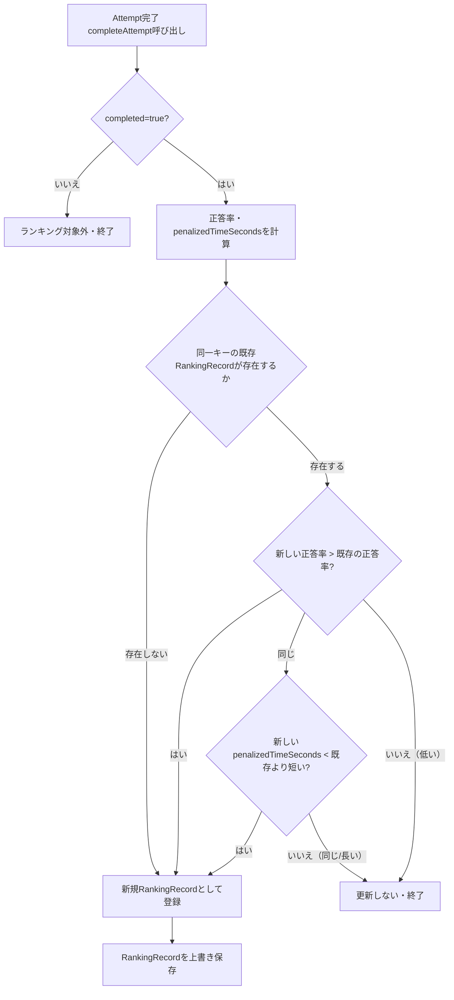
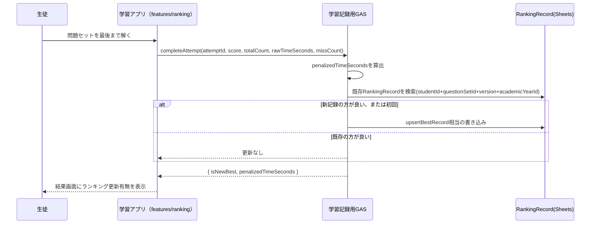

# ランキング仕様書 Ver.1

- 作成日: 2026-08-03
- 位置づけ: `docs/architecture/ls-total-test-system-design-v1.md` の11章の詳細版
- 表記ルール（確定/仮決定/要確認）はメイン設計書と共通
- 採用済み仕様（ユーザー指定）: 単元/問題セット単位で管理、最後まで解いた場合のみ登録、途中終了は対象外、問題セット内容が異なる場合は混在させない、同一生徒はベストのみ掲載、正答率を第1順位・ペナルティ込みタイムを第2順位、年度/歴代ランキング両方表示、卒業生記録も保持、自分の順位を確認可能、今日だけのランキングは作らない

---

## 1. RankingRecordのデータ構造

| フィールド | 型 | 説明 |
|---|---|---|
| `studentId` | string | 生徒管理システムのID（外部キー、複製しない） |
| `displayNameSnapshot` | string | **記録時点**の表示名（改名・卒業後もこの記録の見え方を変えないためのスナップショット、2.7参照） |
| `questionSetId` | string | 対象問題セット |
| `questionSetVersion` | int | 対象問題セットのバージョン（2.8参照） |
| `academicYearId` | string | 記録が属する学年度（`AY2026`等） |
| `correctRate` | 分数または高精度小数 | 正答率（2.4参照） |
| `penalizedTimeSeconds` | number | ペナルティ込みクリアタイム（2.5参照） |
| `rawTimeSeconds` | number | ペナルティを含まない実測タイム（参考値として保持） |
| `recordedAt` | datetime | このベスト記録が確定した日時（同点判定に使用、2.11参照） |
| `sourceAttemptId` | string | このベスト記録の元になったAttemptのID（監査・不正確認用） |

**一意キー**: `studentId + questionSetId + questionSetVersion + academicYearId`（この組み合わせで1行のみ、常にベストで上書き）。

---

## 2. 各論点の詳細設計

### 2.1 完了判定

Attemptが「問題セットの全問に解答し、結果画面（`result-screen`相当）まで到達した場合」にのみ`completed = true`となる。既存コードの`goToNextQuestion` → `showFinalResult`到達がこれに相当する（Phase0分析の3.1データフロー図参照）。`backToStart`で開始画面へ戻った場合、または途中でタブを閉じた場合は`completed = false`のままとなり、ランキング対象外。

### 2.2 ベスト記録の更新条件

### 2.3 正答率の比較方法

パーセント表示（小数第1位等への丸め）による誤差を避けるため、比較自体は「正解数/問題数」の分数、または十分な桁数を持つ高精度小数で行う。例えば「7/10」と「70/100」のような異なる問題数の問題セットは、そもそも1章の前提（内容や問題数が異なる場合は同じランキングとして混在させない）により、`questionSetId + questionSetVersion`が異なるため別ランキングとなり、直接比較されない。

### 2.4 ペナルティ込み時間の比較方法

`penalizedTimeSeconds = rawTimeSeconds + penaltySecondsPerMiss(仮決定:10) × missCount`。時間切れの扱い（不正解として1回分のペナルティ）はメイン設計書12.2章を参照。

### 2.5 年度ランキングと歴代ランキングの違い

| 項目 | 年度ランキング | 歴代ランキング |
|---|---|---|
| 対象範囲 | 指定した`academicYearId`のRankingRecordのみ | 全`academicYearId`を跨いだ真のベスト |
| データソース | RankingRecordテーブルをそのままフィルタ | RankingRecordを`studentId + questionSetId + questionSetVersion`で横断集約し、正答率→タイムの順で再度ベストを算出（都度計算） |
| 実体テーブル | あり（RankingRecordそのもの） | 初期は無し（都度計算のビュー、仮決定）。データ量が増えパフォーマンスが問題になれば専用テーブルへ切り出す |

「今日だけのランキング」は作らない（採用済み仕様）ため、日次集計テーブルは設計しない。

### 2.6 卒業後も記録を残す方法

RankingRecordは生徒の在籍状態に依存せず保持し続ける（物理削除しない）。**要確認**: 生徒管理システムが卒業後に`studentId`を再利用しない、またはレコード自体を削除しないことが前提となるため、この点の確認が必須。

### 2.7 表示名変更時の扱い

`displayNameSnapshot`を採用し、記録確定時点の表示名をRankingRecordにコピーして保持する。生徒管理マスタ側で後から表示名が変わっても、既存のランキング記録の見え方は変化しない。内部的な同一生徒判定・自分の順位検索は`studentId`を正とする（表示名は変わっても`studentId`は不変という前提、**要確認**）。

### 2.8 問題セット改訂時のランキング分離

`questionSetVersion`をRankingRecordのキーに含めることで、構成変更のたびにバージョンをインクリメントすれば自動的に別ランキングとして扱われ、新旧が混在しない（採用済み仕様）。旧バージョンのランキングは凍結された記録として残り続ける（閲覧は可能、新規記録は発生しない）。

### 2.9 同じ生徒の複数記録の扱い

RankingRecordでは`studentId + questionSetId + questionSetVersion + academicYearId`ごとに1行のみ（ベストで上書き）。同一生徒が同じ問題セットに何度挑戦しても、ランキングにはベストのみが反映される。**全ての挑戦履歴自体はAttempt/AnswerRecord側にすべて残る**ため、ランキングとは別に全履歴の参照は可能。

### 2.10 表示名変更時の扱い

2.7に統合（重複項目のため参照のみ）。

### 2.11 同点時の扱い

正答率・ペナルティ込みタイムが完全に一致した場合は、`recordedAt`（記録日時）が早い方を上位とする（**仮決定**）。

### 2.12 不正・異常に短いタイムへの将来対応

初期実装では自動検知を行わない（**仮決定**）。将来的に「問題セットの問題数 × 最小妥当回答時間」を下回るタイムを異常値として除外するフィルタを追加できる拡張余地のみ残す。具体的な閾値は未定（**要確認/仮決定**、実データが蓄積してから検討）。

---

## 3. ランキング反映のシーケンス（Phase7実装時のイメージ。Task51.5でPhase6から変更、スピードラン＋ランキング統合）

---

## 4. 公平性のための設計チェックリスト（メイン設計書11章との対応）

| 採用済み仕様の要件 | 本仕様書での対応 |
|---|---|
| 問題セットの一意なID | `questionSetId`（domain-model-v1.md 2.1） |
| 問題セットのバージョン | `questionSetVersion`（2.8） |
| 問題構成変更時の扱い | バージョンインクリメントで分離（2.8） |
| 同点時の扱い | `recordedAt`昇順（2.11） |
| 生徒の改名・進級・卒業・退塾時の扱い | `displayNameSnapshot` + `studentId`基準（2.6, 2.7） |
| 表示名と内部生徒IDの分離 | `displayNameSnapshot`と`studentId`を別フィールドとして保持（2.7） |
| 不正・異常タイムへの将来対応 | 拡張余地のみ確保（2.12） |
